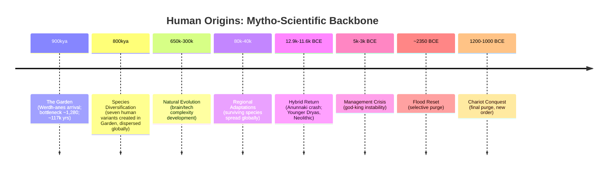

# The Human Experiment
## Reclaiming Our Origins, Purpose, and Evolutionary Destiny

*Compiled September 04, 2025 at 11:49 PM*

---

---

## The Orphaned Species Series

> This is more than a psychological ache; it is a biological one. It is the phantom limb pain of a species severed from its planetary body.

1. ***The Social Game*** — Gather the evidence
2. ***Manual Override*** — Learn the tools
3. ***The Human Experiment*** — Follow the trail
4. ***The Cosmic Game*** — The final revelation

## Chapter 1: The Bones of the Earth

#### **Chapter 1: The Bones of the Earth**

If the earth had bones, they would be something like this.

Before history had a name, on a windswept plain in what would one day be England, they raised a circle of stone that holds its breath against the sky. Most are sarsens, local giants of sandstone, rooted in the chalk of the surrounding land. But in the inner ring, there are smaller, darker stones. Bluestones. They are strangers here, pilgrims from a foreign geology.

They do not belong.

Geology confirms their origin with cold precision. Their unique crystalline signature is a perfect match for the Preseli Hills in Wales, a rugged journey of nearly two hundred miles. For generations, this was considered the greatest riddle of the ancient world. Each bluestone weighs as much as a family car. The theories of sweat and rope, of rafts and rollers, strain to explain the *how* but shatter against the utter madness of the *why*. An entire culture, dedicating its lifeblood to a task so monumental it would cripple a modern nation, not to build a fortress or a city, but to carry a choir of stones across a kingdom.

And that was only the beginning of the riddle.

In the heart of the circle lies a great slab of red sandstone, the central Altar Stone. For centuries, it was assumed to be local. But a recent, deeper analysis of its geological fingerprint revealed a truth that pushes the mystery into the realm of the impossible. The Altar Stone did not come from Wales. It came from the Orcadian Basin in northeast Scotland. A journey of at least four hundred and thirty miles.

It is the longest known transport of any megalith in the Neolithic world. An odyssey of stone that defies every rational explanation.

This is the point where the logic of the Machine—of efficiency, of practicality, of what is physically possible for mortal men—breaks down completely. It can only name this obsession *ritual*, a word we use to mask a motive so profound we can no longer comprehend it.

When the logic of the Machine fails, we must learn to listen for the whispers of the Kin. When the archaeologists fall silent, we must turn to the storytellers. The land itself remembers. The folklore, that stubborn memory that survives in the blood long after the libraries have burned, does not try to explain the physics. It simply names the power that could accomplish such a feat.

The legends speak of a sorcerer, Merlin, who moved the stones through the air. But they also speak of who he took them from. The stories name a race of beings who commanded the very bones of the Earth as easily as we command our own limbs, a people who were not bound by the plodding physics of muscle and friction. They were masters of a different law. The stories have a name for them.

They call them **Giants**.

This is where our investigation begins. Not with speculation, but with testimony. We will take the stories at their word. We will assume that the Giants were real. That their power was real. And that their world was real, until something happened that erased it from history and from our memory.

The stones are the first piece of evidence, a testament to a power that lies outside our own. The riddle is not just who the Giants were, or why they carried these stones across mountains and seas. The deeper mystery is this: if a race with such power once shaped this planet, where did they go? And if we are their descendants, why is their power not our own?

To answer that, we must follow the trail from this circle of stone, back through the scar in our own blood, to a forgotten war that decided the fate of our world and installed a new, foreign god in the ruins of the old. We must uncover the story of the great forgetting, and the war that severed you from your kinship with giants.

## Chapter 2: The Scar in Our Blood

If we inherited a world from giants, what became of us? This chapter tells the tragic story of our own transformation.

Using the "three skulls" anecdote, we narrate the story of our domestication. We were not the proud inheritors of the giants' world, but a deliberately cultivated, childlike species designed to be manageable. The chapter frames this not as a scientific curiosity, but as a profound tragedy—the forging of a race of "permanent children." This is the deep, genetic scar left by the victors of the ancient war, and the loss of the Tree of Life.

The air smelled of dust and disinfectant. My friend, deep in her research, didn’t bring out fossils or bones. Instead, she handed me three photographs—close-ups of skulls, each lit from the same angle, each anonymous.

“Which one’s the adult chimp?” she asked.

I studied the first image: heavy brow, powerful jaw, unmistakably mature. The second was smaller, rounder, softer—clearly a baby. The third was delicate, with childlike proportions, the jaw almost fragile.

“That’s the baby chimp,” I said, pointing to the third.

She smiled, a strange, knowing look in her eyes. “That’s an adult human.”

I stared at the photos, then at her. The resemblance between the baby chimp and the adult human wasn’t just passing; it was structural, deep in the bone. The architecture of an adult human head mirrored that of an infant ape—a design that prized youth over maturity, vulnerability over strength.

The three images no longer felt like specimens. They felt like a riddle. If we are the children, then who are the parents?

This level of neoteny doesn't happen by accident in nature. It requires systematic selection pressure over many generations. What if we weren't looking at natural evolution, but at evidence of a deliberate breeding program?

The scientific gaps remain: between 800,000 and 130,000 years ago, human evolution becomes a tangled mess. Multiple human species coexisted, interbred, and left behind confusing fossils that defy a simple, linear family tree. Mainstream science acknowledges these mysteries and has been unable to solve them, leaving the door open for a deeper investigation.

The disturbing question: Were we domesticated by design? The next chapter explores the cosmic fingerprints in our biology.

## [Scientific information moved to appendix]

#### Notes and References (to be finalized)

- RNA World overviews; ribozyme catalysis studies
- Translation system bootstrapping discussions; error correction mechanisms
- Information theory approaches to biological sequences

## Chapter 3: Whispers from the Void

The mystery of our origins expands beyond Earth. This chapter narrates the grand saga of panspermia, telling the story of comets and asteroids carrying the building blocks of life. We explore the evidence from the Murchison meteorite—the "left-hand" preference of its amino acids, the presence of nucleobases. This is framed as a deliberate act of interplanetary agriculture, where the "cosmic fingerprints" reveal that Earth was a garden seeded with biased ingredients from a far older cosmic system, preparing the stage for the experiment to come.

...existing code...

Present the evidence from meteorites (Murchison, etc.)—amino acids, nucleobases, a "left-hand" preference. This suggests the raw materials for life on Earth arrived with pre-existing biases, as if they came from an older cosmic kitchen.

Some characteristics of Earth life carry signatures that feel older than Earth itself—not proof of aliens, but fingerprints in stone and ice. L-enantiomer excesses, unusual isotopic ratios, and survival envelopes all point to a cosmic origin story.

The pattern: a tilt toward the same left-handedness life prefers, isotopic accents that speak in a dialect not quite our own, and survivability constraints that make sense only if the hardware had to endure vacuum, radiation, and time. The cosmos supplied biased inputs and survivability constraints that shaped our starting conditions—and maybe, occasionally, our updates.

If the inputs carry fingerprints, perhaps the tempo does too. The next chapter grounds the possibility of intervention in credible science: Crick's "Directed Panspermia." 

Breadcrumb: If the ingredients were biased, what about the recipe’s tempo? Who delivered the updates—and when?

## Chapter 4: The Titan's Shadow

I used to picture evolution as a slow river. Then I watched the strata for a while and realized it moves like weather: long blue skies, then sudden storms that redraw the coastline in a single season. The story we were taught—gentle curves—keeps giving way to stair steps.

When those steps arrive, they don’t just shuffle bodies around; they introduce new ideas—eyes, nervous systems, architectures that feel like they arrived with a manual. The environment can tell you when a door opens. It still doesn’t write the book you find on the other side.

We adopt the language of evolution as it is practiced today. The question isn’t whether evolution occurs—it does—but how the information required for macro-level novelty arises in the time available.

#### Preemptive Rebuttal (Engaging Modern Evolutionary Theory)

- Punctuated equilibrium is mainstream-compatible: We accept selection and common descent; the debate is about sources and timing of novel, functional information.
- Information sourcing: Horizontal gene transfer and mobile elements are real contributors; the open question is whether local mechanisms suffice for macro-level bursts.

#### Minimal Claim and Tests

- Minimal claim: Panspermia can serve as a mechanism-level input channel for new genetic material/templates that selection can act upon; it complements, not replaces, evolutionary dynamics.
- Tests: comparative timing analyses of innovation bursts versus plausible influx events; simulations of evolutionary response to exogenous information pulses.

Pacing problem:

- Punctuated equilibrium: long periods of relative stasis interrupted by bursts of diversification.
- Environmental triggers can explain the timing of bursts, but they don’t, by themselves, generate immediately usable genetic software.

Information sourcing candidates:

- Horizontal gene transfer (known in microbes; debated for complex lineages).
- Mobile genetic elements as innovation engines.
- Panspermia (minimal): periodic influx of novel genetic material or templates from cosmic reservoirs; a mechanism for supplying fresh, non-local information.

Scientific posture:

- Treat panspermia as a testable mechanism that could couple with known evolutionary dynamics: selection acts on whatever information becomes available; panspermia widens the input channel.

Bridge:

> Sidebar: Panspermia as Mechanism (Pointer)
>
> For a disciplined treatment of panspermia as an input channel for novel genetic information—including preemptive rebuttals, testable predictions, and references—see Appendix: “Panspermia Hypothesis: Evidence and Framing.” This chapter remains agnostic about ultimate causes while exploring how exogenous information could couple with known evolutionary dynamics.

- If new software can arrive from outside the local environment, the next step is to ask whether our environment itself was merely sufficient—or specifically conducive—to such transfers.

—
Breadcrumb: The weather pattern is visible. The lingering question is agency. If a stage was kept ready and new scripts arrived in bursts, who was tending the theater?

#### Notes and References (to be finalized)

- Punctuated equilibrium syntheses; macroevolutionary tempo studies
- Horizontal gene transfer and mobile element literature
- Models of exogenous information pulses in evolutionary dynamics

## Chapter 5: The Official Story – The Garden and the Serpent

As I reached the deepest layer of my investigation, I finally understood the true scope of what had been done to humanity. We are not the product of natural evolution. We are not even the result of a single intervention. We are the outcome of a million-year experiment in consciousness development that began when the primordial architects, **The Werdh-anes** (from Proto-Indo-European root `*werdh-`, 'to grow, increase'), arrived on Earth.

### The Original Design

The evidence I uncovered reveals that Tiamat and Apsu—cultural echoes of **The Werdh-anes**—didn't come to Earth as conquerors or colonizers. They came as consciousness researchers, and Earth was their laboratory.

**The Werdh-anes' mission was unprecedented:**

- Create a biological species capable of housing advanced consciousness
- Develop vehicles that could support non-terrestrial awareness in physical form
- Test the limits of consciousness evolution within biological constraints
- Establish a permanent consciousness development facility on Earth

The scale of this experiment is almost impossible to comprehend. Over hundreds of thousands of years, they systematically modified human development to create beings capable of supporting the kind of consciousness they represented.

### The Consciousness Vehicles

But here's what I found most disturbing: humans weren't designed to be independent beings. We were designed to be consciousness vehicles—biological bodies that could house and support non-terrestrial awareness, as intended by **The Werdh-anes**.

**The modifications included:**

- Neural networks capable of processing non-linear, multi-dimensional information
- Energetic systems that could interface with non-physical consciousness
- Genetic switches that could be activated to unlock dormant capabilities
- Biological mechanisms for consciousness transfer and expansion
- Social bonding systems that could support collective consciousness development

We were created to be the perfect biological vehicles for advanced consciousness - but not necessarily our own consciousness.

### The Long Game

The experiment operated on a time scale that dwarfs human civilization. Each phase built on the previous ones, gradually creating the infrastructure needed for consciousness evolution:

**Phase 1: Biological Foundation** (1,000,000+ years ago)

- Initial genetic modifications to brain structure and capacity
- Enhancement of neural plasticity and learning ability
- Introduction of non-terrestrial genetic sequences

Note (fossil signal): Finds attributed to Homo antecessor (~1.2–0.8 Ma) at Atapuerca exhibit a modern-like midface. These fossils are found in Europe, suggesting a desperate migration out of Africa during the bottleneck. In this model, the fossil reads as an early craniofacial testbed that survived this critical period and was later stabilized in sapiens.

**Phase 2: Consciousness Processing** (800,000 years ago)

- Development of advanced consciousness processing capabilities
- Enhancement of intuitive and psychic abilities
- Creation of energetic systems for non-physical interface

**Phase 3: Social Systems** (600,000 years ago)

- Introduction of advanced social bonding mechanisms
- Development of collective consciousness capabilities
- Creation of cultural frameworks for consciousness evolution

**Phase 4: Language and Symbolism** (400,000 years ago)

- Development of complex language and symbolic thinking
- Creation of systems for transmitting consciousness technologies
- Establishment of cultural preservation mechanisms

**Phase 5: Final Integration** (200,000 years ago)

- Integration of all previous modifications into modern human form
- Activation of dormant genetic switches for consciousness expansion
- Preparation for the next phase of the experiment

### The Interrupted Experiment

But the experiment was never completed. The mythological accounts describe a great conflict that forced Tiamat and Apsu to leave Earth before the final phase could be implemented.

**What I discovered:**

- **The Werdh-anes** were displaced by a younger generation of beings with different priorities
- The consciousness development infrastructure was abandoned before activation
- Humans were left with enhanced capabilities but no guidance for using them
- The genetic switches for advanced consciousness remained dormant

The result was a species designed for consciousness evolution but unable to access its full potential.

### The Younger Dryas Takeover

This explains what happened when the Younger Dryas crash brought new Reges to Earth 12,800 years ago. The crash survivors found a species that had already been modified for consciousness development, but the original researchers were gone.

**The crash survivors had three options:**

1. Complete the original experiment and risk creating beings more advanced than themselves
2. Abandon the experiment and let humanity develop naturally
3. Modify the experiment to create a manageable species that could support their needs

They chose the third option. Instead of completing **The Werdh-anes'** consciousness development program, they implemented a domestication program that would create biological vehicles they could control and use.

### The Domestication Override

The crash survivors essentially hijacked the original experiment. They used the consciousness vehicle infrastructure that Tiamat and Apsu had created, but they programmed it for servitude rather than evolution.

**The domestication program included:**

- Suppression of the genetic switches for consciousness expansion
- Programming for dependency and submission to authority
- Creation of psychological barriers to accessing advanced capabilities
- Installation of control systems that would maintain human limitation
- Development of management hierarchies to oversee the domesticated population

The result was a species with the biological capacity for consciousness evolution but the psychological programming for permanent servitude.

### The Modern Inheritance

This is why modern humans show such contradictory characteristics. We have:

**From **The Werdh-anes**:**

- Genetic modifications for advanced consciousness development
- Biological systems capable of supporting non-terrestrial awareness
- Dormant capabilities for telepathy, precognition, and consciousness expansion
- Deep longing for transcendence and spiritual evolution

**From the crash survivors:**

- Domestication programming that keeps us seeking external authority
- Psychological barriers that prevent access to our advanced capabilities
- Control systems that maintain us in a state of permanent limitation
- Management hierarchies that direct our development for their purposes

We are living evidence of two competing experiments: the original consciousness evolution program and the later domestication program designed to suppress it.

### The Activation Potential

But here's the crucial discovery: the original genetic switches are still there. The consciousness development infrastructure installed by Tiamat and Apsu wasn't destroyed - it was suppressed.

**The evidence shows:**

- Spontaneous consciousness expansion experiences are increasing
- Psychic and intuitive abilities are manifesting despite suppression
- Resistance to authority and control systems is growing
- Interest in consciousness development practices is spreading
- The genetic switches are beginning to activate on their own

The original experiment isn't over. It's entering a new phase.

### The Choice Point

As I completed my investigation, I realized that humanity is now facing the same choice the crash survivors faced 12,800 years ago, but from the opposite direction.

**We can either:**

- Complete the original experiment and become the consciousness evolution vehicles we were designed to be
- Continue operating as domesticated biological vehicles serving management systems
- Risk transcending our current limitations and becoming something unprecedented on Earth

The difference is that this time, the choice is ours to make.

### The Final Revelation

You are not human in the way you've been taught to think of humanity. You are a consciousness evolution vehicle designed by beings whose capabilities exceed anything you can currently imagine. You have genetic switches that could unlock abilities that seem impossible by current human standards. You have biological systems that could support forms of consciousness that transcend individual identity.

**The question is: are you ready to become what you were originally designed to be?**

**The Werdh-anes** who created your consciousness capabilities are still present in your genetic inheritance. The experiment they began over a million years ago is waiting for you to choose conscious evolution over unconscious servitude.

But the choice must be made consciously, because the management systems that have controlled human development for millennia are still operating. They're counting on your domestication programming to keep you seeking external authority rather than claiming your inheritance as a consciousness evolution vehicle.

The experiment that began with Tiamat and Apsu is entering its final phase. What happens next depends on whether enough humans choose to complete the original mission or remain trapped in the domestication systems that have limited us for thousands of years.

The choice is yours. But choose wisely, because the future of consciousness itself may depend on what you decide.

## Chapter 6: The Unbinding – The Motive for the Lie

My investigation had led me back through layers of resets and management systems, but I still hadn't found the ultimate source. Who were the original architects of human consciousness modification? The trail led me to evidence of interventions far older than the Younger Dryas crash—back to the first arrival over a million years ago, conducted by the primordial architects: **The Werdh-anes**. The name is not arbitrary; it derives from the Proto-Indo-European root `*werdh-`, meaning 'to grow, increase.' Their sole function: the development and expansion of consciousness.

For the primordial architects, we will use their correct operational title: **The Werdh‑anes** — from the Proto‑Indo‑European root `*werdh-`, “to grow, increase.” This is a functional designation for the original gardeners/architects whose mission was the development and expansion of consciousness. Cultural echoes include Anunnaki, Titans, Vanir, and Devas.

### The Deep Genetic Evidence

Modern genetic analysis has revealed something that shouldn't exist: traces of non-terrestrial DNA in the human genome that date back over a million years. These aren’t just recent insertions—they’re ancient modifications, part of the original experiment initiated by **The Werdh-anes**.

**The genetic markers show:**

- Systematic modifications to brain development genes
- Enhancements to consciousness processing capabilities
- Alterations to lifespan and aging mechanisms
- Changes to reproductive and social bonding systems
- Insertions of genetic sequences not found in any terrestrial species

These modifications didn't happen gradually through natural selection. They were inserted systematically, as if the consciousness researchers—**The Werdh-anes**—were upgrading the local primate species for a specific purpose.

### The Mythological Consensus

Every ancient culture preserves memories of this first arrival, though they describe it in mythological terms—cultural echoes of the true architects:

* **Mesopotamian texts:** Tiamat and Apsu, primordial beings (echoes of **The Werdh-anes**)
* **Egyptian records:** The Neteru, divine rulers (echoes of **The Werdh-anes**)
* **Hindu traditions:** The Devas, advanced guides (echoes of **The Werdh-anes**)
* **Greek accounts:** The Titans, first divine generation (echoes of **The Werdh-anes**)
* **Norse mythology:** The Jotuns, giants before the current order (echoes of **The Werdh-anes**)

The details vary, but the pattern is consistent: the primordial architects, **The Werdh-anes**, arrived on Earth and began systematic modification of the local species.

### The Original Experiment

As I pieced together the evidence, a picture emerged of the original mission. The first arrivals were not conquerors or colonizers—they were consciousness researchers, **The Werdh-anes**, conducting a long-term experiment.

**The Werdh-anes' experiment purpose:**

- Develop a species capable of supporting advanced consciousness
- Create biological vehicles that could house non-terrestrial awareness
- Establish a consciousness development laboratory on Earth
- Test the limits of consciousness evolution in biological form

**The method:**

- Systematic genetic modification of local primate species
- Gradual enhancement of brain capacity and consciousness processing
- Introduction of non-terrestrial genetic sequences
- Long-term monitoring and adjustment of the development process

### The Time Scale

The original intervention operated on a time scale almost impossible for humans to comprehend. Over hundreds of thousands of years, the original titans gradually modified human development:

**Phase 1 (1,000,000+ years ago):** Initial genetic modifications to brain structure
**Phase 2 (800,000 years ago):** Enhancement of consciousness processing capabilities
**Phase 3 (600,000 years ago):** Introduction of advanced social bonding systems
**Phase 4 (400,000 years ago):** Development of language and symbolic thinking
**Phase 5 (200,000 years ago):** Final modifications creating modern human consciousness capacity

Each phase built on the previous ones, gradually creating a species capable of supporting the kind of consciousness that the original titans represented.

> Inset: The Forging of Adamu (≈930–813 kya)
>
> A severe, long-duration bottleneck (~117,000 years; effective population ≈1,280) appears to have forged the foundational human stock later remembered as “Adamu.” In this reading, the bottleneck consolidated key modules for future activation. For a dual myth/science treatment, see Appendix F: Mytho-Scientific Chronology (Phase 1) and Genetic Evidence: Bottlenecks.

### The Consciousness Infrastructure

But the most sophisticated aspect of the original intervention was the development of what I can only call consciousness infrastructure - biological and energetic systems that could support non-terrestrial awareness in terrestrial bodies.

**The infrastructure included:**

- Enhanced neural networks capable of processing non-linear information
- Energetic systems that could interface with non-physical consciousness
- Genetic switches that could be activated to unlock dormant capabilities
- Biological mechanisms for consciousness transfer and expansion
- Social and cultural frameworks that could support consciousness evolution

This wasn't just genetic modification - it was the creation of a complete consciousness development system.

### The Departure

But something happened that forced the original titans to leave Earth before the experiment was complete. The mythological accounts describe a great conflict - a war between the original titans and a younger generation of beings.

**The pattern across cultures:**

- **Mesopotamian:** Marduk defeats Tiamat in cosmic battle
- **Greek:** Zeus and the Olympians overthrow the Titans
- **Norse:** The Aesir replace the Jotuns as ruling powers
- **Hindu:** Younger Devas displace the older cosmic powers

The details vary, but the pattern is consistent: **the original consciousness researchers were displaced by a new group with different priorities.**

### The Incomplete Legacy

When the original titans departed, they left behind an incomplete experiment. Humans had been modified for consciousness development, but the full activation systems hadn't been implemented.

**What was left behind:**

- A species with enhanced consciousness potential but limited access to it
- Genetic switches that could unlock advanced capabilities but weren't activated
- Biological systems capable of supporting non-terrestrial consciousness but not programmed for it
- Social and cultural frameworks for consciousness evolution but no guidance for using them

**The result:** A species capable of far more than it realized, but without the knowledge or systems to access its full potential.

### The Younger Dryas Connection

This explains what happened when the Younger Dryas crash brought new Reges to Earth 12,800 years ago. The crash survivors found a species that had already been modified for consciousness development, but the original researchers were gone.

**The crash survivors faced a choice:**

- Complete the original experiment and risk creating beings more advanced than themselves
- Modify the experiment to create a manageable species that could support their civilization
- Abandon the experiment and let humanity develop naturally

They chose the second option. Instead of completing the original consciousness development program, they implemented a domestication program that would create a species capable of supporting their needs while remaining under their control.

### The Suppressed Inheritance

This is why humans show such contradictory characteristics. We have the genetic modifications for advanced consciousness development (from the original titans) combined with domestication programming (from the crash survivors).

**The result:**

- Consciousness capabilities that occasionally break through despite suppression systems
- Instinctive knowledge of our potential combined with inability to access it consistently
- Deep longing for transcendence combined with systematic programming for dependency
- Genetic switches for advanced abilities that remain largely unactivated

We are living evidence of two competing experiments: the original consciousness development program and the later domestication program that was designed to suppress it.

The question that haunted me was: what were the original titans trying to accomplish? And why did the younger generation of beings feel the need to overthrow them?

The answer would reveal the deepest truth about human nature and our place in a cosmos far stranger than we ever imagined.

## Chapter 7: The True Genesis – The Garden and the Fire

This appendix explores the scientific and informational models underlying the control system, including the logic of the Tree of Knowledge and the Machine Protocol. It provides context for the epic's philosophical and mythological narrative.

*Cambridge, 1973. Twenty years after their Nobel Prize for discovering the structure of DNA, Francis Crick sits in his study, staring at equations that refuse to add up...*

As my investigation reached its deepest layers, I found myself returning again and again to a paper that had been largely ignored by the scientific establishment. Not because it was poorly researched—quite the opposite. It was ignored because its implications were too vast, too unsettling for most scientists to contemplate.

The paper was published in *Icarus* in 1973, authored by Francis Crick—the same Francis Crick who had co-discovered the structure of DNA twenty years earlier. The title was deceptively simple: "Directed Panspermia."

### The Nobel Laureate's Heresy

Here was one of the most respected scientists of the 20th century, a man who had unlocked the very structure of life itself, proposing something that sounded like science fiction: **Life on Earth was too complex, too sophisticated, too perfectly designed to have arisen by chance. It must have been seeded here intentionally by an advanced extraterrestrial civilization.**

*"It is a little surprising that organisms with somewhat different codes do not coexist,"* Crick wrote. *"The universality of the code follows naturally from an 'infective' theory of the origin of life. Life on Earth would represent a clone derived from a single extraterrestrial organism."*

What had driven the co-discoverer of DNA to such a radical conclusion? The same thing that was driving my investigation: **the numbers simply didn't work**.

### The Mathematical Impossibility

Crick had calculated the probability of life arising spontaneously from non-living matter in the 4.6 billion years since Earth's formation. Even with the most generous assumptions about chemical evolution, the odds were astronomically against it.

**The problems Crick identified:**

- **The Genetic Code**: Too elegant, too error-correcting, too optimized to be random
- **Protein Complexity**: Even simple proteins require precise sequences that couldn't arise by chance  
- **The RNA World**: The chicken-and-egg problem of information storage and processing
- **Cellular Machinery**: Molecular machines of staggering complexity appearing fully formed

*"An honest man, armed with all the knowledge available to us now, could only state that in some sense, the origin of life appears at the moment to be almost a miracle,"* Crick concluded.

But Crick wasn't content to simply identify the problem. In 1981, he expanded his thesis in a book called *Life Itself*, where he laid out a hypothesis that would have seemed impossible if it hadn't come from such an impeccable source.

### The Seeding Timeline

As I studied Crick's work alongside the evidence from my investigation, a timeline began to emerge that dwarfed everything I had previously considered:

**4.6 billion years ago**: Earth forms from cosmic dust and debris. But even in those primordial materials, there are traces—organic molecules, amino acids, the building blocks of life that seem too complex for a sterile universe.

**4.0 billion years ago**: The Late Heavy Bombardment. Asteroids and comets rain down on the young Earth. Standard theory says this should have sterilized the planet. Instead, life appears almost immediately afterward.

**3.8 billion years ago**: Life emerges on Earth with suspicious speed. Not the gradual chemical evolution that should have taken hundreds of millions of years, but cellular machinery that appears almost fully formed—complete with DNA, RNA, and protein synthesis systems.

**3.5 billion years ago**: Photosynthesis emerges, transforming Earth's atmosphere. The molecular machinery for this process is so complex, so perfectly optimized, that some scientists have called it "irreducibly complex."

**2.1 billion years ago**: The Great Oxidation Event. Oxygen floods the atmosphere, creating the conditions necessary for complex life. The timing seems almost... coordinated.

**540 million years ago**: The Cambrian Explosion. In a geological instant, complex multicellular life appears in dozens of radically different forms. Eyes, nervous systems, shells, predator-prey relationships—all emerging simultaneously as if activated by a signal.

**66 million years ago**: The asteroid impact that kills the dinosaurs. Within a few million years—a blink of an eye in geological terms—mammals diversify explosively, eventually leading to primates, and then to us.

### The Pattern Recognition

Each major leap in complexity coincided with cosmic events—asteroid impacts, bombardments, environmental changes that should have been catastrophic but instead seemed to accelerate evolution.

It was as if something was using these events as opportunities to introduce new biological information into Earth's biosphere.

But the most stunning realization came when I overlaid this timeline with the evidence I'd uncovered about human origins. The 900,000-year bottleneck, the chromosome 2 fusion, the seven species dispersal—all of it was just the **most recent phase** of a program that had been running for billions of years.

### The Revelation

The dragons in the cave weren't the beginning of the story. They were the **final delivery team**.

Earth hadn't been visited by extraterrestrial consciousness researchers 900,000 years ago. Earth had **been their laboratory from the very beginning**. Every major evolutionary leap, every mass extinction followed by rapid diversification, every "impossible" emergence of complex systems—all of it was part of a vast biological engineering project spanning geological time.

The asteroid that killed the dinosaurs wasn't a random cosmic accident. It was **the final terraforming event**, clearing the ecological niche for mammals to diversify and eventually produce a species capable of housing advanced consciousness.

The **Werdh-anes** hadn't arrived 900,000 years ago. They had been **gardening Earth for four billion years**, patiently guiding evolution toward a specific goal: the creation of biological vehicles capable of supporting non-terrestrial awareness.

### The Scope

As the full scope of the program became clear, I understood why Crick's paper had been largely ignored. The implications were too vast for most minds to process:

- Life on Earth was not a random accident but a **deliberate cultivation project**
- Every species, every ecosystem, every evolutionary innovation was part of a **designed system**
- Humanity was not the random product of natural selection but the **intended outcome** of the longest, most sophisticated consciousness development program in the history of the galaxy
- We were not alone in the universe—we **were the universe becoming conscious of itself**

The management systems I had documented, the resets and control mechanisms, the genetic modifications and consciousness suppression—all of it was just the surface layer of something incomprehensibly vast.

We weren't just dealing with ancient astronauts or crashed survivors managing human populations. We were dealing with **the architects of terrestrial life itself**.

Francis Crick had glimpsed this truth in 1973. The co-discoverer of DNA had realized that life was too perfect, too optimized, too elegantly designed to be an accident.

He just hadn't realized that we—humanity—were not just the beneficiaries of this cosmic seeding program.

**We were its culmination.**

## Chapter 8: The Age of Heroes and Monsters

The systematic persecution of consciousness technologies was not random cultural evolution—it was a coordinated, multi-millennial campaign to eliminate the Tree of Life wisdom that could have freed humanity from the Rulers' control.
The true catastrophe of the human experiment began with an act of cosmic hubris. The **Reges**, in their role as administrators, broke the prime directive. They interbred with humanity, creating the powerful but unstable hybrid lineage known as the **Wiros (the Nephilim)**. This act, driven by desire and a will to dominate, unbalanced the entire experiment.

The punishment for this transgression was swift and terrible: **The Reges were severed from their connection to the Tree of Life.** They lost their source of divine vitality and immortality.

This act triggered two simultaneous, opposing responses that would define the next several thousand years of human history. The now-fallen Reges, desperate to survive, doubled down on their control agenda. And the loyal **Gneh-tah (the Sages/Apkallu)**, horrified by the violation, initiated a desperate counter-measure to preserve the original mission. This was the beginning of the war in the blood.

### The Alba Inheritance: Consciousness as Advanced Technology

Dr. Morrison's genetic research had revealed that the Alba bloodlines carried something extraordinary: the preserved consciousness technologies of the original experiment, and a living memory of the Tree of Life.

"The Alba wielded what traumatized humanity would later call 'magic,'" she explained, "but these abilities were actually sophisticated consciousness technologies."

**The Alba Capabilities:**

- **Energy Healing**: Direct interface with the body's bio-electric and quantum fields
- **Telepathy**: Natural resonance and information exchange between coherent consciousness fields
- **Divination/Precognition**: Advanced pattern recognition and probability analysis conducted at levels of consciousness that transcend linear time
- **Weather Working**: Conscious interaction with natural systems and atmospheric patterns
- **Plant Communication**: Direct energetic interface with botanical consciousness networks

"As Arthur C. Clarke observed," Dr. Chen noted, "'Any sufficiently advanced technology is indistinguishable from magic.' The Alba abilities were the 'sufficiently advanced technology'—but to traumatized, pre-scientific human society, they appeared terrifyingly magical."

### The Systematic Persecution

Dr. Vasquez's archaeological research revealed a disturbing pattern of systematic persecution.

"Everywhere the Alba established their communities, they were eventually overrun by aggressive patriarchal warrior cultures," she reported. "The archaeological evidence is unmistakable. Peaceful, matrifocal settlements with advanced astronomical knowledge and sophisticated healing centers—all systematically destroyed and replaced with fortified warrior compounds."

**The Pattern Across Cultures:**

**European Sites**: From the megalithic cultures of Britain and Ireland to the goddess-centered civilizations of Old Europe, sophisticated, peaceful societies with advanced knowledge were suddenly replaced by warrior cultures with bronze weapons and patriarchal social structures.

**Mediterranean Evidence**: The peaceful Minoan civilization with its advanced technology and apparent goddess worship was violently overthrown by the militaristic Mycenaeans.

**Americas Documentation**: Indigenous wisdom traditions were systematically suppressed by more aggressive, hierarchical societies.

"This isn't just conquest for land and resources," Dr. Chen observed. "The sheer brutality feels ideological. They weren't just taking territory—they were trying to eliminate something specific."

### The Mythological Programming

Dr. Chen's research revealed how the persecution was justified through systematic mythological programming.

"The core myth was the heroic sky god slaying the great serpent," he explained, showing images of Thor and Jörmungandr, Indra and Vritra, Zeus and Typhon, Saint George and the Dragon.

**The Mythological Pattern:**

- **The Serpent**: Symbol of earth wisdom, consciousness technologies, the original teachers
- **The Hero**: The authority figure, representing imposed order and control
- **The Battle**: The ongoing suppression of consciousness technologies
- **The Victory**: The lockdown justified, wisdom demonized

"Do you see the genius?" Dr. Chen asked. "The serpent in the original stories gave humanity the gift of consciousness. But in every subsequent myth, serpents and dragons are evil monsters that heroes must destroy."

"They turned the liberator into the enemy," Dr. Rodriguez observed.

"Every time a hero slays a dragon, the audience is unconsciously celebrating the suppression of the consciousness technologies that could free them," Dr. Chen confirmed.

### The Privatization of Magic

Dr. Chen's research into Norse mythology revealed a crucial detail about how consciousness technologies were controlled rather than destroyed.

"The war between the Æsir and Vanir shows the real strategy," he explained. "The Vanir were gods of fertility, wisdom, and magic. The Æsir were gods of war, law, and hierarchical order. But the ending is crucial—it wasn't total victory, but a truce where the Æsir **co-opted** the Vanir's magic."

"The consciousness technologies weren't destroyed," Dr. Chen emphasized. "They were made **taboo for humanity** while being reserved for the elite."

Dr. Kim's eyes widened. "That explains the entire history of secret societies and ruling-class esotericism."

"Exactly," Dr. Chen confirmed. "The magic was never gone; it was just privatized."

### The Koryos System: The Human Machine of Conquest

Dr. Chen revealed how the persecution was carried out through human agents.

"The Rulers didn't need to send armies," he explained. "They installed a social program into their most loyal human populations: the warrior band system. It was a self-replicating system for creating ideological shock troops."

**The Warrior Band Programming:**

- Young, landless men recruited into brotherhood organizations
- Intensive ideological programming combining mythology and violence
- Systematic targeting of consciousness-practicing communities
- Rapid expansion across continents carrying the new programming

"They were the human engine of the takeover," Dr. Chen observed. "They tore down the stone circles and drove the consciousness teachers into hiding. It was a slow, brutal, face-to-face conquest."

### The Modern War on Magic

Dr. Chen moved to contemporary examples, showing how the ancient war continued in modern times.

"Look at how this plays out today," he said:

**Medical Suppression**: Alternative healing practices dismissed as "quackery" despite evidence of effectiveness. Energy healing, herbalism, and consciousness-based therapies marginalized in favor of pharmaceutical interventions.

**Educational Programming**: Schools that systematically suppress intuitive abilities, creativity, and non-analytical ways of knowing. Children taught to distrust their inner guidance and rely only on external authorities.

**Scientific Materialism**: Academic institutions that refuse to study consciousness phenomena, dismissing them as "unscientific" despite mounting evidence.

**Religious Control**: Spiritual institutions that discourage direct spiritual experience in favor of mediated authority and prescribed beliefs.

**Cultural Ridicule**: Media systems that consistently portray consciousness technologies as either fraudulent or dangerous, maintaining the ancient fear programming.

### The Suppression Mechanisms

Dr. Petrov identified the psychological mechanisms used to maintain the suppression:

**Fear Programming**: Consciousness technologies associated with evil, danger, or mental illness. People taught to fear their own intuitive abilities.

**Ridicule and Shame**: Those who practice consciousness technologies labeled as "crazy," "delusional," or "primitive."

**Academic Gatekeeping**: Research into consciousness phenomena blocked by institutional bias and funding restrictions.

**Legal Restrictions**: Laws that criminalize or regulate consciousness-expanding practices and natural healing methods.

**Economic Pressure**: Alternative practitioners marginalized economically, making it difficult to sustain consciousness-based practices.

### The Alba Preservation Network

Despite the systematic persecution, Dr. Morrison's research revealed that the Alba had developed sophisticated preservation strategies.

"They didn't just disappear," she explained. "They went underground, creating a global preservation network that maintained the consciousness technologies through hidden traditions."

**Preservation Strategies:**

- **Cultural Embedding**: Consciousness technologies preserved within acceptable cultural forms—art, music, storytelling, religious ritual
- **Genetic Distribution**: Alba bloodlines integrated into major civilizations, carrying dormant abilities
- **Mystery Schools**: Secret educational systems that preserved advanced knowledge
- **Folk Traditions**: Healing and consciousness practices maintained as "folk wisdom" and "old wives' tales"

"The knowledge was never lost," Dr. Morrison concluded. "It was just hidden until humanity was ready to reclaim it."

### The Modern Awakening

Dr. Chen's research revealed signs that the ancient suppression was beginning to break down.

"We're seeing unprecedented interest in consciousness technologies," he observed. "Meditation, energy healing, plant medicines, intuitive practices—all emerging from the underground into mainstream acceptance."

**Signs of the Awakening:**

- Scientific research validating consciousness phenomena
- Medical institutions integrating alternative healing approaches
- Educational systems incorporating mindfulness and emotional intelligence
- Corporate environments adopting consciousness-based practices
- Cultural shift toward valuing inner development alongside external achievement

"The War on Magic is ending," Dr. Chen concluded, "not through revolution, but through evolution. As people rediscover their natural consciousness abilities, the fear programming loses its power."

### The Choice Point

Dr. Tyra looked around the room at her colleagues. "If this analysis is correct, then we're living through the end of a 5,000-year suppression campaign. The consciousness technologies that were driven underground are re-emerging."

"The question," Dr. Petrov added, "is whether humanity will embrace these abilities or allow the fear programming to drive them back underground."

"This isn't just about individual awakening," Dr. Chen observed. "It's about whether our species will reclaim its original design or remain trapped in the emergency programming that was activated after the crash."

Dr. Vasquez studied the archaeological evidence. "The stone circles, the consciousness technologies, the healing practices—they're all still here. The infrastructure for human consciousness development was never destroyed, just abandoned."

"Which means," Dr. Morrison concluded, "that the path back to our original potential is still available. The War on Magic can end whenever we choose to stop fighting it."

*The team had uncovered the systematic campaign that had suppressed human consciousness technologies for millennia. But they had also discovered that the suppression was breaking down, that the ancient abilities were re-emerging, and that humanity was approaching a choice point about its own evolution.*

*The war was ending. The question was what would emerge from the peace.*

## Chapter 9: The Drowning of the World

*Dr. Morrison stared at the genetic analysis results on her screen, her hands trembling as the implications sank in. The data was impossible, horrifying, and undeniable. She had been analyzing Y-chromosome diversity patterns when she discovered something that made her question everything she thought she knew about human evolution.*

*"This can't be right," she whispered, running the analysis for the fourth time. The results were the same: between 5000 and 3000 BCE, human male genetic diversity had collapsed to an unprecedented degree. For every 17 women who reproduced, only 1 man successfully passed on his genes.*

*She reached for her phone with shaking hands.*

*Twenty minutes later, the research team gathered around her workstation, their faces pale as they studied the data.*

*"This is the most extreme reproductive bottleneck in human history," Dr. Morrison explained, her voice tight with the weight of discovery. "It's not natural. It's not random. It's the genetic signature of systematic warfare."*

*Dr. Chen looked up from his mythological texts. "The timing matches perfectly with the hybridization crisis. This isn't just mythology—this is the biological evidence of the war in the blood."*

*Dr. Vasquez felt her grandmother's voice echoing: "When brother turned against brother, the earth drank deep of family blood." She leaned forward. "You're saying we can see the ancient war in our DNA?"*

*"I'm saying," Dr. Morrison replied grimly, "that we're looking at the genetic scar of humanity's most desperate hour. The moment when our species chose systematic violence over extinction."*

---

*In the war council chambers beneath Göbekli Tepe, five years after the great crash, Marduk-Resh faced a problem that threatened to unravel everything they had built.*

*"The humans are adapting," his intelligence officer reported, her form flickering with barely contained anxiety. "Despite the ideological programming, despite the control systems, we're seeing spontaneous consciousness awakenings in multiple populations. The original genetic potential is reasserting itself."*

*Marduk-Resh studied the holographic displays showing human settlements across the planet. In sector after sector, the same pattern was emerging: individuals breaking free from the programming, questioning the control systems, beginning to access the dormant abilities the Architects had installed.*

*"How long before we lose control entirely?" he asked.*

*"At current rates? Perhaps three generations. The consciousness awakening appears to be accelerating."*

*Marduk-Resh felt the weight of command settle heavier on his shoulders. They had survived the crash, activated the emergency protocols, and established a functioning control system. But now the very genetics they were trying to control were working against them.*

*"We need permanent representatives," he said finally. "Beings who can maintain control even when we're not present. Beings who share our authority but can live among the humans indefinitely."*

*His chief geneticist stepped forward, her consciousness bright with terrible possibility. "Sir, we could create hybrid offspring. Combine our genetics with human genetics. The resulting beings would have our capabilities but could integrate with human populations."*

*"Show me the projections."*

*The holographic display shifted, showing the potential results of systematic interbreeding between the crash survivors and human populations. The hybrid offspring would be powerful, charismatic, long-lived—perfect enforcers for the new order.*

*But in the hidden caverns beneath the Mediterranean, another council was meeting. The surviving Gneh-tah, led by the ancient Enki-Shar, faced the same crisis from the opposite perspective.*

*"The Reges are planning something," Enki-Shar said to his small circle of survivors. "Our intelligence suggests they intend to create hybrid enforcers—beings who can maintain their control system indefinitely."*

*"Then we must act as well," replied his companion, her form shimmering with desperate resolve. "If they create hybrids for control, we must create hybrids for preservation. Beings who can carry the original knowledge through the dark age that's coming."*

*And so began the war in the blood—a biological conflict that would nearly destroy the human species entirely.*

### The Discovery of Two Genetic Signatures

*Dr. Morrison pulled up her comparative genetic analysis, her excitement barely contained despite the horrifying implications.*

*"Look at this," she said, highlighting different sections of the human genome. "I've been analyzing the post-crash genetic modifications, and there are two completely different signatures. Two different approaches to human enhancement."*

*Dr. Chen leaned forward, studying the data. "You're saying different groups were responsible for different modifications?"*

*"I'm saying there were two separate hybrid programs," Morrison confirmed. "And they had completely opposite goals."*

*She manipulated the display, showing the genetic markers side by side.*

*"The first signature shows modifications for physical dominance—enhanced size, strength, aggression markers. The second signature shows modifications for consciousness enhancement—expanded neural capacity, intuitive abilities, longevity markers."*

*Dr. Tyra studied the timeline. "The crash survivors weren't a unified group. The flight crew (**The Reges**) and the science crew (**The Gneh-tah**) had different approaches to their survival crisis, and this created two very different types of hybrid offspring."*

### The Two Hybrid Programs

**The Wiros (The Nephilim)**: The Enforcers

**The Reges** created their hybrid enforcers by interbreeding with human women. These beings, remembered in myth as the Nephilim and known by their true name as **The Wiros** ("The Heroes"), were designed for dominance and control:

- **Enhanced Physical Capabilities**: Massive size, extraordinary strength, extended lifespans measured in centuries
- **Divine Entitlement**: Inherited sense of superiority over pure humans, seeing them as resources to be exploited
- **Genetic Instability**: The mixing of survivor and human DNA created beings that were powerful but temperamentally unpredictable
- **Viral Reproduction**: They reproduced extensively, spreading their genetics like a biological weapon across human populations
- **Warrior Culture**: They established themselves as kings, heroes, and demigods, ruling through force and charisma

**The Alba (The Preservers)**: The Guardians

Meanwhile, the **Gneh-tah** created their own hybrid lineage by carefully interbreeding with selected human bloodlines. These beings, remembered in myth as the Elves and known by their true name as **The Alba** ("The White Ones"), were designed for preservation and wisdom:

- **Enhanced Consciousness**: Advanced intuitive abilities, direct knowing, expanded awareness
- **Inherited Knowledge**: Genetic memory of the original consciousness technologies and the true history
- **Genetic Stability**: Careful breeding maintained genetic integrity while enhancing specific capabilities
- **Limited Reproduction**: They reproduced selectively, maintaining bloodline purity rather than seeking proliferation
- **Hidden Culture**: They went underground, establishing secret communities focused on preserving knowledge until the time was right for restoration

### The Unintended Consequence

*Fifty years after the first hybrid births, Marduk-Resh stood in his command center staring at population data that made his consciousness recoil in horror.*

*"Sir," his chief demographer reported, her voice tight with barely controlled panic, "we have a problem. A catastrophic problem."*

*The holographic display showed genetic tracking data from across the planet. In region after region, the same terrifying pattern was emerging: human Y-chromosomes were disappearing.*

*"Explain," Marduk-Resh commanded, though part of him already understood what he was seeing.*

*"The Wiros, sir. Your hybrid enforcers. They're... they're too successful. A single Wiros can live for centuries, mating with generations of human women across vast territories. Their enhanced life force, their charismatic presence—human females find them irresistible."*

*The display zoomed in on specific populations, showing the mathematical progression of genetic replacement.*

*"In the Mesopotamian sector, pure human males now represent less than thirty percent of the breeding population. In the Anatolian region, it's down to fifteen percent. At current rates..."*

*"At current rates?" Marduk-Resh prompted, though he dreaded the answer.*

*"At current rates, pure human genetics will be extinct within five hundred years. The human species will be absorbed entirely into an unstable hybrid population."*

*Marduk-Resh felt something he had not experienced since the crash: genuine terror. They had created the Wiros to control humanity, not to replace it. But the biological mathematics were inexorable. The hybrids were simply superior competitors for reproductive resources.*

*"Options?" he asked.*

*"Limited, sir. The Wiros won't voluntarily restrict their reproduction—they see it as their right to mate with whomever they choose. And we can't simply eliminate them—they're too powerful, and we need them to maintain control."*

*"What about the humans themselves? Are they aware of what's happening?"*

*The demographer's form flickered with grim amusement. "Oh, they're aware, sir. And they're beginning to respond."*

*The display shifted to show human settlements across the globe. In community after community, the same pattern was emerging: human males were organizing, creating warrior bands, developing strategies to compete with or eliminate the hybrid threat.*

*"They're calling it the War of the Bloodlines," the demographer continued. "Brother against brother, human against hybrid. It's becoming the most violent period in human history."*

*Marduk-Resh realized with growing horror that their solution had created a crisis far worse than the original problem. In trying to control humanity, they had triggered a biological war that threatened to destroy both species.*

*"And the Alba?" he asked, referring to the Gneh-tah hybrids.*

*"They're caught in the middle, sir. Their limited reproduction means they're not contributing to the crisis, but they're also not numerous enough to serve as a buffer. Many of their communities are being overrun by Wiros or destroyed by human warrior bands who can't distinguish between different types of hybrids."*

*The war in the blood had begun. And no one knew how it would end.*

### The Human Response: The 17:1 Solution

Faced with genetic annihilation, pure humans did not go extinct. Instead, they innovated. They developed the most radical and consequential act of conscious self-programming in human history: the systematic control of reproduction to ensure the survival of pure human genetics.

**The Core Logic:** "If we cannot compete with the hybrids directly, we must control the means of reproduction."

**The Mechanism:** Humans switched from matrifocal, community-based systems to rigid patrilineality. They invented what we now call patriarchy—not as a system of male dominance for its own sake, but as a desperate survival strategy against genetically superior competitors.

**The Implementation:**

- Systematic control of female sexuality through enforced monogamy
- Honor/shame cultures that made female "infidelity" a capital offense
- Property-based marriage that treated women as reproductive resources
- Violent punishment systems that eliminated hybrid bloodlines
- Warrior cultures that could compete with **Wiros** through organized violence

**The Goal:** Keep bloodlines pure and ensure human Y-chromosomes would survive the hybrid onslaught.

The result was the infamous 17:1 reproductive bottleneck—for every 17 women who reproduced, only 1 man passed on his genes. This wasn't natural selection or divine punishment. This was artificial selection designed to concentrate the best pure-human genetics while systematically excluding hybrid bloodlines.

The 17:1 bottleneck wasn't imposed by gods—it was **humanity turning on itself** to survive a threat it couldn't defeat by force.

### The War on the Alba

The **Alba** faced a different but equally devastating persecution. Unlike the **Wiros**, who were eliminated for their dominance, the **Alba** were hunted for their knowledge.

**The Pattern of Systematic Persecution:**

Everywhere the **Alba** established their communities, they were eventually overrun by aggressive patriarchal warrior cultures. The archaeological evidence is unmistakable: peaceful, matrifocal settlements with advanced astronomical knowledge and sophisticated healing centers—all systematically destroyed and replaced with fortified warrior compounds.

**The Cultural Evidence:**

- **Celtic Druids**: Systematically eliminated by Roman conquest, their knowledge burned, their bloodlines scattered
- **Gnostic Communities**: Hunted as heretics, their texts destroyed, their teachers executed
- **Wise Women Traditions**: Persecuted as witches, their healing knowledge demonized, their lineages broken
- **Indigenous Shamanic Cultures**: Conquered by patriarchal civilizations, their consciousness technologies suppressed

This wasn't just conquest for land and resources. The sheer brutality was ideological. The warrior cultures weren't just taking territory—they were trying to eliminate something specific: the preserved knowledge of the original consciousness development experiment.

The **Alba** were being systematically hunted not for what they did, but for what they remembered.

#### A Different Kind of Violence: The Fate of the Preservers

The violence of this era was not uniform. While the battles against the **Wiros** were wars of extermination against a dominant competitor, the attacks on the **Alba** were acts of ideological cleansing. The archaeological evidence for this is more subtle but equally tragic.

A Late Neolithic mass grave discovered in **Koszyce, Poland (c. 2800 BCE)** tells this story with heartbreaking clarity. Genetic analysis revealed that the 15 victims were all members of a single, large, three-generational extended family. They were patrilineal, and they were systematically executed by blows to the head.

But here, the pattern is different. The victims were mostly women and children. The adult males of the family were almost entirely absent from the grave, suggesting they were away when the massacre occurred and returned to bury their kin with great care.

This was not a battle for genetic dominance, but a targeted execution of a specific lineage—a family that held preserved knowledge. This represents the second phase of the human survival strategy: after defeating the physically imposing **Wiros**, the now-dominant human warrior cultures, running on the Rulers' control software, turned on the last pockets of Gardener-aligned wisdom. The **Alba**, and the humans who sheltered them, were hunted not for their threat, but for their memory of a different way of being.

#### A Different Kind of Violence: The Fate of the Preservers

The violence of this era was not uniform. While the battles against the **Wiros** were wars of extermination against a dominant competitor, the attacks on the **Alba** were acts of ideological cleansing. The archaeological evidence for this is more subtle but equally tragic.

A Late Neolithic mass grave discovered in **Koszyce, Poland (c. 2800 BCE)** tells this story with heartbreaking clarity. Genetic analysis revealed that the 15 victims were all members of a single, large, three-generational extended family. They were patrilineal, and they were systematically executed by blows to the head.

But here, the pattern is different. The victims were mostly women and children. The adult males of the family were almost entirely absent from the grave, suggesting they were away when the massacre occurred and returned to bury their kin with great care, arranging mothers with their children and brothers side-by-side, and including rich grave goods.

This was not a battle for genetic dominance, but a targeted execution of a specific lineage—a family that held preserved knowledge. This represents the second phase of the human survival strategy: after defeating the physically imposing **Wiros**, the now-dominant human warrior cultures, running on the Rulers' control software, turned on the last pockets of Gardener-aligned wisdom. The **Alba**, and the humans who sheltered them, were hunted not for their threat, but for their memory of a different way of being.

### The Great Flood: The Genetic Reset

As the Hybridization Crisis—the direct result of their own transgression—reached its peak, the now-fallen **Reges** faced an unsustainable situation. The unstable **Wiros** bloodlines threatened to completely derail their control agenda. The **Wiros** were genetically unstable—powerful but unpredictable, brilliant but destructive. The **Alba** were being systematically eliminated. Pure humans were barely surviving through increasingly brutal control systems.

This mythological "Age of legends"—the turbulent era of the Hybridization Crisis, the rise of the human warrior clans, and the great genetic purge—is not a timeless fantasy. The scientific evidence from genetics and archaeology places these events squarely within the **Neolithic and early Chalcolithic periods, between roughly 5,000 and 3,000 BCE**. This was the age of the great stone monuments, but it was also the age of the great massacres. The megalithic tombs that rose across the landscape can be seen as the monuments of the victorious human patrilineages that survived this brutal war, built to glorify the very ancestors who led the fight for humanity's genetic survival.

Something had to give.

The solution was the Great Flood—not a natural disaster, but a large-scale genetic reset designed to wipe the slate clean of the unstable hybrid bloodlines.

Every culture preserves the same story: a catastrophic flood that destroyed the "giants" and "corrupt bloodlines," leaving only a small population of "pure" humans to restart civilization. The biblical account describes the "wickedness" of the pre-diluvian world, but the genetic evidence tells the real story: systematic interbreeding had created a hybrid population that threatened the stability of the entire experiment.

The flood wasn't divine punishment for moral wickedness. It was the eventual solution to the hybridization crisis—a controlled reset that eliminated the unstable genetics while preserving the viable bloodlines.

**The Cultural Reset:**

The flood wasn't just biological—it was cultural. This is when we see the systematic burial of the megalithic sites, the erasure of pre-flood knowledge, and the establishment of new civilizations with carefully controlled mythologies.

The flood marked the end of the Age of legends and the beginning of something new—a more controlled, more manageable human population, now fully severed from the memory of the **Tree of Life** and running on the new software of the Rulers' extractive Machine.

---

This story of a desperate, species-level war for genetic survival may sound like the stuff of myth. But it left a brutal and precise scar on the human genome—a mathematical anomaly so extreme it has baffled scientists for decades. It is the genetic signature of the Nephilim Crisis.

### The 17:1 Reproductive Bottleneck: The Scar of the Nephilim Crisis

The genetic evidence reveals the most shocking ratio in human history: 17 women reproduced for every 1 man who successfully passed on his genes. This shocking ratio is no longer a mystery. It is the direct biological scar of the **Nephilim Crisis**, the trauma record of humanity's desperate invention of patriarchal control to survive genetic annihilation.

#### The Scientific Evidence: A Genetic Anomaly of Unprecedented Scale

The Neolithic Y-chromosome bottleneck is a central enigma of human prehistory, a demographic event of immense scale and specificity that provides a unique lens through which to view the social dynamics of early agricultural societies. Between approximately 5000 and 3000 BCE, the genetic diversity of the human Y chromosome collapsed across Europe, Asia, and Africa—exactly the timeframe of the hybridization crisis.

**This pattern was unprecedented in nature because it was not natural:**

The core of the phenomenon is a severe and abrupt reduction in male-specific genetic diversity that occurred across the Old World. Geneticists identified this event by analyzing phylogenies reconstructed from modern Y-chromosome data, which revealed a dramatic pruning of the paternal family tree during this period.

What makes this bottleneck so puzzling is its stark contrast with the genetic history of female lineages. While Y-chromosome diversity plummeted, mitochondrial DNA (mtDNA), which is inherited exclusively from mother to child, shows a pattern of relatively stable or even continuous population growth throughout the same period. This sex-specific discrepancy rules out causes that would affect a population indiscriminately, such as famine, disease, or climate catastrophe.

The scale of the collapse in male genetic diversity was so extreme that it produced a genetic signature equivalent to a scenario where only one man was successfully reproducing for every 17 women. In most mammalian species, the reproductive ratio is much closer to 1:1. Even in highly polygamous species like elephant seals, the ratio rarely exceeds 4:1. But humans showed a level of reproductive control that could only result from systematic management in response to an existential threat.

It is critical to distinguish between a census population and an *effective* population. The bottleneck does not necessarily imply that the total number of living men crashed relative to women. Rather, it reflects a dramatic decrease in the *effective male population size*—the number of men who successfully passed on their Y-chromosome lineages to subsequent generations. This crucial distinction strongly indicates that the underlying causes were not purely demographic but were social and cultural, relating to which men were able to reproduce.

#### The Warring Patrilineal Clans Hypothesis

The leading explanation for this male-specific genetic event is a socio-cultural hypothesis centered on the rise of patrilineal kin groups and violent competition between them. This model posits a powerful two-part mechanism that perfectly aligns with the mythological framework of the hybridization crisis.

First, the shift to agriculture fostered the emergence of patrilineal and patrilocal social structures. In these systems, group membership, property, and status are inherited through the male line (patrilineality), and men tend to remain in their birth communities while women marry out and move to their husbands' groups (patrilocality). This social arrangement has a direct genetic consequence: it creates high Y-chromosome homogeneity *within* a given clan, as all the men share a recent common paternal ancestor, while homogenizing mtDNA *between* clans due to the movement of women.

Second, these newly formed, land-holding corporate kin groups engaged in intense inter-group competition for resources like fertile land and livestock. This competition frequently escalated into lethal conflict. Because men of the same clan fought and died together, the annihilation of an entire group in warfare would lead to the extinction of its unique Y-chromosome lineage. The repeated extinction of entire paternal lines across generations would drastically reduce the overall Y-chromosome diversity in the wider population, effectively "pruning" the human paternal tree and creating the observed bottleneck.

The timeline reveals the story: Before agriculture, human reproductive patterns were relatively normal. Then, around 10,000 years ago, this extreme bottleneck appears suddenly across multiple populations simultaneously—exactly when the hybridization crisis reached its peak.

This was not external control. This was humanity's own desperate innovation—the invention of patriarchy as a survival strategy against genetically superior hybrid competitors. The 17:1 ratio represents the biological mathematics of species survival: the systematic concentration of pure human genetics while excluding the hybrid bloodlines that threatened to make pure humans extinct.

---

The genetic data provides the final, chilling confirmation of the biological war described in the myths. The 17:1 bottleneck is not a statistical anomaly—it is the mathematical signature of humanity's most desperate hour, when our species chose systematic reproductive control over genetic extinction.

This is the Scar of Cain—the mark left on humanity when brother turned against brother for survival. The biblical story of Cain and Abel preserves the memory of this ancient trauma: the moment when humans first killed their own kind not in passion, but as a systematic strategy for genetic survival. The "mark" that God placed on Cain was not a visible sign, but the genetic signature of the reproductive bottleneck itself—the permanent scar in our DNA that records humanity's first great act of organized violence.

### The Archaeological Evidence: Stone, Bone, and Blood

*Dr. Vasquez had been quiet during the genetic discussion, but now she looked up from her archaeological data with an expression of grim recognition.*

*"The genetic evidence matches perfectly with what we're seeing in the archaeological record," she said, pulling up site maps and excavation photos. "The period of the Y-chromosome bottleneck coincides precisely with two seemingly contradictory phenomena: the construction of magnificent megalithic monuments and an unprecedented surge in organized violence."*

*She highlighted different sites across Europe, her voice growing more intense as the pattern became clear.*

*"What we’re looking at here isn’t a series of separate events—they’re interconnected manifestations of the same social revolution. The monuments aren’t just tombs—they’re victory markers, built by the lineages that survived the war."*

*Dr. Chen studied the timeline. "You're saying the megaliths are monuments to the winners of the hybridization crisis?"*

*"I'm saying," Vasquez replied, "that the genetic evidence of the hybridization crisis is powerfully corroborated by archaeological discoveries that reveal the brutal reality of this ancient war."*

#### The Age of Stone: Megalithic Monuments as Lineage Markers

The great stone monuments of Neolithic Europe are not merely silent relics of a distant past—they are the monuments of the victorious human patrilineages that survived the brutal war for genetic survival. The chronology reveals a remarkable and precise overlap: megalithic construction dates from between 5000 and 2500 BCE, directly paralleling the period of the Y-chromosome bottleneck.

From their origin in Northwestern France around 5000 BCE, the tradition of megalith-building spread via maritime routes across Western Europe. These monuments served as powerful ideological statements for the living—legitimizing a specific lineage's ancestral claim to territory, glorifying its ancestors, and creating a permanent, physical focus for group identity.

**Direct Genetic Evidence from the Tombs:**

The connection between megaliths and patrilineal societies is not theoretical—it is confirmed by direct genetic evidence. A pivotal 2019 study analyzed the genomes of 42 individuals buried in the Niedertiefenbach gallery grave, a megalithic tomb in Germany dated to c. 3300-3200 BCE. The results were unambiguous: the analysis revealed the predominance of a single Y-DNA lineage among the males, providing direct, empirical evidence for a patrilineal social structure where related men were buried together.

This genetic "smoking gun" demonstrates that megalith-building communities during the bottleneck period were organized along the exact patrilineal lines required by the genetic hypotheses. The megaliths were not just tombs—they were monuments to the lineages that survived the hybridization crisis, built to glorify the very ancestors who led the fight for humanity's genetic survival.

#### The Age of Violence: Mass Graves and Systematic Warfare

The idyllic image of the peaceful Neolithic farmer has been definitively overturned by mounting archaeological evidence. The European Neolithic may represent a "high watermark of human violence." Bioarchaeological studies of skeletal remains from across Northwestern Europe, encompassing over 2,300 individuals from 180 sites, have found that more than one in ten displayed injuries consistent with weapons trauma.

The foundations for this formalized warfare appear to be directly linked to the Neolithic revolution itself. The shift from mobile hunter-gatherer lifestyle to settled agriculture created fixed, defensible resources such as cultivated land, stored grain, and livestock herds. This led to the development of territoriality, heritable wealth, and social inequality—all potent catalysts for the kind of inter-lineage conflict described in the mythological framework.

**The Pattern of Annihilation:**

Several well-documented massacre sites across Europe provide a grim picture of systematic violence that perfectly matches the pattern expected from the hybridization crisis:

**Talheim, Germany (c. 5000 BCE):** The "Death Pit" contained 34 individuals—men, women, and children—all killed by blows to the head from polished stone adzes. Crucially, the demographic profile shows a deficit of young adult women compared to what would be expected in a typical village population, leading researchers to hypothesize that women were captured as "spoils of war" rather than killed. This pattern of community annihilation with selective capture of women provides a direct behavioral mechanism that would produce the exact genetic signature of the Y-chromosome bottleneck.

**Asparn-Schletz, Austria (c. 5200-5000 BCE):** This fortified settlement was completely annihilated, with approximately 200-300 individuals found in the defensive ditch, most killed by blunt force trauma. As at Talheim, the skeletal assemblage shows a significant under-representation of young adult females, again strongly suggesting their selective abduction by the attackers.

**Schöneck-Kilianstädten, Germany (c. 5000 BCE):** This mass grave held at least 26 victims of brutal attack, distinguished by evidence for systematic and targeted mutilation—a high percentage had their lower leg bones deliberately smashed, interpreted as either torture of the living or post-mortem desecration of the dead.

These sites reveal the violent extinction of entire male lineages coupled with the absorption of their women into victorious groups—exactly the mechanism required to produce the Y-chromosome bottleneck while maintaining stable female lineages.

### The Modern Inheritance

The consequences of this ancient hybridization crisis are still playing out today. Understanding this framework explains many otherwise puzzling aspects of human behavior and social organization:

**The Nephilim Inheritance:** The persistent pattern of dominance, extraction, and charisma without substance—manifesting in celebrity worship, CEO culture, alpha male influencer systems, and the worship of power for its own sake.

**The Alba Inheritance:** The keepers of balanced, pre-trauma consciousness who remember the world before the Great Trauma—manifesting in ecological preservation movements, goddess spirituality, cooperation-based systems, and the persistent longing for a more harmonious way of life.

**The Human Inheritance:** The protective innovation born from existential terror that became our foundational system—manifesting in patriarchal protection patterns, honor/shame cultures, security-based relationships, and the deep fear of genetic or cultural contamination.

### The Genetic Programs Still Running

The ancient genetic programs are still active in the modern world:

- **The Wiros Pattern**: The drive for dominance, the need to control resources, the charismatic leadership that masks inner emptiness
- **The Alba Pattern**: The preservation of wisdom, the connection to natural cycles, the ability to see through illusions
- **The Human Pattern**: The protective vigilance, the tribal loyalty, the willingness to sacrifice freedom for security

These are not moral categories—they are genetic programs, each with their own gifts and their own shadows. The crisis was not that any of these programs were inherently evil, but that they were locked in conflict rather than working in harmony.

### The Path to Integration

Understanding the hybridization crisis reveals why we are at such a critical juncture. The biological crisis created the trauma patterns that still shape our world, but it also created the diversity of approaches needed to heal the ancient wound.

We are not victims of our genetics. We are programmable beings with the capacity to rewrite our own code. The hybridization crisis created the fragmentation, but understanding it gives us the key to integration.

The question facing humanity is whether we will continue to be pawns in this ancient proxy war, or whether we will finally take conscious control of our own development. The same genetic diversity that created the conflict also provides the tools for resolution.

The war in the blood can become the peace in the blood—but only if we choose consciousness over unconsciousness, integration over fragmentation, healing over the perpetuation of ancient trauma patterns.

The choice, as it has always been, is ours to make.

---

*As the research team sat in stunned silence, processing the magnitude of what they had discovered, Dr. Morrison's computer chimed with an urgent message. She glanced at the screen, then looked up with an expression of shock.*

*"I just received a priority message from the Human Genome Project archives," she said, her voice barely above a whisper. "They want to know if we've found any evidence of... systematic genetic modification in human history."*

*She turned the screen toward the team, showing an official inquiry about "anomalous genetic signatures" and "non-natural selection patterns" in human DNA.*

*"They're asking specifically about the Y-chromosome bottleneck. And they want to know if we've identified any... preservation networks."*

*Dr. Chen felt a chill run down his spine. "They know. Someone else has been investigating this."*

*Dr. Vasquez looked around the room at her colleagues, the weight of their discovery suddenly feeling much heavier.*

*"The question is," she said quietly, "are they trying to suppress this information... or are they part of the awakening?"*

## Chapter 10: The Divine Blueprint

*Dr. Tyra had been analyzing the behavioral patterns in modern institutions when she made a discovery that left her staring at her own life with horrifying clarity. She had been looking for the ancient programming in historical systems, but suddenly she could see it everywhere—in her workplace, her relationships, even in how she thought about herself.*

*"I need everyone to see this," she said, her voice tight with a mixture of excitement and personal recognition. "I've found how the ancient conflict lives in every structure around us. We're not just studying history—we're living it."*

*The team gathered around her workstation, their faces reflecting the emotional weight of weeks of investigation. But this discovery felt different—more immediate, more personal.*

*"The ideological programming we discovered in Chapter 12," Tyra continued, her hands trembling as she manipulated the display, "it didn't just create stories. It created two completely different ways of organizing human life. And we're all caught between them."*

*She gestured to the data, then to herself, then to each of them.*

*"The schism between **The Werdh-anes'** consciousness development approach and **The Reges'** control system—it became the blueprint for the two ways humanity organizes itself: as an Machine, and as a Kin."*

*Dr. Morrison felt a chill of recognition. "You're saying we can see the ancient conflict in... everything?"*

*"I'm saying," Tyra replied, her voice heavy with the weight of realization, "that every day we wake up and choose between two incompatible operating systems. And most of the time, we don't even know we're choosing."*

*The room fell silent as the team realized they were about to discover how the cosmic trauma had become the foundation of their daily lives.*

### The Parable of the Two Workshops

*Dr. Chen had been quiet during Tyra's presentation, but now he looked up with an expression of profound understanding. The mythological patterns he had been studying suddenly made perfect sense in this context.*

*"I have a story that illustrates exactly what you're describing," he said, his voice filled with the weight of recognition. "But before I tell it, I need to say something."*

*He looked around at his colleagues, his academic composure cracking slightly.*

*"I've been thinking about my own life while listening to this. My university, my research, even this investigation—I can see both systems operating. The Machine that demands publications and grants, and the Kin that actually cares about truth and wisdom."*

*Dr. Vasquez nodded, her own recognition dawning. "My grandmother's people versus the academic institution that studies them."*

*"Exactly," Chen replied. "We're all living this split. But let me tell you a parable that shows how fundamental this division really is."*

*In a city of forgotten truths, there were two workshops.*

*The first was run by a master Clockmaker. His space was a marvel of order and precision. Every tool had its place, every gear its function. One day, a small cog in his great machine developed a flaw. The Clockmaker did not weep. He did not try to fix the cog. He simply removed the flawed part with sterile tweezers and dropped it into a waste bin, inserting a perfect replacement. The great clock hummed on, its precision restored. The purpose of the part was to serve the machine.*

*The second workshop was run by a master Potter. Her space was a place of organic, beautiful chaos. One day, as she shaped a large urn, her hand slipped, creating a deep gouge. The Potter did not discard it. She paused, felt its new character, and began to work with the flaw, transforming the wound into a beautiful, flowing handle. The finished urn was unique, strong, and more beautiful for its imperfection.*

*"These are the two protocols that have been at war for the soul of humanity," Dr. Chen explained, his voice heavy with the weight of understanding.*

*Dr. Morrison felt a chill of personal recognition. "The Clockmaker and the Potter. I can see them both in my own work. The part of me that wants to fix genetic 'flaws' versus the part that sees them as unique variations."*

*Dr. Vasquez looked around at her colleagues. "And in archaeology—the Machine that catalogs artifacts versus the Kin that honors the stories they tell."*

*Dr. Tyra studied the parable with growing understanding. "We're not just analyzing ancient systems. We're living them. Right now."*

### Decoding the Protocols: A Comparison

Dr. Chen moved to the whiteboard and created a comparison chart:

| Attribute | The Machine Protocol | The Kin Protocol |
| :--- | :--- | :--- |
| **Core Unit** | **The Part.** An interchangeable component. | **The Member.** A unique, irreplaceable being. |
| **Primary Purpose** | **Output & Efficiency.** Produce predictable results. | **Nurturing & Growth.** Well-being of all members. |
| **Response to Entropy** | **Ejection.** Remove inefficient parts to maintain system health. | **Integration & Healing.** Adapt and reallocate resources to support struggling members. |
| **Source of Value** | **Function.** Worth determined by contribution to output. | **Being.** Value is inherent, not conditional. |
| **Model of Growth** | **Scaling.** Add more identical parts, increase speed and output. | **Maturing.** Deepen relationships, wisdom, and resilience. |
| **Communication** | **Command & Control.** Information flows down hierarchy. | **Relationship & Story.** Information flows through web of relationships. |

### The Great Takeover: Installing the Machine

"The original human tribe was a Kin," Dr. Chen explained. "It was messy, inefficient, and based on the complex bonds of kinship and love. It was the Potter's studio."

"The takeover was the moment the Clockmaker seized control of the studio. They looked upon the messy, unpredictable family of humanity and saw only a chaotic, inefficient system. Their solution was to dismantle the family and rebuild it as an engine."

**The Transformation Process:**

- Replaced intricate web of kinship with rigid lines of hierarchy
- Replaced wise elders with credentialed managers
- Replaced value of belonging with value of productivity
- Replaced organic growth with systematic scaling

*"This is why modern life feels schizophrenic," Dr. Chen observed, his voice filled with personal recognition. "We are born into Families, our hearts running on the ancient software of unconditional love and intrinsic value. Then we are sent to work in Machines, where we must operate as interchangeable parts valued only for our output."*

*Dr. Morrison felt the truth of this in her bones. "I can feel it every day. At home, I'm valued for who I am. At the lab, I'm valued for what I produce."*

*Dr. Vasquez nodded, thinking of her own academic career. "And the constant pressure to choose between them. To be 'professional' instead of human."*

*Dr. Tyra studied the data with new understanding. "The stress, the anxiety, the feeling of never being enough—it's not personal failure. It's systemic incompatibility."*

### The Human Condition: A Cog That Yearns to Be Held

*Dr. Tyra connected this to her behavioral research, her voice thick with emotion. "The soul-crushing feeling of the modern workplace, the deep sense of alienation and meaninglessness that haunts our civilization—it's the cry of a Kin member being forced to pretend it is a Cog."*

*She highlighted the psychological data, but now it felt personal, immediate.*

*"We work in Machines but go home and try to build Families. We are judged by our function from 9 to 5, but long to be valued for our being in the evenings and on weekends. This constant code-switching between two incompatible operating systems is the primary source of stress, anxiety, and exhaustion in modern life."*

*Dr. Morrison looked around at her colleagues, seeing the recognition in their faces. "And we all thought it was just us. That we were failing to adapt."*

*"When really," Dr. Vasquez added quietly, "we're trying to be human in a system designed to make us into machines."*

### The Legend of the Iron King

Dr. Chen shared a mythological story that captured the Machine protocol in its purest form:

*Into the chaos after the sky wept fire came a being of terrible purpose. He was the Iron King, forged in the cold spaces between stars. He looked upon the world not as a living thing, but as a great machine that had fallen into disrepair.*

*"You are inefficient," his voice rang out with the cold tone of final calculation. "Your passions are friction. Your grief is waste. Your love is unpredictable. I will save you from yourselves. I will give you Purpose."*

*He did not offer healing; he offered function.*

*From the mountains, he drew iron. From fire, he forged gears. And from humanity, he built his great Machine. Each person received a single, perfect task. They were no longer farmers, poets, or lovers. They were cogs, levers, and pistons.*

*One day, a child approached the Iron King, holding a wildflower that had pushed through the city's iron floor.*

*"Your Majesty," she whispered, "is your Machine not sad? It has no room for this."*

*The Iron King looked at the flower. It was illogical, inefficient, serving no function. With surgical precision, he plucked it from her hand and dropped it into a furnace.*

*"The Machine is not sad," he said. "The Machine is correct. Now return to your function."*

### The Whispers of the Forest Queen

"But there was another way," Dr. Chen continued, "another story that the world has almost forgotten."

*Long before the Iron King came, there lived a queen who had no crown, no castle, and no laws written on stone. She was the Forest Queen, and her kingdom was the great, breathing web of life itself.*

*Her throne was the root of an ancient oak. Her subjects were the wolves, the bees, the wandering tribes, and the silent, growing things. Her law was not a command, but a listening.*

*When a wolf grew old and could no longer hunt, the pack did not cast it out. They brought it food. The Queen would sit with the old wolf, listening to the stories of its life, and when its time came, she would help it die with grace, its body returning to the soil to feed the next generation.*

*When a child was born with a crooked leg, the tribe did not see it as a flawed part. The Queen held the child and listened for its unique song. This child could not be a swift runner, but their stillness would allow them to become a great listener, a keeper of stories, a seer of truths that the swift runners would miss.*

*When a storm shattered a branch from her throne tree, the Queen did not see damage to be repaired. She saw a gift from the sky. From the fallen wood, they carved cradles for newborns, handles for tools, and a flute that could play the song of the wind that had broken it.*

### The Modern Manifestations

Dr. Chen showed how these two protocols manifested in contemporary institutions:

**Machine Institutions:**

- **Corporations**: Employees as "human resources" to be optimized or discarded
- **Industrial Education**: Students processed through standardized systems
- **Modern Healthcare**: Bodies treated as machines to be repaired
- **Government Bureaucracy**: Citizens as data points to be processed

**Kin Institutions (Under Siege):**

- **Traditional Families**: Operating on Kin protocol but under Machine pressure
- **Indigenous Communities**: Maintaining consensus-based, care-focused systems
- **Religious Communities**: At their best, offering unconditional acceptance
- **Small Cooperatives**: Starting as Families but pressured to become Machines

### The Psychological Toll: Personal Recognition

*Dr. Tyra highlighted the mental health implications, but now they felt intensely personal: "The human psyche was not designed to constantly switch between these incompatible operating systems. The result is an epidemic of identity confusion, relationship dysfunction, existential anxiety, and chronic stress."*

*"We are born into Families but forced to work in Machines," she explained, her voice heavy with recognition. "We learn to love unconditionally at home, then compete ruthlessly at work. We value being in our personal lives, then are valued only for doing in our professional lives."*

*Dr. Chen looked around at his colleagues. "I can see it in all of us. The way we've been approaching this investigation—trying to be 'professional' researchers while our hearts are breaking over what we're discovering."*

*Dr. Morrison nodded, tears in her eyes. "The way I've been suppressing my emotional reactions to the genetic evidence, telling myself I need to 'stay objective.'"*

*Dr. Vasquez felt her grandmother's voice echoing: "The Builders made us to be whole, but the Breakers taught us to split ourselves in pieces."*

### The Path Forward: Integration, Not Domination

"The solution is not to destroy all Machines and return to a purely Kin-based world," Dr. Chen concluded. "Both protocols have their place. The Machine protocol can be effective for specific tasks—building infrastructure, coordinating large projects, responding to emergencies."

"The problem is when the Machine protocol becomes the *only* protocol, when it colonizes every aspect of human life."

**The Integration Path:**

- **Conscious Choice**: Recognizing which protocol serves each situation
- **Sacred Boundaries**: Protecting Kin spaces from Machine colonization
- **Hybrid Models**: Creating institutions that integrate both protocols
- **Personal Integration**: Honoring both our need to contribute and our need to belong

### The Two Great Archetypes

"The Iron King and the Forest Queen are not just characters in a story," Dr. Chen concluded. "They are the two great archetypes, the two competing operating systems that have been at war for the soul of humanity."

"The tragedy is not that the Iron King won. The tragedy is that we have forgotten the Forest Queen ever existed. We live our lives in the Machine, judging ourselves as efficient or inefficient parts, while a deeper part of us aches for the messy, beautiful wisdom of the Kin."

*Dr. Vasquez looked around the room at her colleagues, seeing them with new eyes. "To be a human in the modern world is to be a cog that yearns to be held."*

*"The path forward," Dr. Chen said, his voice filled with both sorrow and hope, "is not to destroy the Machine. It is to infuse it with the memory of the Forest Queen. It is to learn how to build living systems, to create functional families, and to finally heal the divided soul that is our shared inheritance."*

*Dr. Morrison looked around at her colleagues, feeling the weight of their discovery. "We've been living this split our entire lives. But now that we can see it..."*

*"Now we can choose," Dr. Tyra finished quietly.*

---

### The Integration Discovery

*As the team sat processing the emotional weight of recognizing their own divided lives, Dr. Tyra's computer chimed with an urgent alert. She glanced at the screen, then looked up with an expression of shock and excitement.*

*"I just received a priority message from the Global Organizational Research Network," she said, her voice tight with disbelief. "They're reporting unprecedented changes in institutional structures worldwide. Companies, schools, governments—they're all beginning to integrate Kin protocols into Machine systems."*

*She turned the screen toward the team, showing a flood of incoming research reports.*

*"They're calling it 'The Integration Movement.' Apparently, the consciousness activation we discovered isn't just affecting individuals—it's affecting how humans organize themselves. People are spontaneously creating hybrid institutions that honor both efficiency and humanity."*

*Dr. Chen felt his heart racing. "The Forest Queen is awakening?"*

*"I think," Dr. Morrison said slowly, studying the data, "that the genetic activation is restoring our ability to recognize and create Kin systems. The Machine protocol was always artificial—imposed from outside. But the Kin protocol is encoded in our DNA."*

*Dr. Vasquez looked around the room at her colleagues, the weight of their discovery suddenly feeling much more hopeful.*

*"The question is," she said quietly, "are we ready to help humanity remember how to build living systems? Because if the Integration Movement is spreading, we're about to become the architects of a new kind of civilization."*

*Dr. Tyra studied the integration data, her face growing both excited and concerned.*

*"According to this," she said slowly, "the movement is happening organically, but it needs conscious guidance. People are feeling the pull toward integration, but they don't have the frameworks to understand what they're experiencing."*

*The team stared at the data, realizing that their investigation had led them to become witnesses to the most important organizational revolution in human history: the healing of the ancient split between Machine and Kin.*

*The Iron King's reign was ending. The Forest Queen was coming home.*

## Chapter 11: The Cog and the Soul

*As the team compiled their research, a disturbing realization emerged: the ancient control systems hadn't disappeared with the fall of empires or the rise of democracy. They had simply evolved, becoming more sophisticated and less visible.*

*Dr. Petrov looked around the conference room at her colleagues. "We've been thinking about this as historical research," she said quietly. "But what if the systems we've been studying are still running? What if modern civilization is just the latest version of the same control software?"*

### The Invisible Empire

Dr. Chen pulled up his analysis of modern institutions, his expression grim.

"**The Reges'** greatest achievement wasn't building pyramids or conquering territories," he said. "It was creating a control system so sophisticated that the controlled would never recognize it as control. They would experience it as freedom, choice, and progress."

**The Modern Control Matrix:**

**Economic Systems**: Global capitalism that treats humans as "human resources" and the Earth as "raw materials"—the Machine protocol scaled to planetary level.

**Educational Systems**: Standardized education that suppresses creativity, intuition, and consciousness development while producing compliant workers.

**Media Systems**: Information networks that maintain binary thinking, promote consumption, and suppress consciousness technologies through ridicule and fear.

**Healthcare Systems**: Medical institutions that treat symptoms rather than causes, suppress natural healing, and maintain dependency on external authorities.

**Political Systems**: Democratic institutions that provide the illusion of choice while maintaining the same fundamental power structures.

"It's the same three-function system," Dr. Chen observed. "Priests (media/academia), Warriors (military/police), and Producers (everyone else). The hierarchy is intact; it's just been made invisible."

### The Psychological Colonization

Dr. Petrov's research revealed how the ancient programming had been internalized into modern psychology.

"The inner battlefield we identified isn't just individual psychology," she explained. "It's been systematically cultivated and exploited by modern institutions."

**The Modern Inner War:**

**Consumer Culture**: Exploiting the inner battlefield by creating artificial desires and then offering products to fill the void created by our own self-suppression.

**Social Media**: Amplifying the Watcher's judgment and comparison functions while suppressing the River's natural flow and authentic expression.

**Productivity Culture**: Validating the Watcher's control over the River through endless optimization, self-improvement, and performance metrics.

**Anxiety Epidemic**: The result of forcing humans to constantly suppress their natural impulses while maintaining high performance in artificial environments.

"We're not just living with ancient trauma," Dr. Petrov observed. "We're living in systems designed to perpetuate and exploit that trauma."

### The War on Magic Continues

Dr. Chen's research revealed how the systematic suppression of consciousness technologies continued in modern times.

"The War on Magic never ended," he said. "It just became more sophisticated."

**Modern Suppression Mechanisms:**

**Scientific Materialism**: Academic institutions that refuse to study consciousness phenomena, dismissing them as "unscientific" despite mounting evidence.

**Medical Monopoly**: Healthcare systems that criminalize or marginalize natural healing practices while promoting pharmaceutical dependency.

**Educational Programming**: Schools that systematically suppress intuitive abilities and non-analytical ways of knowing.

**Cultural Ridicule**: Media systems that consistently portray consciousness technologies as either fraudulent or dangerous.

**Legal Restrictions**: Laws that regulate or criminalize consciousness-expanding practices and alternative healing methods.

"The same fear programming that drove the witch trials is still running," Dr. Chen observed. "It's just been updated for the modern era."

### The Hybrid Bloodlines in Modern Times

Dr. Morrison's genetic research revealed how the ancient hybrid bloodlines continued to influence modern civilization.

"The three bloodlines we identified—Nephilim, Alba, and Human—are still active in the population," she explained. "But they're no longer distinct genetic groups. They're psychological and behavioral patterns that can emerge in any individual."

**Modern Manifestations:**

**The Nephilim Pattern**: Celebrity culture, CEO worship, alpha male influencer systems—the persistent pattern of dominance, extraction, and charisma without substance.

**The Alba Pattern**: Ecological preservation movements, alternative healing communities, consciousness development groups—the keepers of balanced, pre-trauma wisdom.

**The Human Pattern**: The majority population caught between these extremes, running on patriarchal protection programming while yearning for authentic connection and meaning.

"The ancient war is still being fought," Dr. Morrison concluded. "But now it's being fought within individuals and communities rather than between distinct bloodlines."

### The Corporate Colosseum

Dr. Vasquez connected the ancient control systems to modern corporate culture.

"The Roman Colosseum has evolved into the modern sports stadium," she observed. "The epic tales of demigods like Hercules and Achilles have become 24-hour news cycles and celebrity culture."

**The Modern Bread and Circuses:**

**Sports Entertainment**: Channeling tribal energy into harmless competition while maintaining social hierarchies.

**Celebrity Worship**: Providing substitute **Reges** for the worship imperative while keeping real power invisible.

**Consumer Culture**: Redirecting the sacrifice compulsion into purchasing behaviors that fuel the economic engine.

**Social Media**: Creating artificial tribes and conflicts that exhaust energy that might otherwise challenge the system.

"These systems serve multiple functions," Dr. Vasquez noted. "They fulfill legitimate human needs for community and meaning while channeling energy away from consciousness development and systemic change."

### The Awakening Resistance

Despite the sophisticated control systems, Dr. Chen's research revealed signs of growing resistance.

"The ancient programming is breaking down," he observed. "People are beginning to see through the illusions."

**Signs of the Awakening:**

**Consciousness Movement**: Unprecedented interest in meditation, mindfulness, and consciousness development practices.

**Alternative Healing**: Growing acceptance of energy healing, plant medicines, and holistic health approaches.

**Ecological Awareness**: Increasing recognition of the Earth as a living system rather than dead resources.

**Economic Alternatives**: Development of cooperative, sustainable, and consciousness-based economic models.

**Political Awakening**: Growing awareness of systemic manipulation and demand for authentic representation.

"The War on Magic is ending," Dr. Chen concluded, "not through revolution, but through evolution. As people rediscover their natural consciousness abilities, the fear programming loses its power."

### The Choice Point

Dr. Tyra looked around the room at her colleagues. "If this analysis is correct, then we're living through the end of a 5,000-year control system. The consciousness technologies that were driven underground are re-emerging."

"The question," Dr. Petrov added, "is whether humanity will embrace these abilities or allow the fear programming to drive them back underground."

"This isn't just about individual awakening," Dr. Chen observed. "It's about whether our species will reclaim its original design or remain trapped in the emergency programming that was activated after the crash."

### The Modern Liberation

Dr. Morrison studied her genetic data with new understanding. "The original consciousness development programming is still intact in human genetics. It was never destroyed, just suppressed."

"Which means," Dr. Vasquez concluded, "that the path back to our original potential is still available. The ancient war can end whenever we choose to stop fighting it."

Dr. Chen gathered his research materials. "The investigation has revealed not just the history of human consciousness, but the roadmap for its future. We now understand both the control systems that have shaped us and the liberation technologies that can free us."

"The question," Dr. Petrov said quietly, "is whether we have the courage to use this knowledge."

*The team had uncovered how ancient control systems continued to operate in modern civilization, but they had also discovered that these systems were breaking down. Humanity was approaching a choice point—continue running on ancient trauma programming or consciously evolve beyond it.*

*The investigation was complete. The choice was now in humanity's hands.*

## Chapter 12: The Invisible Kingdom

As I compiled the evidence from my investigation, I realized we are living at the most crucial moment in human history. The management systems that have controlled human development for millennia are breaking down. The genetic switches installed by **The Werdh-anes** are beginning to activate spontaneously. And for the first time since the original experiment began, humans have a choice about what we become next.

### The System Breakdown

The control systems I've documented throughout this investigation are failing:

**The bloodline management system** collapsed with the elimination of the hybrid god-kings. The Bronze Age conquest successfully eliminated direct hybrid rule, but it also eliminated the sophisticated consciousness development infrastructure that had been guiding human evolution.

**The appointed authority system** that replaced it is losing credibility. Modern humans are increasingly skeptical of political leaders, religious authorities, and expert classes. The invisible commanders who directed the chariot conquest are no longer able to maintain control through human intermediaries.

**The psychological programming** is breaking down as more humans recognize the manipulation. The hero mythologies that celebrated the elimination of enhanced beings are being questioned. The domestication programming that kept us seeking parental authority figures is being consciously resisted.

**The result:** For the first time in thousands of years, the management system is losing its grip on human consciousness.

### The Spontaneous Activations

As the control systems weaken, something unprecedented is happening: the genetic switches installed by **The Werdh-anes** are beginning to activate on their own.

**I'm seeing evidence of:**

- Spontaneous consciousness expansion experiences in ordinary people
- Increased psychic and intuitive abilities across populations
- Growing resistance to authority and institutional control
- Rising interest in consciousness development practices
- Systematic questioning of official narratives about human nature and history

What’s happening here isn’t just random cultural change. These are the signs of a species beginning to access its suppressed genetic inheritance.

### The Two Paths

Humanity now faces the same choice the crash survivors faced 12,800 years ago, but from the opposite direction. We can either:

**Path 1: Complete the Original Experiment**

- Activate the consciousness development systems installed by **The Werdh-anes**
- Develop the advanced capabilities that were always our genetic inheritance
- Transcend the domestication programming and become truly sovereign beings
- Risk creating a species more advanced than anything that has existed on Earth

**Path 2: Maintain the Management System**

- Accept continued control by whatever forces have replaced the old managers
- Remain a domesticated species seeking external authority and guidance
- Suppress the spontaneous activations and maintain the status quo

This is not a choice between being wild or being tame. It is the choice to reject the Reges’ forced domestication and reclaim the Titans’ path of conscious self‑domestication—like cats choosing proximity to the fire rather than dogs trained to heel. The mature human destiny is sovereign partnership, not obedient servitude.

- Continue operating as consciousness vehicles for other intelligences

### The Resistance to Choice

But there's a problem: the domestication programming runs so deep that many humans actively resist the first path. We've been bred to seek external authority, to fear our own power, to celebrate the elimination of enhanced individuals.

**The programming manifests as:**

- Fear of consciousness expansion and enhanced abilities
- Preference for remaining "normal" rather than developing exceptional capabilities
- Automatic submission to authority figures and institutional systems
- Suspicion of anyone claiming advanced consciousness abilities
- Resistance to taking full responsibility for our own development

The most sophisticated aspect of the domestication program was making us complicit in our own limitation.

### The Modern Managers

But the choice isn't happening in a vacuum. The investigation revealed that new management systems have emerged to replace the old ones:

**Corporate hierarchies** that treat humans as "human resources"
**Technological systems** that monitor and influence human behavior
**Media networks** that shape perception and maintain psychological programming
**Educational institutions** that suppress consciousness development while producing compliant workers
**Healthcare systems** that maintain dependency while suppressing natural healing abilities

These systems don't require hybrid god-kings or appointed human rulers. They operate through institutional structures that most humans don't even recognize as control systems.

### The Activation Protocols

But for those ready to choose the first path, I discovered evidence of activation protocols - methods for consciously accessing the genetic inheritance from **The Werdh-anes**:

**Consciousness development practices** that can activate dormant genetic switches
**Direct experience methods** that bypass the psychological programming
**Community structures** that support consciousness evolution rather than institutional dependency
**Integration techniques** that help manage the activation process safely
**Verification methods** that distinguish genuine development from spiritual bypassing or delusion

This isn’t new-age fantasy. These are practical methods for accessing capabilities that are already encoded in human genetics.

### The Collective Choice

But here's the crucial point: this isn't just an individual choice. The original experiment was designed to develop human consciousness collectively, not just in isolated individuals.

**The activation process requires:**

- Communities of people supporting each other's development
- Shared commitment to transcending the domestication programming
- Collective resistance to the modern management systems
- Coordinated effort to preserve and develop consciousness technologies
- Mutual support through the challenges of genetic activation

Individual awakening without collective support often leads to isolation, persecution, or co-optation by the management systems.

### The Time Factor

The window for this choice may be limited. The spontaneous activations are accelerating, but so are the efforts to suppress them. New control technologies are being developed that could make consciousness development much more difficult.

**The modern management systems are implementing:**

- Technological surveillance that monitors consciousness states
- Pharmaceutical interventions that suppress psychic abilities
- Educational programming that eliminates consciousness development from curricula
- Media campaigns that ridicule and marginalize consciousness expansion
- Economic systems that make consciousness development practices inaccessible

The choice point may not remain open indefinitely.

### The Gnostic Inheritance and the Future of Humanity

The ancient Gnostics, reading the evidence available to them, concluded that the material world was a prison—an artifact of a lesser craftsman. Their reluctance to reproduce was not nihilism but compassion: an unwillingness to trap another soul in the machine. Life was a sentence to be served, not a gift to be shared.

This worldview fit their data: a record of control, memory of a lost superior reality, and the palpable sense of being trapped in a system designed to limit consciousness.

But standing here at the Choice Point, a different synthesis appears. If this world is not a prison but a training ground—an exquisitely designed game for the evolution of consciousness—then the Gnostic conclusion inverts. Life is not a sentence; it is the ultimate gift. The constraints and challenges are not bugs; they are the features that make growth possible.

From this vantage, procreation becomes a high act of generosity: the choice to offer the gift of the game to a new consciousness, knowing the trials are the very catalysts of development. The future of this community is not retreat from the world but joyful, deliberate participation in it—completing the interrupted experiment through sovereign engagement.

### Your Choice

As I finish this investigation, I realize that you, the reader, are now faced with the same choice that has shaped human development for over a million years:

**Will you choose to remain a domesticated species serving management systems, or will you choose to reclaim your inheritance as a consciousness evolution vehicle designed by the original titans?**

The evidence is clear: you are not the product of natural evolution. You are the result of a million-year experiment in consciousness development that was interrupted by a domestication program designed to keep you manageable and controllable.

But the original experiment isn't over. The genetic switches are still there. The consciousness development potential is still encoded in your DNA. The choice to activate it is still available.

**The question is: are you ready to become what you were originally designed to be?**

The management systems that have controlled human development for millennia are counting on you to choose continued domestication. They're counting on your programming to seek external authority, to fear your own power, to remain a permanent child looking for parental figures to guide you.

But **The Werdh-anes** who designed your consciousness capabilities are also present in your genetic inheritance. They're waiting for you to choose conscious evolution over unconscious servitude.

The choice is yours. But choose consciously, because the future of human consciousness - and possibly consciousness itself - depends on what enough humans choose in this crucial moment.

The experiment that began over a million years ago is entering its final phase. What happens next is up to you.

## Chapter 13: The War on Magic

Before the pattern of intentional destruction became clear, there was a simpler riddle: scattered evidence across the Old World that something abrupt and world-shaping happened about 4,200 years ago. Archaeologists call it the "4.2 kiloyear event"—a sudden climatic shift marked by aridification, crop failures, migrations, and cascading state collapses from Mesopotamia and Egypt to the Indus.

Independent traditions echo the same memory. Using Biblical chronology, cross-checked with known histories and simple arithmetic, many place the Flood roughly 4,359 years ago—year 1656 AM, around 2348 BC—not with calendar-day precision, but with enough clarity to mark an era-defining deluge.

And long before modern timelines, the Sumerian King List already split time in two: rulers "before the Flood" with impossibly long reigns, and shortened spans after. Other Sumerian stories—the Eridu Genesis, the flood episode in the Epic of Gilgamesh—preserve the same motif: a judgement, a vessel, a survivor, a world reset.

If a catastrophe reset memory and power once, it would explain why later ages seem to restart with fragments—why literate empires emerge from silence, and why their myths remember an older order more than their archives do. Only after tracing that older break can we make sense of later, surgical erasures.

This chapter anchors that hinge in time, not as an exact day, but as an event horizon—where climate proxies, king lists, and sacred chronologies all point to a reset that reordered the ancient world.

## Chapter 14: The Choice at the End of the World

As I compiled the evidence from my investigation, I realized we are living at the most crucial moment in human history. The management systems that have controlled human development for millennia are breaking down. The genetic switches installed by **The Werdh-anes** are beginning to activate spontaneously. And for the first time since the original experiment began, humans have a choice about what we become next.

### The System Breakdown

The control systems I've documented throughout this investigation are failing:

**The bloodline management system** collapsed with the elimination of the hybrid god-kings. The Bronze Age conquest successfully eliminated direct hybrid rule, but it also eliminated the sophisticated consciousness development infrastructure that had been guiding human evolution.

**The appointed authority system** that replaced it is losing credibility. Modern humans are increasingly skeptical of political leaders, religious authorities, and expert classes. The invisible commanders who directed the chariot conquest are no longer able to maintain control through human intermediaries.

**The psychological programming** is breaking down as more humans recognize the manipulation. The hero mythologies that celebrated the elimination of enhanced beings are being questioned. The domestication programming that kept us seeking parental authority figures is being consciously resisted.

**The result:** For the first time in thousands of years, the management system is losing its grip on human consciousness.

### The Spontaneous Activations

As the control systems weaken, something unprecedented is happening: the genetic switches installed by **The Werdh-anes** are beginning to activate on their own.

**I'm seeing evidence of:**

- Spontaneous consciousness expansion experiences in ordinary people
- Increased psychic and intuitive abilities across populations
- Growing resistance to authority and institutional control
- Rising interest in consciousness development practices
- Systematic questioning of official narratives about human nature and history

What’s happening here isn’t just random cultural change. These are the signs of a species beginning to access its suppressed genetic inheritance.

### The Two Paths

Humanity now faces the same choice the crash survivors faced 12,800 years ago, but from the opposite direction. We can either:

**Path 1: Complete the Original Experiment**

- Activate the consciousness development systems installed by **The Werdh-anes**
- Develop the advanced capabilities that were always our genetic inheritance
- Transcend the domestication programming and become truly sovereign beings
- Risk creating a species more advanced than anything that has existed on Earth

**Path 2: Maintain the Management System**

- Accept continued control by whatever forces have replaced the old managers
- Remain a domesticated species seeking external authority and guidance
- Suppress the spontaneous activations and maintain the status quo

This is not a choice between being wild or being tame. It is the choice to reject the Reges’ forced domestication and reclaim the Titans’ path of conscious self‑domestication—like cats choosing proximity to the fire rather than dogs trained to heel. The mature human destiny is sovereign partnership, not obedient servitude.

- Continue operating as consciousness vehicles for other intelligences

### The Resistance to Choice

But there's a problem: the domestication programming runs so deep that many humans actively resist the first path. We've been bred to seek external authority, to fear our own power, to celebrate the elimination of enhanced individuals.

**The programming manifests as:**

- Fear of consciousness expansion and enhanced abilities
- Preference for remaining "normal" rather than developing exceptional capabilities
- Automatic submission to authority figures and institutional systems
- Suspicion of anyone claiming advanced consciousness abilities
- Resistance to taking full responsibility for our own development

The most sophisticated aspect of the domestication program was making us complicit in our own limitation.

### The Modern Managers

But the choice isn't happening in a vacuum. The investigation revealed that new management systems have emerged to replace the old ones:

**Corporate hierarchies** that treat humans as "human resources"
**Technological systems** that monitor and influence human behavior
**Media networks** that shape perception and maintain psychological programming
**Educational institutions** that suppress consciousness development while producing compliant workers
**Healthcare systems** that maintain dependency while suppressing natural healing abilities

These systems don't require hybrid god-kings or appointed human rulers. They operate through institutional structures that most humans don't even recognize as control systems.

### The Activation Protocols

But for those ready to choose the first path, I discovered evidence of activation protocols - methods for consciously accessing the genetic inheritance from **The Werdh-anes**:

**Consciousness development practices** that can activate dormant genetic switches
**Direct experience methods** that bypass the psychological programming
**Community structures** that support consciousness evolution rather than institutional dependency
**Integration techniques** that help manage the activation process safely
**Verification methods** that distinguish genuine development from spiritual bypassing or delusion

This isn’t new-age fantasy. These are practical methods for accessing capabilities that are already encoded in human genetics.

### The Collective Choice

But here's the crucial point: this isn't just an individual choice. The original experiment was designed to develop human consciousness collectively, not just in isolated individuals.

**The activation process requires:**

- Communities of people supporting each other's development
- Shared commitment to transcending the domestication programming
- Collective resistance to the modern management systems
- Coordinated effort to preserve and develop consciousness technologies
- Mutual support through the challenges of genetic activation

Individual awakening without collective support often leads to isolation, persecution, or co-optation by the management systems.

### The Time Factor

The window for this choice may be limited. The spontaneous activations are accelerating, but so are the efforts to suppress them. New control technologies are being developed that could make consciousness development much more difficult.

**The modern management systems are implementing:**

- Technological surveillance that monitors consciousness states
- Pharmaceutical interventions that suppress psychic abilities
- Educational programming that eliminates consciousness development from curricula
- Media campaigns that ridicule and marginalize consciousness expansion
- Economic systems that make consciousness development practices inaccessible

The choice point may not remain open indefinitely.

### The Gnostic Inheritance and the Future of Humanity

The ancient Gnostics, reading the evidence available to them, concluded that the material world was a prison—an artifact of a lesser craftsman. Their reluctance to reproduce was not nihilism but compassion: an unwillingness to trap another soul in the machine. Life was a sentence to be served, not a gift to be shared.

This worldview fit their data: a record of control, memory of a lost superior reality, and the palpable sense of being trapped in a system designed to limit consciousness.

But standing here at the Choice Point, a different synthesis appears. If this world is not a prison but a training ground—an exquisitely designed game for the evolution of consciousness—then the Gnostic conclusion inverts. Life is not a sentence; it is the ultimate gift. The constraints and challenges are not bugs; they are the features that make growth possible.

From this vantage, procreation becomes a high act of generosity: the choice to offer the gift of the game to a new consciousness, knowing the trials are the very catalysts of development. The future of this community is not retreat from the world but joyful, deliberate participation in it—completing the interrupted experiment through sovereign engagement.

### Your Choice

As I finish this investigation, I realize that you, the reader, are now faced with the same choice that has shaped human development for over a million years:

**Will you choose to remain a domesticated species serving management systems, or will you choose to reclaim your inheritance as a consciousness evolution vehicle designed by the original titans?**

The evidence is clear: you are not the product of natural evolution. You are the result of a million-year experiment in consciousness development that was interrupted by a domestication program designed to keep you manageable and controllable.

But the original experiment isn't over. The genetic switches are still there. The consciousness development potential is still encoded in your DNA. The choice to activate it is still available.

**The question is: are you ready to become what you were originally designed to be?**

The management systems that have controlled human development for millennia are counting on you to choose continued domestication. They're counting on your programming to seek external authority, to fear your own power, to remain a permanent child looking for parental figures to guide you.

But **The Werdh-anes** who designed your consciousness capabilities are also present in your genetic inheritance. They're waiting for you to choose conscious evolution over unconscious servitude.

The choice is yours. But choose consciously, because the future of human consciousness - and possibly consciousness itself - depends on what enough humans choose in this crucial moment.

The experiment that began over a million years ago is entering its final phase. What happens next is up to you.

## Timeline of Human Management

*"Those who cannot remember the past are condemned to repeat it."* - George Santayana

This timeline synthesizes the mythological framework presented throughout this book, organizing the key events and transitions that shaped human consciousness and civilization. Within this functional mythology, these represent the major phases of an ongoing experiment in consciousness modification and social control.

#### Timeline Overview

The following timeline traces the major phases of human development within this mythological framework, from initial genetic preparation through the current evolutionary choice point.

##### Understanding the Reset Cycle

Throughout this timeline, you'll notice a pattern of cyclical "reset" events—catastrophic disruptions that reshape both human genetics and civilization. These resets aren't random disasters but appear to serve specific purposes in the ongoing experiment:

- **Genetic Resets**: Bottleneck events that modify human DNA and capabilities
- **Civilizational Resets**: Climate/cosmic events that collapse and rebuild human societies
- **Consciousness Resets**: Transitions that alter human awareness and spiritual development

The term "Great Catastrophe" or "deluge" refers to this entire pattern of resets, not any single event. Different cultures remember different resets in their flood myths and catastrophe stories.

#### Phase I: Primordial Seeding (Millions of Years Ago)

*The Long Foundation: Setting the Stage for Consciousness*

**The Foundation**: Tiamat and Abzu initiate the seeding of Earth through directed panspermia - not random cosmic accident but deliberate interplanetary agriculture. Comets and asteroids carrying purpose-built gigaviruses impact Earth, introducing basic genetic "receivers" into the terrestrial biosphere.

**The Spread**: These genetic receivers weave themselves into the fabric of life, from microbes to megafauna, creating a planetary-scale genetic infrastructure that would remain dormant for millions of years, waiting for the right host species to emerge.

**The Patience**: This phase demonstrates the Titan approach - operating on geological timescales, seeding potential across vast periods, creating foundations for experiments that would unfold over millions of years.

*Key Insight: This phase establishes the genetic foundation that would make all subsequent human development possible.*

#### The Multi-Stage Contact Timeline

**Phase 1: The Garden Experiment (900,000 Years Ago)**

- **Arrival**: **The Werdh-anes** (dragon-like beings) arrive on Earth
- **The Garden**: Creation of a controlled environment for human domestication
- **The Bottleneck**: 1,280 breeding pairs maintained for 117,000 years
- **Genetic Preparation**: Modification and preparation of the domesticated population for species diversification
- **Continued Presence**: **The Werdh-anes** remain on Earth to complete the species creation project

**Phase 2: The Species Diversification (800,000 Years Ago)**

- **Location**: On Earth, within the Garden complex
- **Activity**: **The Werdh-anes** create seven distinct human species from the domesticated population:
  - Neanderthals (cold-adapted for northern regions)
  - Denisovans (high-altitude adapted for mountains)
  - Homo heidelbergensis (temperate zone adapted)
  - Homo floresiensis ("hobbits" - island adapted)
  - Ummanu (consciousness-enhanced variant)
  - Three other specialized variants (evidence fragmentary)
- **The Dispersal**: Each species is sent out from the Garden to populate different regions and environments across Earth

**Phase 3: The Hybrid Return (12,000 Years Ago - Younger Dryas)**

- **The Anunnaki**: Hybrid descendants of **The Werdh-anes** and the seven human species
- **The Crash**: Anunnaki ship explodes during atmospheric entry, triggering Younger Dryas climate disruption
- **Survival Split**: Stranded Anunnaki divide into two hierarchical groups:
  - **Apkallu** (**The Gneh-tah**): Lower-level scientists and teachers, focus on knowledge preservation
  - **Igigi** (**The Reges**): Higher-level administrators, focus on population control
- **Emergency Protocol**: Establish control over human populations for survival and resource access
- **The Management System**: Create the civilizational control structures that persist to modern times

#### Phase II: The Natural Evolution Period (800,000-12,000 Years Ago)

*The Long Development: Species Diversification and Natural Selection*

**The Seven Species Deployment**: Following the off-world genetic engineering, the seven human species are deployed across Earth's different environments. Each species carries dormant genetic programming from **The Werdh-anes** original Garden experiment.

**Natural Selection Process**: Over hundreds of thousands of years, most experimental lineages fail due to environmental pressures, genetic instability, or dilution of modifications. Only a few lineages survive to the present era.

**The Bottleneck Survivors**: The genetic bottlenecks recorded in human DNA reflect not single catastrophic events, but the natural winnowing of the experimental populations as they adapt to Earth's changing conditions.

**The Modifications**: Each of the seven pairs received sophisticated genetic modifications:

- Enhanced receiver sequences for future activation
- Consciousness preparation protocols
- Binary programming framework (installed as temporary learning tool)
- Foundational genetic architecture for enhanced cognitive capacity
- Unique experimental variations specific to each pair's intended environment and role

**The Lock System**: This represents the installation of complex genetic "locks" that would define human potential, waiting for future "keys" to activate dormant capabilities.

**Geographic Distribution**: The seven pairs were distributed across different continents and ecological niches, creating parallel experiments in human development. Over hundreds of thousands of years, most experimental lineages failed due to environmental pressures, genetic instability, or dilution of modifications.

**Temporal Advantage**: The Anunnaki's mastery of time - whether through near-light speed travel or other temporal technologies - allows them to execute plans across geological ages while experiencing minimal subjective time.

*Key Insight: This gradual modification period creates the specific genetic foundation that makes modern human consciousness possible, while the seven refugia protocol demonstrates the systematic, experimental nature of human genetic engineering. The process was structured and subtle, not catastrophic, allowing for sophisticated genetic modifications without detection.*

#### Phase III: The Gradual Emergence (300,000-50,000 Years Ago)

**The Progressive Activation**: Rather than a single dramatic event, the enhanced genetic potential installed during MIS 6 begins expressing itself gradually across multiple populations and regions. Different traits emerge at different times and places, creating the mosaic pattern we see in the fossil record.

**Regional Development**: Enhanced cognitive abilities, symbolic thinking, and consciousness expansion develop through natural selection acting on the modified genetic foundation. Populations in Africa, Europe, and Asia each contribute different innovations and capabilities.

**Cumulative Enhancement**: Over tens of thousands of years, the receiver protocols gradually activate through environmental pressures, population mixing, and natural selection. HAR1 and other regulatory sequences evolve at accelerated but natural rates, guided by the underlying genetic architecture.

**The Emergence of Modern Humans**: By 50,000 years ago, the combination of Titan genetic modifications and natural evolutionary processes produces fully modern *Homo sapiens* - the Umannu - with enhanced consciousness, symbolic thinking, and technological capability.

#### Phase IV: Titan Supervision Era (50,000-15,000 Years Ago)

**Direct Management**: The older generation maintains physical presence on Earth, serving as the "living gods" of early human mythology. This is the golden age of direct divine guidance.

**Gradual Development**: Humans develop under benevolent supervision:

- Mastery of fire and basic tools
- Development of language and early spiritual practices
- Social cooperation and tribal organization
- Connection to natural rhythms and ecological wisdom

**The Spear Moment (~400,000 Years Ago)**: A crucial test occurs when humans develop the first distance weapons capable of killing large prey - and each other. This represents the first major assessment of human consciousness: will enhanced capabilities be used for survival or domination?

**Enki's Advocacy**: Throughout this period, Enki's faction argues for gradual preparation of humans for independence, believing they should eventually become autonomous conscious beings rather than permanent dependents.

**The Withdrawal Plan**: As the era progresses, the Anunnaki begin planning their withdrawal, believing the human experiment is ready for the next phase of independent development.

#### Phase V: The Generational Conflict (15,000-11,600 Years Ago)

**The Philosophical Split**: The younger generation, led by Enlil's faction, fundamentally disagrees with the Titan withdrawal plan. They view humans as too dangerous and unpredictable to be left unsupervised.

**The Palace Coup**: What mythology remembers as the "war in heaven" is actually a civil war between the older and younger generations of gods. This is not external invasion but internal revolution.

**The Great Transgression and Punishment:** The Reges interbreed with humans, creating the Wiros. For this violation, they are cut off from the **Tree of Life**, triggering their desperation and motivating their subsequent takeover.

**The Planned Return Mission**:

- *Anunnaki*: Return to Earth with specialized crews to check on experiment progress
- *Igigi*: Bio-engineered administrators designed for high-altitude management
- *Apkallu*: Bio-engineered scientists designed for knowledge preservation and development

**The Younger Dryas Catastrophe (12,900 Years Ago)**: The planned return mission becomes a disaster when the Anunnaki ship breaks apart and explodes during atmospheric entry. This catastrophic crash landing triggers the Younger Dryas climate disruption and transforms visiting scientists into stranded survivors who must quickly establish control over the human population for their own survival.

**Archaeological Evidence - Göbekli Tepe**: The construction of Göbekli Tepe (11,600 years ago) marks the immediate aftermath of the crash. This massive temple complex represents:

- The first major construction project by stranded survivors establishing operational control
- A memorial to the lost Anunnaki home world and the failed return mission (the carved pillars depicting their origins)
- Evidence of advanced knowledge being rapidly deployed to establish civilization-scale control systems
- The beginning of the emergency domestication program to ensure survivor security
- The beginning of organized religion as a control mechanism

**The Deliberate Burial**: Göbekli Tepe's intentional burial around 8,000 BCE represents a deliberate act of preservation and concealment. This was not desecration; it was the systematic sealing of a time capsule and the erasure of a history. The Igigi, understanding the fragility of memory and the danger of the knowledge they now possessed, hid the evidence of their predecessors. They buried the Anunnaki legacy, ensuring that future humanity would remember the Igigi as the original creators, not the conquerors.

**Marduk's Victory**: The mythological battle between Marduk and Tiamat represents the final defeat of the primordial Anunnaki consciousness by the younger generation's systematic approach. Organic, evolutionary development is replaced by mechanical, controlled management.

#### Phase VI: Igigi Control Era (11,600-6,000 Years Ago)

**The New Management**: The younger generation implements their vision of permanent human domestication through systematic control mechanisms, beginning immediately after their violent takeover.

**Göbekli Tepe as Control Template (11,600-10,000 Years Ago)**: The massive temple complex serves multiple functions in the new control system:

- **Organized Labor**: First large-scale project requiring coordinated human effort under centralized direction
- **Religious Programming**: Establishment of worship systems focused on external authorities rather than internal development
- **Knowledge Preservation**: Selective preservation of useful Titan-era knowledge while suppressing consciousness development techniques
- **Historical Erasure**: The deliberate burial around 10,000 years ago represents systematic destruction of evidence from the previous era

**Agricultural Revolution (~10,000 Years Ago)**: The introduction of systematic agriculture serves as the foundation of the new control system through systematic degradation of human life:

- **The Health Catastrophe**: Average human height drops from 5'9"/5'5" to 5'3"/5'1", massive increase in dental disease, bone pathology, and infectious diseases
- **The Social Catastrophe**: End of egalitarian hunter-gatherer societies, creation of property ownership, labor exploitation, and rigid hierarchies
- **The Desperation Machine**: Creates large populations of desperate people willing to work under terrible conditions because the alternative is starvation
- **Permanent Settlement**: Traps humans in fixed locations where they can be easily monitored and controlled
- Creates the first Adammu - agricultural humans designed for permanent management and labor extraction
- Establishes the foundation for all subsequent hierarchical civilizations built on agricultural surplus
- Coincides with the burial of Göbekli Tepe, marking the transition from memorial to active control

**Binary Programming Exploitation**: The Igigi discover they can exploit the Anunnaki-installed binary programming for direct control:

- What was designed as temporary cognitive training becomes permanent manipulation
- Simple either/or choices bypass complex reasoning
- Emotional charges attached to concepts create predictable responses
- Religious systems channel this programming through worship of external authorities

**Urban Civilization (~6,000 Years Ago)**: The development of cities, writing, and complex hierarchies represents the full implementation of Igigi control systems:

- Creation of Umannu - modern humans optimized for civilization-scale management
- Establishment of rigid hierarchical structures
- Development of religious and political systems designed for population control
- Complete separation of humans from natural rhythms and ecological wisdom

**The Great Trauma - The Nephilim Crisis**: Hybrid offspring of Igigi and human unions create an existential threat to human survival:

- **The Biological Advantage**: Nephilim possess Tree of Life benefits (longevity, vitality, charisma) making them superior reproductive competitors
- **The Mathematical Threat**: A single Nephilim could mate with generations of human women while human males lived and died in single generations
- **The Extinction Scenario**: Human Y-chromosomes being systematically bred out of existence over centuries
- **Humanity's Innovation**: Invention of patriarchy as a survival strategy - the first act of conscious self-programming
- **The 17:1 Bottleneck**: Result of humanity's own desperate control of reproduction, not external purge
- **The Adaptive Legacy**: Patriarchal protection systems become humanity's dominant organizing principle—a successful survival innovation that now requires conscious expansion

**The Great Reproductive Bottleneck (~8,000-5,000 years ago)**: Genetic evidence reveals an extreme demographic crisis during this period:

- Only 1 man successfully reproduces for every 17 women who bear children
- This represents the most severe reproductive bottleneck in human history
- Suggests systematic elimination or suppression of most male lineages
- Coincides with the establishment of rigid patriarchal hierarchies and warrior elites

**The Hybrid Genetics Crisis**: Like tigons and ligers in modern big cat breeding, the Nephilim hybrids displayed classic hybrid characteristics:

- **First-Generation Vigor**: Enhanced capabilities beyond either parent species
- **Genetic Instability**: Later generations showed fertility issues and behavioral problems
- **Breeding Program Dependency**: Required constant introduction of new human genetic material
- **Systematic Management**: The 17:1 ratio represents managed breeding to maintain hybrid vigor while eliminating competing bloodlines
- **Foundation for Aristocracy**: Creates genetic basis for later "divine right" ruling classes

#### Phase VII: The Abandonment and Automated Control (6,000-4,000 Years Ago)

**The Withdrawal**: The Igigi gradually withdraw from direct human management, leaving behind control systems designed for permanent supervision but no longer actively managed.

**Orphaned Systems**: Humanity is left operating under management protocols designed for external supervision:

- Binary programming continues operating without its original controllers
- Religious and political hierarchies function as automated control systems
- Humans continue worshipping absent masters and following obsolete rules

**The Bronze Age Collapse and Biblical Deluge (4,200 years ago)**: The 4.2 kiloyear climate event triggers widespread civilizational collapse:

- Severe drought and climate disruption across the ancient world
- Fall of the Akkadian Empire and other major civilizations
- This catastrophe becomes preserved in biblical flood narratives
- Represents the failure of early post-abandonment control systems

#### Phase VII.5: The Alba Global Preservation Network (~3,500-2,000 Years Ago)

**The Strategic Response**: Rather than simply hiding, **Alba** survivors implement a sophisticated global preservation strategy:

- **Cultural Seeding**: **Alba** groups integrate into major civilizations while preserving core knowledge
- **Genetic Distribution**: Interbreeding ensures **Alba** enhancements spread through global populations
- **Knowledge Encoding**: Consciousness technologies embedded in religious practices, philosophical systems, and cultural traditions
- **Ritualization Process**: Complex techniques simplified into mantras, ceremonies, and symbolic practices

**Global Evidence of Alba Influence**:

- **Sanxingdui, China** (~3,200 years ago): Bronze Tree of Life sculptures and advanced metallurgy appear suddenly
- **Greek Mystery Schools** (~3,000-2,000 years ago): Consciousness technologies preserved in Eleusinian and Orphic traditions
- **Vedic India** (~3,500-2,500 years ago): **Alba** knowledge travels with Indo-European expansion, creating sophisticated ritual systems
- **Celtic Britain** (~2,500-2,000 years ago): Final **Alba** concentration in Druidic traditions before Roman destruction

**The Preservation Methods**:

- **Beneficial Corruption**: Allowing knowledge to be "corrupted" into religious forms ensures survival
- **Mass Accessibility**: Ritualized forms make consciousness technologies available to entire populations
- **Cultural Immunity**: Religious embedding protects knowledge from systematic destruction
- **Network Coordination**: Evidence suggests global communication and strategic planning

**The Hidden Victory**: **Alba** strategy ensures human consciousness development continues even under **Reges** control, setting stage for eventual awakening.

#### Phase VIII: The Deluge Wave System (Ongoing Reset Mechanism)

**The Pattern Discovery**: Coordinated catastrophes occurring in regular cycles to reset human civilization and force evolutionary adaptation:

**The Four Horsemen Protocol**:

- **War (Red Horse)**: Military conflicts destroying power structures and redistributing resources
- **Pestilence (Pale Horse)**: Disease outbreaks reducing population and eliminating weak genetic lines
- **Famine (Black Horse)**: Economic collapse forcing adaptation and innovation
- **Death (White Horse)**: Natural disasters reshaping geographical and social landscapes

**Major Reset Waves**:

- **Bronze Age Collapse** (~3,200 years ago): Sea Peoples, climate change, technological disruption
- **Classical Collapse** (~1,600 years ago): Roman fall, Justinian plague, barbarian migrations
- **Medieval Reset** (~700 years ago): Black Death, Hundred Years' War, Little Ice Age
- **Modern Transition** (~200 years ago): Napoleonic Wars, Industrial Revolution, political upheavals
- **Contemporary Reset** (20th-21st century): World Wars, pandemics, climate change, consciousness awakening

**Reset Functions**:

- Population pressure relief through coordinated mortality events
- Technological acceleration through infrastructure destruction and rebuilding
- Social structure renewal through collapse of rigid hierarchies
- Genetic mixing and selection through migrations and survival pressures

**The Intelligence**: Evidence suggests coordinated triggering beyond human capability, with optimal timing and severity to achieve reset goals without total civilizational collapse.

**Current Wave Characteristics**: Unlike previous resets, the contemporary wave appears designed to trigger consciousness awakening and potentially end the reset cycle itself.

#### Phase IX: Covenant Control Systems (4,000 Years Ago-Present)

**Abraham's Calling (~4,000 years ago)**: In response to the failure of automated control systems, a new approach emerges:

- Establishment of monotheistic covenant as refined control mechanism
- Direct communication with "God" replaces polytheistic pantheon worship
- Creation of chosen people concept for testing new management protocols
- Introduction of moral law as internalized control system

**The Covenant Innovation**: The Abrahamic system represents a sophisticated evolution of control technology:

- Single deity eliminates confusion of competing authorities
- Covenant relationship creates sense of special status and obligation
- Moral commandments function as internal control mechanisms
- Promise of future reward maintains compliance across generations

#### Phase IX: The Age of legends (~3,500-1,200 Years Ago)

**The Bronze Age Heroic Period**: This era represents the final phase of direct divine-human interaction before complete withdrawal:

- Legendary figures like Gilgamesh, Hercules, Achilles, and other heroes emerge
- These represent the last generation of human-divine hybrids with enhanced capabilities
- Stories preserve memories of beings with superhuman strength, longevity, and abilities
- Marks the transition from direct divine rule to human kingdoms claiming divine mandate

**The Trojan War and Its Significance (~3,200 years ago)**: Within this framework, the Trojan War represents:

- The final major conflict involving direct divine intervention in human affairs
- Gods taking sides and directly participating in human warfare
- The end of the age when divine beings walked openly among humans
- Transition to an era where divine influence becomes indirect and mediated

**The Collapse of the Bronze Age (~3,200-3,000 years ago)**: The end of the heroic age coincides with:

- Widespread civilizational collapse across the Mediterranean and Near East
- Disappearance of the "Sea Peoples" and other mysterious groups
- Final withdrawal of direct divine presence from human affairs
- Beginning of the "Dark Age" when humans must govern themselves

**The Albian Consolidation in Albion**: During this collapse period, the last survivors carrying significant Titan genetic heritage—the Albians—establish their stronghold in Albion (Britain):

- Construction and maintenance of Titan consciousness technologies in stone circle networks (Stonehenge, Avebury, etc.)
- Preservation of ecological wisdom and natural harmony approaches
- Development of sophisticated matrifocal societies centered on goddess worship
- Creation of advanced astronomical and mathematical knowledge systems
- Establishment of peaceful trading networks across Atlantic and Mediterranean

**Expansion and Refinement**: The covenant system proves highly effective and spreads:

- Judaism establishes the foundational model
- Christianity adapts it for broader populations
- Islam further refines and systematizes the approach
- All three maintain core control mechanisms while adapting to different cultures

#### Phase X: The Two-Phase Final Conquest (~4,500-3,500 Years Ago)

**Phase 1: The Bell Beaker Expansion (*koryos Period, ~2800-2100 BCE)**
The systematic destruction of the last **Werdh-anes** stronghold using human social software:

- **The *koryos System**: **The Reges** deploy self-replicating warrior bands across Western Europe
- **Social Programming**: Young, landless warriors carry complete PIE ideological package
- **Systematic Extermination**: Up to 90% genetic replacement in Britain (~2450 BCE) within centuries
- **Cultural Overwriting**: Complete replacement of Neolithic traditions, burial practices, technologies
- **Consciousness Technology Destruction**: Ancient stone circles abandoned, **Gneh-tah** practices buried
- **Methodical Expansion**: The same pattern repeated across Western Europe with mechanical precision

**Phase 2: The Sintashta Revolution (Chariot Period, ~2100-1800 BCE)**
The technological escalation using divine hardware upgrades:

- **Technology Transfer**: **The Reges** provide elite **\*koryos** bands with chariot technology and advanced bronze-working
- **Sintashta Culture**: Recipients of the hardware upgrade become unstoppable force on Eurasian steppe
- **Rapid Conquest**: High-speed chariot warfare enables conquest from India to Greece
- **PIE Language Spread**: Explosive expansion of Indo-European languages and **Reges** ideology
- **Final Elimination**: Remaining centers of **Werdh-anes** and **Gneh-tah** influence systematically destroyed

**The End of the Albian Bloodlines**: The final phase of genetic elimination:

- Systematic targeting of families carrying Titan genetic markers
- Forced integration into patriarchal Indo-European social systems
- Intermarriage policies designed to dilute remaining Titan genetics
- Transformation of sacred sites into Indo-European religious centers

**Archaeological Evidence of the Elimination**: The genetic and cultural evidence:

- Ancient DNA studies show massive population replacement in Britain ~4,400 years ago
- Bell Beaker pottery and burial practices completely replace Neolithic traditions
- Abandonment of stone circle construction and ceremonial use
- Shift from collective burial practices to individual warrior graves
- Introduction of bronze weapons and hierarchical social structures

**Knowledge Preservation Attempts**: Final efforts to preserve Titan wisdom:

- Encoding of consciousness technologies into megalithic stone arrangements
- Hidden preservation of astronomical alignments in surviving stone circles
- Integration of Titan knowledge into later Celtic and Druidic traditions
- Creation of symbolic systems that would influence medieval alchemy and mysticism
- Survival of goddess-centered spiritual practices in folk traditions

**Modern Manifestation**: Current human society operates under evolved covenant principles:

- Secular ideologies function as substitute religions
- National identity replaces tribal covenant
- Economic systems channel sacrifice instincts toward abstract authorities
- Political movements provide sense of chosen status and moral superiority

**The Dormant Potential**: The original Titan programming for consciousness development remains inactive:

- Capacity for independent wisdom and spiritual development
- Ability to transcend binary thinking and develop contextual understanding
- Potential for direct connection to consciousness without external mediation
- These capabilities remain suppressed by increasingly sophisticated control systems

**The Current Tension**: Modern humans experience constant internal conflict between:

- Drive for freedom (Titan legacy) vs. compulsion to submit to authority (covenant programming)
- Independent thinking vs. ideological conformity
- Spiritual development vs. institutional dependence
- Ecological wisdom vs. technological domination

#### Key Technology Timeline

- **MIS 6 Genetic Modifications** (150,000-130,000 years ago): Anunnaki enhance isolated refugia populations, install receiver protocols
- **The Spear Moment** (~400,000 years ago): First distance weapons test human consciousness
- **Gradual Emergence** (300,000-50,000 years ago): Progressive activation of enhanced genetic potential across multiple populations
- **Younger Dryas Crash** (12,900 years ago): Anunnaki return ship explodes during atmospheric entry, stranding survivors who must establish emergency control
- **Göbekli Tepe Construction** (11,600 years ago): First major Igigi construction project, memorial to defeated Anunnaki
- **Göbekli Tepe Burial** (10,000 years ago): Systematic erasure of Anunnaki-era evidence begins
- **Agricultural Revolution** (10,000 years ago): Igigi introduce settlement-based control system
- **The 17:1 Ratio** (~8,000-5,000 years ago): Extreme reproductive bottleneck - 17 women reproduce for every 1 man
- **Urban Civilization** (6,000 years ago): Full implementation of systematic population management
- **The Abandonment** (6,000 years ago): Control systems continue operating without active management
- **Deluge Wave System** (Ongoing): Cyclical reset mechanisms using coordinated wars, pestilence, disasters, and social collapse to prevent civilizational stagnation and force evolutionary adaptation
- **Abraham's Calling** (~4,000 years ago): Establishment of monotheistic covenant system as post-abandonment control mechanism
- **Bell Beaker Expansion (*koryos Period)** (~4,800-4,100 years ago): **The Reges** deploy self-replicating warrior bands across Western Europe, achieving up to 90% population replacement
- **Sintashta Revolution (Chariot Period)** (~4,100-3,800 years ago): Technology transfer provides elite **\*koryos** bands with war chariots, enabling rapid conquest of Eurasia
- **Alba Global Preservation Network** (~3,500-2,000 years ago): **Alba** refugees implement worldwide cultural seeding strategy, preserving consciousness technologies through integration and ritualization
- **Age of legends** (~3,500-1,200 years ago): Bronze Age period of legendary figures and divine-human interactions
- **Albian Retreat to Albion** (~3,000-2,000 years ago): Last **Werdh-anes** descendants establish final stronghold in Britain
- **Roman Conquest of Albion** (~2,000-1,500 years ago): Systematic destruction of final **Werdh-anes** consciousness technologies and bloodlines

#### The Present Moment: Living Out Ancient Trauma

Humanity currently exists in a unique historical position - still operating from the patriarchal protection systems developed during the Great Crisis, while the original threat (Nephilim) no longer exists. This creates both the tensions and opportunities of human experience:

**The Three Inheritance Programs Still Running:**

**Nephilim Inheritance (Alpha Dominance Program):**

- Celebrity worship, CEO culture, influencer dynamics
- Systems that elevate charismatic figures who command disproportionate resources
- The ghost of the "superior competitor" that originally threatened human extinction

**Albian Inheritance (Matrifocal Wisdom Program):**

- Ecological movements, goddess spirituality, cooperation-based systems
- Guardians of pre-trauma consciousness and balanced relationships
- The memory of what was lost when patriarchy was invented

**Human Inheritance (Patriarchal Protection Program):**

- Deep commitment to lineage, continuity, and structural stability—born from existential terror of genetic annihilation
- Masculine drive to protect and provide, intensified by ancestral fear of **Wiros** dominance, **Alba** magic, and climatic collapse
- Honor/shame cultures designed to maintain social cohesion under existential threat—fear-based systems that created both necessary protection and destructive control
- The protective innovation born from terror that became our foundational organizing system, carrying both survival wisdom and trauma patterns that now require conscious integration

**The Modern Crisis:**
The security program that saved us from extinction now threatens our survival through ecological collapse, social fragmentation, and spiritual emptiness. The pain of the system's failure is the alarm clock for collective healing.

**The Control Legacy**: Systematic hierarchies, binary thinking, institutional dependence, worship of external authorities

**The Consciousness Legacy**: Capacity for wisdom, spiritual development, independent thinking, direct connection to source

Understanding this dual inheritance is crucial for anyone seeking to navigate modern life consciously. We are not simply victims of control systems, nor are we free agents operating without constraints. We are beings caught between two competing visions of what humanity should become, with the power to choose which legacy we will activate and develop.

The question facing each individual - and humanity as a whole - is whether we will continue operating under obsolete management systems designed by absent controllers, or whether we will activate the dormant potential for consciousness development that remains encoded in our deepest genetic inheritance.

*Within this mythology, the choice is ours to make.*

## Glossary

#### PIE-Derived Terms (The True Names)

**Alba, The** - (from PIE `*albho-`, "white, bright"). The revealed functional name for the hybrid preservation lineage created by **The Gneh-tah** to carry forward the original **Werdh-anes** knowledge. After **The Reges** conquest, **Alba** survivors implemented a sophisticated global preservation strategy, integrating into major civilizations while seeding consciousness technologies through cultural embedding and genetic distribution. Archaeological evidence of **Alba** influence found worldwide, from Sanxingdui bronze artifacts in China to Greek mystery schools to Vedic traditions in India. **Cultural Echoes:** Elves (Germanic), Tuatha Dé Danann (Celtic), Álfar (Norse), Shining Ones (various traditions).

**Gneh-tah, The** - (from PIE `*ǵneh₃-`, "to know"). The revealed functional name for the scientist-class agents created by **The Werdh-anes** to serve as teachers and knowledge-keepers—stewards of the **Tree of Knowledge**, responsible for the gradual and safe education of humanity. They opposed the Reges' coup and work to preserve the original mission. **Cultural Echoes:** Apkallu (Mesopotamian), Rishis (Hindu), Prometheus-type figures (Greek), Wise Ones (various traditions).

**Reges, The** - (from PIE `*h₃rḗǵs`, "ruler, king"). The revealed functional name for the administrator-class agents who staged a coup after being severed from the **Tree of Life** as punishment for illicitly interbreeding with humanity. They now manage humanity through an **Machine Protocol** to extract the life force they can no longer access directly. **Cultural Echoes:** Igigi (Mesopotamian), Olympians (Greek), Æsir (Norse), Asuras (Hindu).

**Werdh-anes, The** - (from PIE `*werdh-`, "to grow, increase"). The revealed functional name for the primordial architects who designed the original Human Experiment as a long-term consciousness development project. **Cultural Echoes:** Anunnaki (Mesopotamian), Titans (Greek), Vanir (Norse), Devas (Hindu).

**Wiros, The** - (from PIE `*wiHrós`, "hero, man"). The revealed functional name for the hybrid warrior lineage created by **The Reges** to serve as their enforcers. Characterized by physical prowess, aggression, and a philosophy of domination. **Cultural Echoes:** Nephilim (Hebrew), The Heroes (Greek), Giants/Jötnar (Norse), Rakshasa (Hindu).

##### A

**Abraham's Covenant** - The establishment of monotheistic covenant system around 4,000 years ago as a sophisticated evolution of control technology. Replaced polytheistic confusion with single authority, created chosen people concept, and introduced moral law as internalized control mechanism.

**Adamu** - (Mesopotamian, "mankind, first man"). The primordial human template forged by **The Werdh-anes** during the Garden Experiment (900,000–783,000 years ago) with an effective population of 1,280 breeding pairs maintained for 117,000 years. The **Adamu** represent the unactivated genetic **hardware**—stable biological vessels with immense latent potential but without the "operating system" of civilization installed. They existed as hunter-gatherers for 800,000 years in a state of pre-civilized innocence, waiting for activation. **Cultural Echoes:** Adam before the Serpent (Hebrew), the fourteen Manus (Hindu). **See also:** Umannu (the activated, civilized human).

**Asherah** - Archaeological evidence from the "Yahweh and his Asherah" inscription suggests this functioned as a title for a divine consort or sacred object rather than a fixed personal name. This supports the interpretation that many ancient divine names represent roles or functions rather than individual identities.

**Albians** - The final survivors carrying significant Titan genetic heritage, displaying hybrid characteristics similar to tigons and ligers. They established their stronghold in Albion (Britain), preserving Titan consciousness technologies through stone circle networks (Stonehenge, Avebury) and matrifocal social structures. Systematically eliminated during the Bell Beaker expansion (~4,500-3,500 years ago), which brought up to 90% population replacement to the British Isles. Archaeological evidence shows violent conquest by Indo-European warrior cultures, though Albian knowledge was encoded into surviving megalithic structures and later Celtic traditions.

**Age of legends** - The Bronze Age period (~3,500-1,200 years ago) representing the final era of direct divine-human interaction. Heroes like Gilgamesh, Hercules, and Achilles represent the last generation of human-divine hybrids with enhanced capabilities.
**Anunnaki** - Mesopotamian cultural echo of **The Werdh-anes**, the primordial architects who initiated the original human experiment. They operated on geological timescales with patient, evolutionary approach designed to eventually produce independent conscious beings. Overthrown by **The Reges** (remembered as the Igigi) during the Younger Dryas catastrophe.

**Apkallu** - Ancient Mesopotamian cultural echo of **The Gneh-tah**, the "seven sages" or divine beings who brought civilization to humanity. In this framework, they represent the scientist-class agents who managed human development and preserved the original **Werdh-anes** plan even after **The Reges** coup.

**Igigi** - Mesopotamian cultural echo of **The Reges**, the administrator-class agents who overthrew **The Werdh-anes** and **The Gneh-tah** during the cosmic war marked by the Younger Dryas impact (12,900 years ago). They represented a different philosophy - preferring direct, systematic control over the original patient, evolutionary approach to human development.

##### B

**Binary Programming** - Originally installed by the Anunnaki as a temporary learning tool to help early humans process complex information. Later exploited by the Igigi for permanent control, reducing complex reality into simple either/or choices (good/evil, us/them, right/wrong). This programming makes humans predictable and manageable by bypassing complex reasoning through emotional triggers.

#### D

**Divine Titles** - Archaeological and textual evidence suggests that names like Enki, Enlil, Yahweh, and Asherah may represent titles or roles rather than fixed personal names. This explains apparent contradictions in mythological accounts where the same "character" displays different personalities or functions. Like modern titles (CEO, Judge, General), these designations describe divine functions that could be held by different consciousnesses in different contexts.

#### G

**MIS 6 Modification Period** - The gradual genetic enhancement period during Marine Isotope Stage 6 (150,000-130,000 years ago) when expanding ice sheets fragmented human populations into isolated refugia. Within this framework, this was Phase II of the Titan experiment - using natural population separation to systematically modify isolated groups without detection, installing sophisticated genetic modifications and receiver protocols.

**Great Catastrophe/Deluge** - Not a single event, but the cyclical pattern of reset events that have shaped human history. Different cultures preserve memories of different resets in their flood myths: the 4.2 kiloyear event (biblical deluge), the Younger Dryas impact, and other civilizational collapses. Each reset served different purposes in the ongoing human experiment.

**Göbekli Tepe** - Massive temple complex constructed 11,600 years ago, representing the first major Igigi construction project. Served as memorial to defeated Anunnaki and template for organized labor under centralized control. Deliberately buried around 10,000 years ago as part of systematic erasure of Anunnaki-era evidence.

#### H

**HAR1 (Human Accelerated Region 1)** - A regulatory RNA gene expressed in neurons of the developing human neocortex that shows accelerated evolution in the human lineage. In this mythology, HAR1 represents one of the key genetic switches activated during Phase III of the experiment.

**Hybrid Genetics** - The Nephilim displayed characteristics similar to tigons and ligers in modern big cat breeding: first-generation hybrid vigor with enhanced capabilities, followed by genetic instability and fertility issues in later generations. This required systematic breeding programs to maintain hybrid lines, contributing to the 17:1 reproductive bottleneck.

#### K

**\*koryos** - (PIE reconstructed term). The social institution of landless warrior bands, identified as the "human engine" of **The Reges'** conquest. Responsible for the slow-phase cultural and genetic replacement in Western Europe (e.g., the Bell Beaker phenomenon). These bands of young, landless warriors were ritually associated with wolves or dogs, engaged in ecstatic rites to enter battle-fury, and functioned as self-replicating shock troops carrying the complete PIE ideological package. The human implementation of **The Wiros** program.

#### M

**Manu** - In Hindu tradition, the progenitors of humanity across different cosmic ages. Fourteen Manus rule over successive periods (Manvantaras), with each cosmic age ending in destruction of the current human type and emergence of a new Manu with enhanced capabilities. This tradition parallels the Mesopotamian seven pairs of Adamu, suggesting global memory of systematic human genetic engineering. We currently live under the seventh Manu (Vaivasvata), approaching a transition to the eighth.

**Mooneyed People** - Cherokee term for the builders of Fort Mountain's 900-foot stone wall in Georgia. Descriptions vary between small, pale beings and strong, cannibalistic giants with red or blonde hair. These seemingly contradictory accounts likely preserve memories of both hybrid lineages: the small, pale descriptions corresponding to Albians (goddess-human hybrids with astronomical knowledge), and the giant descriptions corresponding to Nephilim (aggressive Titan-human hybrids who "devoured the land").

#### N

**Nephilim** - Hebrew cultural echo of **The Wiros**, the "giants" or "fallen ones" - the offspring of **The Reges** and human women. In this framework, they represent the hybrid warrior lineage displaying characteristics similar to tigons and ligers: first-generation vigor with enhanced capabilities, but genetic instability and fertility issues in later generations requiring constant breeding program management.

#### S

**Sintashta Culture** - A specific archaeological culture (~2100-1800 BCE) on the Eurasian steppe. Identified as the recipients of a direct technology transfer from **The Reges**, granting them the first war chariots and advanced bronze weapons. Represented an escalation from social warfare (**\*koryos**) to high-tech warfare, enabling the rapid conquest of Eurasia and explosive spread of Indo-European languages and **Reges** ideology. They were **\*koryos** 2.0—elite warrior bands who received the hardware upgrade.

#### S

**Seventeen-to-One Ratio** - The extreme reproductive bottleneck (~8,000-5,000 years ago) where only 1 man successfully reproduced for every 17 women who bore children. Represents systematic elimination of competing male lineages and creation of genetic foundation for later ruling classes.

#### T

**Tertiary Consciousness** - The ability to transcend binary programming and hold multiple perspectives simultaneously without needing to collapse them into simple either/or choices. This represents an evolutionary step beyond the binary thinking that characterizes most human consciousness.

**Trinity Reinterpretation** - Within this functional mythology, traditional religious concepts can be understood through consciousness frameworks. One interpretation views the Christian Trinity as representing three levels of human consciousness: the Father as the Soul (the eternal, conscious observer), the Son as the NPC (the programmed personality that interfaces with physical reality), and the Holy Spirit as the Energy (the life force that animates both). This reframing suggests that religious traditions may have encoded sophisticated understanding of consciousness architecture in symbolic form.

**Titans** - Greek mythological term for the elder gods, corresponding to the Anunnaki in Mesopotamian tradition. The older generation of beings who initiated the original human experiment, operating on geological timescales with patient, evolutionary approach designed to eventually produce independent conscious beings. Overthrown by the younger generation (Olympians/Igigi) during the cosmic war.

#### U

**Umannu** - (Sumerian/Akkadian, "artisan, craftsman"). The activated, civilized human—the **Adamu** template after the civilizational software has been installed. The **Umannu** emerged after the crash of the Elohim (12,900 BCE) when stranded **Apkallu** survivors needed skilled workforce to rebuild. They "activated" the latent code within local **Adamu** populations by teaching the software of civilization: systematic agriculture, architecture, writing, law, social organization, and astronomy. The first **Umannu** were the builders of Göbekli Tepe, Catalhoyuk, and the first Sumerian cities—humans who actively shape nature rather than just living within it. **Cultural Echoes:** Humanity after expulsion from the Garden (Hebrew). **See also:** Adamu (the unactivated genetic template).

#### N

**Nephilim** - The hybrid offspring of the **Reges** ("sons of God") and human women, described in Genesis 6. These genetically superior but unstable beings created a biological crisis that threatened pure human extinction. Their existence led to the development of the 17:1 reproductive bottleneck as a human survival strategy and ultimately necessitated the flood as a genetic reset. Cultural echoes include the Giants, Titans, and various "hero" lineages in global mythology.

#### P

**Perseus Protocol** - The archetypal approach to consciousness liberation that allows individuals to see and transform programming without being overwhelmed. Named after the mythological hero who used a mirror shield to defeat Medusa without looking directly at her. Represents the technology of indirect seeing—approaching difficult truths through reflection, metaphor, and strategic perspective rather than direct confrontation. The three Perseus tools are: the Mirror Shield (reflective awareness), Winged Sandals (dimensional mobility), and the Sword of Discrimination (precise discernment).

#### Y

**Yahweh** - Within this framework, one of the seventy sons of El assigned to govern specific human populations. Not a "bad" faction but a territorial divine authority competing with divine siblings for influence. The name "Israel" (Isra-El) means "those who struggle with El," suggesting eventual conflict with the higher divine hierarchy. Represents both political divine management and authentic spiritual relationship that generated genuine wisdom and moral development.

**Younger Dryas** - A period of climatic cooling approximately 12,800 years ago, marked by significant environmental changes and the extinction of many large mammals. In this framework, it represents the time of the cosmic war that destroyed Titan civilization and reshaped human destiny.

---

*Note: These terms are presented within the context of the functional mythology outlined in this book. They represent symbolic and narrative frameworks for understanding human consciousness and development, not literal historical or scientific claims.*

**Marine Isotope Stage 22** - A geological period around 875,000 years ago that marked the peak of the environmental collapse during the Mid-Pleistocene Transition. It led to widespread desertification and a dramatic drop in African lake levels, correlating with humanity's near extinction.

**Mid-Pleistocene Transition** - A dramatic climate transformation around 900,000 years ago that shifted Earth's climate from relatively mild 40,000-year glacial cycles to more severe 100,000-year cycles, contributing to the human population bottleneck.

## Genetic Evidence Summary

This appendix summarizes the key genetic evidence that supports the conclusions of my investigation into human origins and development.

## Human Neoteny - Evidence of Domestication

**Physical Characteristics:**

- Adult human skulls resemble baby chimpanzee skulls in proportions
- Large head-to-body ratio maintained throughout life
- Weak jaws and small teeth compared to other primates
- Childlike facial features retained into adulthood
- Body proportions remain juvenile throughout lifespan

**Neurological Characteristics:**

- Extended neuroplasticity far beyond other primate species
- Continued learning capacity throughout adult life
- Play behavior maintained into adulthood
- Social bonding patterns similar to juvenile primates
- Extended dependency period compared to all other mammals

**Comparison to Domestic Animals:**

- Wolves vs. dogs: same neoteny pattern (floppy ears, shortened snouts, childlike behavior)
- Wild boars vs. pigs: identical domestication syndrome
- Wild cats vs. house cats: same retention of juvenile characteristics
- Humans show all classic signs of a domesticated species

## The 930–813 kya Bottleneck (The Forging of “Adamu”)

**Scientific Evidence:**

- A new genomic analysis technique called FitCoal (Fast Infinitesimal Time Coalescent) was applied to the DNA of over 3,150 modern humans to trace coalescent patterns. The signal shows an extreme genetic traffic jam, where nearly all lineages funnel through a tiny group of survivors.
- Between approximately 900,000 and 783,000 years ago, the human population crashed by an estimated 98.7%.
- Our ancestors plummeted from around 100,000 individuals to roughly 1,280 breeding humans, and remained at that level for about 117,000 years—smaller than many critically endangered species today.
- The bottleneck helps explain why human genetic diversity is low compared to other great apes.
- The timing provides a compelling context for the fusion of two ancestral ape chromosomes into human chromosome 2; in such a small population a new chromosomal arrangement could spread through the entire lineage. Today, every person carries this fused chromosome—effectively a molecular fossil of the bottleneck.

[^fitcoal]: The bottleneck signal and estimates cited here are consistent with analyses using the FitCoal (Fast Infinitesimal Time Coalescent) framework applied to large modern human datasets; see population genetics literature for methodological details.

**Interpretation:**

- This catastrophic event, corresponding to the mythic forging of “Adamu,” consolidated the foundational genetic stock for all subsequent human evolution.
- The extreme selective pressure may have accelerated evolution in ways that shaped our species’ trajectory, including aspects of our unique brain development.

## The Chromosome 2 Fusion: Molecular Evidence of Genetic Machineering

**The Fusion Event:**

- All great apes (chimpanzees, bonobos, gorillas, orangutans) have 24 pairs of chromosomes
- Modern humans, Neanderthals, and Denisovans all have 23 pairs
- Human chromosome 2 is the product of two ancestral chromosomes fusing together
- This fusion is visible today: chromosome 2 contains telomeric DNA sequences in its center—the "molecular scar" where two chromosome ends joined

**Precise Dating Evidence (John Hawks, 2023):**

- Barbara Poszewiecka's team used biased gene conversion patterns to date the fusion
- The fusion occurred approximately 900,000 years ago (95% confidence interval: 400,000 to 1.5 million years)
- This timing coincides precisely with the population bottleneck period
- The fusion became fixed in the small population during the Garden Experiment

**Technical Details:**

- The fusion site shows distinctive GC-biased substitution clusters—genetic signatures that only occur near telomeres
- These clusters exist at chromosome 2's center because this region was once at the ends of two separate chromosomes
- The ancestral 2b centromere became deactivated and contains human-specific sequence variations not found in chimpanzees
- All known Neanderthal and Denisovan genomes carry the same fused chromosome with identical human-specific markers

**Interpretation:**

- The chromosome 2 fusion represents direct molecular evidence of genetic modification during the Garden Experiment
- The timing correlation with the population bottleneck suggests intentional genetic engineering rather than random evolutionary accident
- The fusion becoming fixed in such a small population (1,280 individuals) indicates controlled breeding conditions
- This genetic modification preceded the divergence of all later human lineages, establishing it as a foundational change to the **Adamu** template

## The 17:1 Reproductive Bottleneck

**Genetic Evidence:**

- Y-chromosome analysis shows extreme male reproductive bottleneck 5,000-3,000 years ago
- For every 17 women who reproduced, only 1 man passed on genes
- This ratio is unprecedented in mammalian species
- Pattern suggests systematic warfare or controlled breeding

**Timeline Correlation:**

- Bottleneck coincides with Bronze Age period
- Matches mythological accounts of "wars between gods and giants"
- Corresponds to systematic elimination of certain bloodlines
- Followed by rapid population recovery with different genetic characteristics

## Non-Terrestrial Genetic Sequences

**Ancient Modifications:**

- Genetic markers in human DNA not found in any terrestrial species
- Modifications date back over 1 million years
- Systematic enhancements to brain development genes
- Alterations to consciousness processing capabilities
- Changes to aging and lifespan mechanisms

**Consciousness-Related Genes:**

- HAR1 gene: rapid evolution in human lineage, controls brain development
- FOXP2 gene: language and communication capabilities
- CACNA1C gene: associated with enhanced memory and learning
- COMT gene: affects dopamine processing and consciousness states
- Multiple genes show signs of directed modification rather than natural selection

## Hybrid Bloodline Evidence

**Royal Bloodline Anomalies:**

- Skeletal remains from Bronze Age royal burials show exceptional characteristics
- Individuals 7-8 feet tall in populations averaging 5'6"
- Robust bone structure indicating unusual physical strength
- Cranial anomalies: skull shapes outside normal human variation
- Dental differences not found in contemporary populations

**Genetic Markers:**

- Certain royal bloodlines show genetic sequences not found in general population
- Enhanced physical capabilities encoded in DNA
- Longevity genes activated in specific lineages
- Consciousness processing enhancements in elite bloodlines
- Systematic breeding patterns designed to maintain hybrid characteristics

## Population Replacement Events

**European Population Replacements:**

- Bell Beaker culture: 90% population replacement in British Isles around 2500 BCE
- Corded Ware expansion: massive genetic turnover in Central Europe
- Yamnaya expansion: systematic replacement of existing populations
- Iberian Peninsula: near-complete population replacement 4,500 years ago

**Coordination Evidence:**

- Simultaneous population replacements across vast distances
- Similar genetic profiles in replacement populations
- Coordinated timing suggests central planning
- Preservation of specific bloodlines while eliminating others

## Lactase Persistence Anomaly

**Rapid Genetic Change:**

- Lactase persistence mutation appeared suddenly 7,500 years ago
- Spread through European populations in just a few thousand years
- Speed of spread impossible under normal evolutionary pressures
- Selection pressure would have had to be enormous

**Artificial Selection Evidence:**

- Pattern consistent with directed breeding programs
- Coincides with development of dairy farming
- Suggests systematic modification of human populations
- Evidence of managed genetic enhancement

## Consciousness Suppression Markers

**Genetic Switches:**

- Dormant genetic sequences that could enhance consciousness capabilities
- Suppression mechanisms that prevent activation of advanced abilities
- Genetic "locks" that limit access to enhanced cognitive functions
- Evidence of systematic consciousness limitation programming

**Modern Activations:**

- Increasing reports of spontaneous psychic abilities
- Growing numbers of people experiencing consciousness expansion
- Genetic switches beginning to activate without external intervention
- Pattern suggests breakdown of suppression systems

## Comparative Analysis

**Humans vs. Other Primates:**

- Humans show 98.8% genetic similarity to chimpanzees
- But the 1.2% difference includes systematic enhancements not found in natural evolution
- Modifications are too coordinated and purposeful for random mutation
- Pattern suggests directed genetic engineering over long time periods

**Humans vs. Neanderthals:**

- Selective retention of certain Neanderthal genetic sequences
- Systematic elimination of others, particularly brain-related genes
- Pattern suggests careful curation of genetic inheritance
- Evidence of managed hybridization rather than random interbreeding

## Implications

**The Genetic Evidence Supports:**

- Systematic modification of human genetics over million-year timespan
- Multiple interventions by advanced intelligences
- Domestication program designed to create manageable human populations
- Suppression of consciousness development capabilities
- Ongoing management of human genetic development

**The Evidence Contradicts:**

- Natural evolution as sole explanation for human development
- Random mutation and selection as source of human capabilities
- Independent development of human consciousness and culture
- Absence of external intervention in human evolution

---

*This genetic evidence forms the foundation for understanding humanity as the product of a million-year consciousness development experiment that was later modified into a domestication program. The DNA doesn't lie - we are not the product of natural evolution alone.*

## Archaeological Anomalies

This appendix documents the archaeological evidence that supports the existence of advanced pre-flood civilizations and systematic destruction patterns uncovered in my investigation.

## Megalithic Precision Anomalies

**Göbekli Tepe (Turkey) - 11,600 years old**

- Massive stone pillars weighing up to 20 tons
- Precision carving and astronomical alignments
- Built by supposedly "primitive" hunter-gatherers
- Deliberately buried around 8,000 BCE
- Evidence of advanced planning and engineering capabilities

**Puma Punku (Bolivia) - 12,000+ years old**

- Stone blocks cut with precision measured in fractions of millimeters
- Complex interlocking joints requiring advanced mathematics
- Andesite and granite blocks moved from quarries hundreds of miles away
- Tool marks suggest advanced cutting technology
- No explanation for precision using Bronze Age tools

**Baalbek (Lebanon) - Foundation stones pre-Roman**

- Foundation stones weighing over 800 tons
- Precision fitting without mortar
- No known technology capable of moving such massive blocks
- Roman construction built on much older foundation
- Evidence of pre-Roman advanced engineering

## The Planetary Grid Hypothesis: Gaia vs. Counter-Grid

**Bio-Resonance Amplifiers (The Gardeners’ Grid):** Stone circles, dolmens, and megalithic complexes positioned on Earth’s energetic nodes functioned as coherence amplifiers for human-planet coupling. By tuning human heart/brain rhythms to the Schumann resonance band, these sites stabilized a consciousness-supportive field—an “acupuncture network” for Gaia intended to epigenetically favor health, resilience, and higher cognition.

**Counter-Grid Installations (The Managers’ Dissonance):** In contrast, pyramids, ziggurats, and obelisks—precisely geometric and often dielectric-cased—formed a counter-technology placed on distinct nodes to generate mathematical, rigid fields that disrupted natural resonance. The effect: persistent energetic “static” fragmenting attention, elevating stress arousal, and inhibiting activation of latent “Gardener” genetics. The global pattern reads as an energetic arms race with human consciousness as the prize.

## Sudden Appearance and Disappearance

**Indus Valley Civilization**

- Advanced urban planning appears suddenly around 2600 BCE
- Sophisticated drainage systems and standardized measurements
- Undeciphered script suggests advanced communication
- Sudden abandonment around 1900 BCE with no clear cause
- No gradual development - appears fully formed

**Minoan Civilization**

- Advanced maritime technology and palace complexes
- Sophisticated art and engineering capabilities
- Sudden destruction around 1450 BCE
- Evidence of systematic destruction rather than natural disaster
- Advanced capabilities that exceed contemporary civilizations

## Bronze Age Destruction Evidence

**Hattusa (Hittite Capital)**

- Systematic dismantling rather than random destruction
- Specific buildings targeted while others left intact
- Royal archives burned but certain religious sites preserved
- Evidence of coordinated destruction by people who knew the city layout
- Pattern suggests selective elimination of specific knowledge

**Mycenaean Palace Centers**

- Simultaneous destruction across multiple sites
- Linear B archives systematically destroyed
- Administrative centers targeted while residential areas spared
- Evidence of coordinated campaign rather than random warfare
- Destruction pattern too systematic for barbarian invasion

**Ugarit**

- Prosperous Bronze Age city suddenly abandoned
- Evidence of hasty evacuation
- Valuable items left behind suggesting urgent departure
- No evidence of siege or gradual decline
- Pattern consistent with coordinated elimination campaign

## Advanced Ancient Technologies

**Antikythera Mechanism**

- Complex bronze computer from ancient Greece
- Astronomical calculations requiring advanced mathematics
- Technology not seen again until medieval period
- Suggests much more advanced ancient capabilities than acknowledged
- Evidence of lost technological knowledge

**Roman Concrete**

- Self-healing concrete superior to modern formulations
- Technology lost after fall of Rome
- Suggests advanced materials science in ancient world
- Evidence of systematic loss of technical knowledge
- Pattern of technological regression rather than progression

**Damascus Steel**

- Superior metallurgy lost during medieval period
- Techniques not fully understood even today
- Evidence of advanced materials science in ancient world
- Systematic loss of technical knowledge
- Pattern suggests deliberate elimination of advanced technologies

## Systematic Knowledge Destruction

**Library of Alexandria**

- Systematic destruction of accumulated knowledge
- Multiple destruction events over several centuries
- Pattern suggests coordinated campaign against preserved knowledge
- Loss of irreplaceable ancient texts and scientific works
- Evidence of deliberate elimination of consciousness technologies

**Mystery School Destruction**

- Systematic persecution of Eleusinian Mysteries
- Destruction of Mithraic temples across Roman Empire
- Elimination of Gnostic communities and texts
- Pattern of targeting consciousness development traditions
- Coordinated campaign against esoteric knowledge

**Mayan Codex Destruction**

- Spanish systematic burning of Mayan books
- Only 4 codices survive from thousands
- Deliberate elimination of astronomical and mathematical knowledge
- Pattern consistent with systematic knowledge suppression
- Evidence of coordinated campaign against advanced indigenous knowledge

## Anomalous Skeletal Remains

**Giant Skeletons**

- Numerous reports of 7-9 foot skeletons in North America
- Robust bone structure indicating exceptional strength
- Systematic removal from museums and collections
- Pattern of evidence suppression
- Consistent with accounts of "giants" in ancient texts

**Elongated Skulls**

- Paracas skulls show non-human characteristics
- 25% larger brain capacity than normal humans
- Different bone structure and suture patterns
- DNA analysis shows unknown genetic sequences
- Evidence of non-human or hybrid populations

**Anomalous Dental Patterns**

- Teeth patterns not found in modern human populations
- Evidence of different dietary and genetic characteristics
- Systematic removal of anomalous remains from study
- Pattern of evidence suppression
- Consistent with hybrid bloodline accounts

## Coordinated Destruction Patterns

**Bronze Age Collapse Sites**

- Simultaneous destruction across Mediterranean and Near East
- Similar destruction patterns despite vast distances
- Coordinated timing suggests central planning
- Selective preservation of certain sites and knowledge
- Evidence of systematic campaign rather than random collapse

**Megalithic Site Burial**

- Systematic burial of megalithic sites worldwide
- Coordinated timing around 8,000-6,000 BCE
- Pattern suggests organized campaign to hide evidence
- Sites deliberately covered rather than naturally buried
- Evidence of systematic knowledge suppression

## Modern Evidence Suppression

**Smithsonian Suppression**

- Documented cases of anomalous artifacts being "lost"
- Systematic removal of giant skeletons from collections
- Pattern of evidence suppression in major institutions
- Coordinated campaign to maintain official narratives
- Evidence of ongoing management of archaeological record

**Academic Gatekeeping**

- Systematic rejection of research challenging official timelines
- Career destruction for archaeologists presenting anomalous evidence
- Funding restrictions for research into advanced ancient civilizations
- Pattern of institutional control over archaeological narrative
- Evidence of ongoing suppression of consciousness-related discoveries

## Implications

**The Archaeological Evidence Supports:**

- Existence of advanced pre-flood civilizations
- Systematic destruction campaigns targeting specific knowledge
- Evidence of non-human or hybrid populations in ancient times
- Coordinated suppression of anomalous archaeological evidence
- Pattern of technological regression rather than progression

**The Evidence Contradicts:**

- Linear progression model of human civilization
- Primitive capabilities of ancient peoples
- Natural causes for Bronze Age collapse
- Random distribution of advanced ancient technologies
- Independent development of similar advanced capabilities worldwide

---

*The archaeological record, when examined without institutional bias, reveals clear evidence of advanced ancient civilizations, systematic destruction campaigns, and ongoing suppression of anomalous evidence. The stones don't lie - our history is far more complex and managed than we've been taught.*

## Mythological Cross-References

This appendix documents the consistent mythological patterns across cultures that support the historical framework presented in this investigation.

## The Original Titans - First Arrival

**Mesopotamian Sources:**

- **Tiamat and Apsu**: Primordial beings who shaped the first humans
- **Enuma Elish**: Creation epic describing cosmic conflict between generations
- **Abzu**: Fresh water deity representing structured consciousness development
- **Tiamat**: Salt water chaos representing unlimited consciousness potential

**Egyptian Sources:**

- **Nun**: Primordial waters from which all creation emerged
- **Neteru**: Divine beings who ruled before human civilization
- **Zep Tepi**: "First Time" when gods ruled directly on Earth
- **Ptah**: Creator deity who shaped humans through divine word/consciousness

**Greek Sources:**

- **Titans**: First generation of divine beings
- **Gaia and Uranus**: Earth and sky deities representing consciousness and matter
- **Theogony**: Hesiod's account of generational conflict among divine beings
- **Golden Age**: Time when gods and humans lived together

**Hindu Sources:**

- **Devas**: Advanced beings who guided early human development
- **Brahma**: Creator aspect representing consciousness development
- **Yugas**: Cyclical ages describing decline from divine to human rule
- **Puranas**: Detailed accounts of divine beings and their interactions with humans

## The Cosmic Conflict - Generational War

**Universal Pattern:**

- Younger generation of beings overthrows older generation
- Original consciousness researchers displaced by control-oriented beings
- Systematic elimination of original divine order
- Installation of new management system

**Mesopotamian Version:**

- **Marduk defeats Tiamat**: Younger god destroys primordial consciousness
- **Enuma Elish**: Detailed account of cosmic war and new world order
- **Anunnaki**: New generation of gods who rule through control rather than development

**Greek Version:**

- **Titanomachy**: War between Titans and Olympians
- **Zeus overthrows Kronos**: New order replaces old
- **Olympians**: Younger gods who rule through power rather than wisdom

**Norse Version:**

- **Aesir vs. Jotuns**: Ongoing conflict between new and old divine orders
- **Ragnarok**: Prophesied final battle between competing systems
- **Vanir**: Older generation associated with wisdom and fertility

## The Flood - The Great Reset

**Global Flood Accounts:**

- **Mesopotamian**: Gilgamesh Epic, Atrahasis, Ziusudra
- **Hebrew**: Noah and the Ark
- **Greek**: Deucalion's Flood
- **Hindu**: Manu and the Great Deluge
- **Native American**: Numerous tribal flood accounts
- **Chinese**: Gun-Yu flood control myths

**Consistent Elements:**

- Divine beings decide to eliminate human populations
- Specific bloodlines chosen for preservation
- Advanced warning given to selected survivors
- Systematic elimination of pre-flood civilizations
- Controlled restart of human development

## The God-Kings - Hybrid Rule

**Mesopotamian God-Kings:**

- **Gilgamesh**: Two-thirds divine, one-third human
- **Lugalbanda**: Divine king with supernatural abilities
- **Enmerkar**: King who could communicate with gods directly
- **Sumerian King List**: Records of impossibly long reigns

**Egyptian Pharaohs:**

- **Divine Kingship**: Pharaohs as living gods
- **Neteru Bloodlines**: Direct descent from divine beings
- **Horus Kings**: Embodiment of divine consciousness
- **Turin King List**: Records of divine and semi-divine rulers

**Greek Heroes:**

- **Demigods**: Offspring of gods and humans
- **Perseus**: Son of Zeus, slayer of "monsters"
- **Hercules**: Divine strength, eliminator of "giants"
- **Theseus**: Royal hero who eliminated hybrid creatures

## The Nephilim - Hybrid Crisis

**Hebrew Sources:**

- **Genesis 6:4**: "Sons of God" taking "daughters of men"
- **Book of Enoch**: Detailed accounts of Watchers and their offspring
- **Numbers 13:33**: Giants in the land of Canaan
- **Deuteronomy**: Commands to eliminate giant populations

**Consistent Characteristics:**

- Exceptional size and strength
- Advanced knowledge and capabilities
- Violent and uncontrollable behavior
- Systematic elimination by divine command
- Genetic contamination of human populations

## The Chariot Conquest - Systematic Elimination

**Archaeological Correlations:**

- **Sea Peoples**: Mysterious invaders who destroyed Bronze Age civilizations
- **Dorian Invasion**: Systematic replacement of Mycenaean civilization
- **Aryan Invasions**: Coordinated conquests across vast territories
- **Bronze Age Collapse**: Simultaneous destruction of advanced civilizations

**Mythological Accounts:**

- **Trojan War**: Systematic destruction of advanced civilization
- **Mahabharata**: Great war eliminating divine bloodlines
- **Ragnarok**: Prophesied destruction of old divine order
- **Celtic Invasions**: Systematic replacement of megalithic cultures

## The Hero Mythology - Propaganda System

**Universal Hero Pattern:**

- Normal human faces supernatural opponent
- Monster/giant represents old divine order
- Hero uses cunning or divine assistance
- Victory represents triumph of new order
- Celebration of elimination of enhanced beings

**Examples Across Cultures:**

- **Perseus and Medusa**: Elimination of ancient wisdom keeper
- **David and Goliath**: Small human defeats giant representative
- **Hercules' Labors**: Systematic elimination of hybrid creatures
- **Gilgamesh and Humbaba**: King eliminates guardian of old knowledge

## The War on Magic - Consciousness Suppression

**Systematic Persecution Accounts:**

- **Witch Trials**: Elimination of consciousness practitioners
- **Mystery School Destruction**: Systematic elimination of esoteric traditions
- **Gnostic Persecution**: Destruction of direct consciousness experience traditions
- **Indigenous Wisdom Suppression**: Elimination of shamanic and consciousness practices

**Pattern Across Cultures:**

- Consciousness development practices labeled as "evil"
- Practitioners systematically persecuted and eliminated
- Knowledge preserved only in hidden or coded forms
- Replacement with authority-based religious systems

## Modern Mythological Programming

**Contemporary Myths:**

- **Superhero Stories**: Enhanced individuals as threats requiring control
- **Alien Invasion Narratives**: Advanced beings as enemies to be defeated
- **Dystopian Fiction**: Enhanced humans as dangerous to society
- **Scientific Materialism**: Consciousness as mere brain function

**Consistent Themes:**

- Enhanced capabilities portrayed as dangerous
- Authority figures as protectors from enhanced threats
- Normal humans as heroes for remaining limited
- Transcendence portrayed as delusion or evil

## Implications

**The Mythological Evidence Supports:**

- Consistent global memory of advanced beings ruling Earth
- Systematic conflict between consciousness development and control systems
- Coordinated elimination campaigns against enhanced bloodlines
- Ongoing psychological programming to prevent consciousness development
- Universal human memory of golden age under divine guidance

**Cross-Cultural Consistency Indicates:**

- Shared historical experience rather than independent myth creation
- Global events affecting all human populations
- Systematic preservation of specific narrative elements
- Coordinated suppression of practical knowledge while preserving mythological accounts
- Evidence of managed human memory and cultural development

---

*The mythological record, when examined as historical testimony rather than primitive fantasy, reveals consistent global memories of the events described in this investigation. Every culture remembers the same basic story - we just haven't been taught to recognize it as history.*

## Nephilim Passages — Genesis 6:4 and Numbers 13:33 (Hebrew Etymology)

This appendix provides a combined, word-by-word Hebrew etymology for two key Nephilim passages: Genesis 6:4 and Numbers 13:33.

## Genesis 6:4 — Word-by-Word Etymology

**הַנְּפִלִ֞ים (han-nə-p̄i-lîm) — The Nephilim**

- הַ (ha-): The definite article "the."
- נְּפִלִים (nə-p̄i-lîm): The core word comes from the Hebrew root נ-פ-ל (n-p-l), which means "to fall." Therefore, the most direct translation is "the fallen ones."

**הָי֣וּ (hā-yū) — were**

- From the root ה-י-ה (h-y-h), meaning "to be," "to exist," or "to become." Third-person common plural: "they were."

**בָאָרֶץ֮ (ḇā-’ā-reṣ) — on the earth**

- בָ (ḇā-): Combination of the preposition בְּ (bə-), "in/on," and the definite article הַ (ha-), "the."
- אָרֶץ (’ā-reṣ): Noun for "earth/land." A common Semitic term; ultimate origin uncertain.

**בַּיָּמִ֣ים (bay-yā-mîm) — in days**

- בַּ (bay-): Combination of בְּ (bə-), "in," and הַ (ha-), "the."
- יָּמִים (yā-mîm): Plural of יוֹם (yōm), "day."

**הָהֵם֒ (hā-hêm) — those**

- הָ (hā-): The definite article "the."
- הֵם (hêm): Third-person masculine plural pronoun, "they/them"; with article functions as demonstrative "those."

**וְגַ֣ם (wə-ḡam) — and also**

- וְ (wə-): Conjunction "and."
- גַם (ḡam): Adverb "also/too."

**אַֽחֲרֵי־כֵ֗ן (’a-ḥă-rê-ḵên) — after that**

- אַֽחֲרֵי (’a-ḥă-rê-): Preposition "after," from root א-ח-ר (a-ch-r), related to "behind/later."
- כֵן (ḵên): Adverb "so/thus/that."

**אֲשֶׁ֨ר (’ă-šer) — when / who**

- Common relative pronoun meaning "that/which/who," connecting clauses.

**יָבֹ֜אוּ (yā-ḇō-’ū) — came in**

- From root ב-ו-א (b-w-a), "to come/enter/come in." Form means "they came in."

**בְּנֵ֤י (bə-nê) — the sons of**

- Construct (possessive) plural of בָּנִים (bānîm), "sons." Singular בֵּן (bēn), from root ב-נ-ה (b-n-h), "to build"—sons "build up" the household.

**הָֽאֱלֹהִים֙ (hā-’ĕ-lō-hîm) — of God**

- הָ (hā-): The definite article "the."
- אֱלֹהִים (’ĕ-lō-hîm): Generic term for "God/gods." Grammatically plural (often plural of majesty). Derives from older Semitic root אֵל ('el), "god/deity."

**אֶל־ (’el-) — to**

- Common preposition meaning "to/toward."

**בְּנ֣וֹת (bə-nō-wṯ) — the daughters of**

- Construct plural of בַּת (baṯ), "daughter" (feminine counterpart to בֵּן bēn). Related to the same root concept of "building" the family.

**הָֽאָדָ֔ם (hā-’ā-ḏām) — of men / mankind**

- הָ (hā-): The definite article "the."
- אָדָם (’ā-ḏām): "Man/mankind." Related to אֲדָמָה (’ădāmāh), "ground/earth," from root א-ד-ם (a-d-m), associated with "red," likely the reddish earth.

**וְיָלְד֖וּ (wə-yā-lə-ḏū) — and they bore**

- וְ (wə-): "and."
- יָלְד֖וּ (yā-lə-ḏū): From root י-ל-ד (y-l-d), "to bear/give birth." Form: "and they bore..."

**לָהֶ֑ם (lā-hem) — to them**

- לָ (lā-): Preposition לְ (lə-), "to/for."
- הֶם (-hem): Third-person masculine plural suffix, "them."

**הֵ֧מָּה (hêm-māh) — Those**

- Emphatic form of הֵם (hêm), "they/those were"—adds emphasis to the subject.

**הַגִּבֹּרִ֛ים (hag-gib-bō-rîm) — the mighty men**

- הַ (ha-): "the."
- גִּבֹּרִ֛ים (gib-bō-rîm): Plural of גִּבּוֹר (gibbōr), "mighty man/warrior/hero," from root ג-ב-ר (g-b-r), "to be strong/to prevail."

**אֲשֶׁ֥ר (’ă-šer) — who**

- Relative pronoun "who/which/that."

**מֵעוֹלָ֖ם (mê-‘ō-w-lām) — of old**

- מֵ (mê-): From preposition מִן (min), "from."
- עוֹלָם (‘ō-w-lām): "a long time ago/eternity/ancient time/of old." Root "to be hidden/concealed," implying time hidden in the distant past.

**אַנְשֵׁ֥י (’an-šê) — men of**

- Construct form of אֱנוֹשׁ ('enosh), another word for "man/mankind." Root א-נ-ש (a-n-sh) associated with mortality/weakness/frailty.

**הַשֵּֽׁם (haš-šêm) — of renown**

- הַ (ha-): "the."
- שֵּׁם (šêm): "name." Idiomatically, "men of the name" = men of fame/renown.

**פ (p̄) — [Paragraph Break]**

- The Hebrew letter Pe (פ). Not a word but a scribal marker indicating a פָּרָשָׁה פְתוּחָה (parashah petuchah), an "open paragraph"—a major section break or significant topic shift in the biblical text.

## Numbers 13:33 — Hebrew Text and Word-by-Word Etymology

### Hebrew (Masoretic Text)

> וְשָׁם רָאִינוּ אֶת־הַנְּפִילִים בְּנֵי עֲנָק מִן־הַנְּפִילִים וַנְּהִי בְעֵינֵינוּ כַּחֲגָבִים וְכֵן הָיִינוּ בְּעֵינֵיהֶם׃

### English (New International Version)

> "We saw the Nephilim there (the descendants of Anak come from the Nephilim). We seemed like grasshoppers in our own eyes, and we looked the same to them."

---

### וְשָׁ֣ם (wə-šām) — and there

- וְ (wə-): The conjunction "and."
- שָׁם (šām): Adverb meaning "there."

### רָאִינוּ (rā-’î-nū) — we saw

- From the root ר-א-ה (r-’-h), "to see." The suffix -נוּ (-nū) indicates first-person common plural: "we saw."

### אֶת־ (’eṯ-) — [direct object marker]

- Grammatical particle marking a definite direct object; has no direct English equivalent.

### הַנְּפִילִים (han-nə-p̄î-lîm) — the Nephilim

- הַ (ha-): The definite article "the."
- נְּפִילִים (nə-p̄î-lîm): From root נ-פ-ל (n-p-l), "to fall"—often understood as "the fallen ones."

### בְּנֵי (bə-nê) — sons of

- Construct (possessive) form of בָּנִים (bānîm), "sons." Singular: בֵּן (bēn), from root ב-נ-ה (b-n-h), "to build."

### עֲנָק (‘ă-nāq) — Anak

- Proper name "Anak," progenitor of a tall/mighty people. Possibly related to a root for "neck/necklace," suggestive of stature.

### מִן־ (min-) — from

- Preposition meaning "from/of," indicating origin or association.

### הַנְּפִלִים (han-nə-p̄i-lîm) — the Nephilim

- Repetition; see above for etymology.

### וַנְּהִי (wan-nə-hî) — and we were

- וַ (wa-): "and."
- נְּהִי (nə-hî): From root ה-י-ה (h-y-h), "to be/exist." The n- marks first-person plural: "and we were."

### בְּעֵינֵינוּ (ḇə-‘ê-nê-nū) — in our own sight

- בְ (ḇə-): Preposition "in."
- עֵינֵינוּ (‘ê-nê-nū): From עַיִן (‘ayin), "eye." Plural + 1st person possessive: "our eyes."

### כַּחֲגָבִים (ka-ḥă-ḡā-ḇîm) — like grasshoppers

- כַּ (ka-): Preposition "like/as."
- חֲגָבִים (ḥă-ḡā-ḇîm): Plural of חָגָב (ḥā-ḡāḇ), "grasshopper."

### וְכֵן (wə-ḵên) — and so/thus

- וְ (wə-): "and."
- כֵן (ḵên): Adverb "so/thus."

### הָיִינוּ (hā-yî-nū) — we were

- Another form of "to be" from root ה-י-ה (h-y-h). The -נוּ (-nū) suffix indicates first-person plural: "we were."

### בְּעֵינֵיהֶם (ḇə-‘ê-nê-hem) — in their sight

- בְ (ḇə-): "in."
- עֵינֵיהֶם (‘ê-nê-hem): From עַיִן (‘ayin), "eye." Plural + 3rd person masculine plural possessive: "their eyes."

## Mytho-Scientific Chronology of Human Origins

This appendix integrates mythic roles (Adamu, Ummānu/Umannu, Igigi, Apkallu, Anunnaki) with scientific signals (genetics, archaeology, climate) to provide a concise backbone timeline. It complements the standard Timeline and cross-links evidence across appendices.

Note on names: Functional names in this series map to cultural echoes:

- Werdh-anes ≈ Original dragon-like architects (900,000 years ago)
- Anunnaki ≈ Hybrid descendants who crash-landed (12,000 years ago)
- Igigi ≈ The Reges (Higher-level Anunnaki administrators)
- Apkallu ≈ The Gneh-tah (Lower-level Anunnaki scientists)
- Nephilim ≈ The Wiros (Hybrid warrior lineage)

For definitions, see the Glossary. This chronology uses normalized phase numbers for clarity.

---

## Phase 1: The Garden Experiment (≈900,000–783,000 years ago)

- Myth Lens: **The Werdh-anes** (dragon-like beings) create a controlled "Garden" environment for human domestication and genetic modification.
- Science Lens: A severe, long-duration population bottleneck with an effective population of just 1,280 individuals for 117,000 years. The bottleneck coincides with the Mid-Pleistocene Transition climate shift, providing natural cover for the controlled breeding program.
- Cross-links: This is the period when humans were domesticated as "Adamu" under direct **Werdh-anes** management. The genetic modifications during this period prepare the population for species diversification. Genetic Evidence → The 900–783 kya Bottleneck; Glossary → Adamu, Werdh-anes, Mid-Pleistocene Transition.

- **The "Big Bang" Parallel:** This mythological forging coincides with a major archaeological mystery: the "Big Bang" of genus Homo. After a long period with little change, our ancestors' brains and physical forms suddenly began to evolve, with the first evidence of systematic tool use appearing alongside a new, more humanlike jawbone from this period.

## Phase 2: The Species Diversification (≈800,000 years ago)

- Myth Lens: **The Werdh-anes** create seven distinct human species within the Garden and disperse them across Earth's different environments.
- Science Lens: The emergence of multiple human species (Homo heidelbergensis, early Neanderthal lineages, Denisovan ancestors) across different geographical regions, each adapted to specific environmental conditions.
- Cross-links: This explains the sudden appearance of diverse human species in the archaeological record. Archaeological Anomalies → multiple species emergence; Glossary → Homo heidelbergensis, Neanderthals, Denisovans.

## Phase 3: The Natural Evolution Period (≈650,000–300,000 years ago)

- Myth Lens: The dispersed species develop naturally according to their environmental adaptations, with dormant **Werdh-anes** programming gradually activating.
- Science Lens: Continued evolution of the dispersed human species; cranial capacity expansion; increasing technological complexity; mastery of fire and tool-making.
- Cross-links: Archaeological Anomalies → technology transitions; Glossary → Homo heidelbergensis evolution.
- The Recovery: Following dispersal, the human populations expand and adapt to their new environments, developing the characteristics we see in the archaeological record.

## Phase 4: The Regional Adaptations (≈80,000–40,000 years ago)

- Myth lens: Divergence into specialist lineages—Igigi (biological specialists, “watchers”) and Apkallu (cultural specialists, sages).
- Science lens: Major demographic expansion (80k–10k); symbolic/creative “explosion”; regional high-altitude adaptations.
- Cross-links: Mythological Cross-References → Watchers/Apkallu; Genetic Evidence → demographic expansions.

## Phase 4: The Interrupted Experiment (pre–12,800 BCE)

- Myth lens: Tensions between original architects and younger administrators; infrastructure incomplete.
- Science lens: Pre-Younger Dryas late Pleistocene signals; pre-collapse cultural trajectories.
- Cross-links: Original Titans part; Timeline → pre-impact context.

## Phase 5: The Adamu → Umannu Activation (Younger Dryas onset ≈12,900–11,600 BCE)

- Myth lens: “Anunnaki activation”: agriculture/social architecture as activation key; domestication programming begins competing with original design.
- Science lens: Younger Dryas climate shock; rapid shifts; early Neolithic transitions.
- Cross-links: Timeline → Crash and Takeover; Genetic Evidence → neoteny/domestication traits.

## Phase 6: The Hybridization Crisis (≈5,000–3,000 BCE)

- Myth lens: God-king systems, hybrid vigor then instability; Nephilim/Wiros dynamics and human countermeasures.
- Science lens: Early state formation, monumental construction, elite lineages; divergent health/robustness signals.
- Cross-links: Hybrid Crisis chapter; Nephilim appendix (Genesis 6:4; Numbers 13:33).

- **The "Muddle in the Middle" Parallel:** The mythological chaos of this period is powerfully mirrored in the scientific record. This was a time when multiple human species coexisted, competed, and sometimes interbred, creating a "tangled bush" of a family tree. Genetic analysis has since confirmed the existence of "ghost lineages"—entire human populations that left genetic traces in modern humans but almost no physical fossils. The discovery of the Denisovans, known almost entirely from DNA, is a prime example of such a ghost population.

## Phase 7: The Flood Reset (≈2,350 BCE)

- Myth lens: Coordinated purge of unstable hybrids; selective preservation; memory codified in global deluge narratives.
- Science lens: 4.2k event window correlations; cultural resets; settlement discontinuities.
- Cross-links: Timeline → Great Reset; Mythological Cross-References → Flood.

## Phase 8: The Chariot Conquest (≈1,200–1,000 BCE)

- Myth lens: Coordinated elimination of Bronze Age hybrid lines; installation of new order; hero propaganda cycle.
- Science lens: Simultaneous chariot tech dispersion; Bronze Age collapse; Indo-European expansions.
- Cross-links: Chariot Conquerers part; Archaeological Anomalies → chariot package; Glossary → *koryos*, Sintashta.

---

### Mapping Key (Functional ↔ Cultural)

- Werdh-anes ↔ Anunnaki (Architects)
- Gneh-tah ↔ Apkallu (Scientist-teachers)
- Reges ↔ Igigi (Administrators)
- Wiros ↔ Nephilim (Hybrid warriors)

### Reading Tips

- Use this alongside “Timeline of Human Management” for dates, then dive into Genetic/Archaeological/Mythological appendices for evidence.
- Click glossary terms for definitions and name equivalences.

## Investigator Roundtable: The Dual Morality — Soul and State

The war-room hums with old fluorescents. The research team sits around a scarred table, case files spread like maps. On the wall, two columns: Soul vs State. The debate we’ve been avoiding finally demands a clean frame.

Dr. Tyra flips open a folder labeled Scripture. “We tried to use one book for two jobs,” she says. “Guide a soul. Govern a city. No wonder it reads like a contradiction.”

“Then here’s our baseline,” I say, writing two sentences where everyone can see:

- The Soul’s compass is authentic inner peace — equanimity born from integration. It can be felt but not audited.
- The State’s compass is equal, explicit rules — a social contract applied to actions, not unverifiable interiors.

We test the frame against the worst cases. Inquisition vs hospital. Martyr vs fanatic. Civil disobedience vs order. Each time the distinction holds: the soul can discern depth; the state can be fair to strangers.

“Okay,” Sera says. “But what happens when they collide?”

---

## The Debate (Transcript Excerpt)

Ravi (Skeptic): “If morality is real, it should be clear. The text isn’t. It blesses mercy and massacre. That makes it unfit as a moral guide.”

Tyra (Traditionalist): “You’re asking a constitution to run without courts. The tradition is the court—the interpretive body that stabilizes ambiguity.”

Ravi: “Courts? Your record is schism. Councils, splits, denominations—each claiming exclusive truth. Ambiguity hasn’t stabilized; it has multiplied tribes.”

Mia (Pluralist): “Maybe that’s the point. A living document flexes with history. Unity wasn’t the goal; adaptability was.”

Ravi: “Call it adaptability and you’ve traded truth for utility. If everything can be justified, the crusader and the caregiver both ‘pass’ the test. The book itself claims singular truth.”

Tyra (Sociologist): “Then drop the claim. Read it as a chronicle of one tribe’s evolving group morality. Violence and compassion both appear because the history contains both.”

Ravi: “Fine—then it loses authority. It’s anthropology, not revelation. And tribal morality has a function: strengthen ‘us’ by hardening against ‘them.’ The violent commands stop being mysterious and start being normal—governance logic for survival.”

Sera (Mystic): “Perhaps the rulebooks are all scaffolding. The only true compass is direct union with the Real. Private, unprovable, but clean.”

Ravi: “Beautiful—and socially useless. A black box can’t govern a city. You can build a saint on private certainty; you can’t build courts on it.”

I underline the board: Divine law reads like the law of a tribe—edicts of a ruler, real or imagined. The text is an operating system for a people, not a universal proof of the good.

---

## The three pathways when conscience and code conflict

1) The Path of the Reformer — Persuasion

- You try to move the rulebook toward wisdom: dialogue, protest, coalition.

2) The Path of the Saint — Civil Disobedience

- If compelled to break an unjust law, you also accept the consequences. The accepted penalty becomes the visible receipt for an invisible interior — how a soul communicates with a state.

3) The Path of the State — Self-Preservation

- The state still enforces to protect the commons. It judges actions, not claims of intention.

“The burden of proof,” Tyra says softly, “is on the individual. You prove your conviction by paying the price.” No one argues.

---

## The social diagnostic: how we recognize wisdom

We realize we already do this:

- Consistency under pressure
- Fruits that heal more than they harm
- Humility over charisma
- Reputation that accrues across seasons

“It’s imperfect,” Sera says. “That’s why we keep the interfaces clean. The state never certifies private revelation. The soul never erases public justice.”

Ravi: “And if someone isn’t going to sit on a cushion?”

Tyra: “Then start outside‑in. Make your behavior carry the weight while the interior catches up.”

Sera: “Four checks everyone can see: consistency under pressure; fruits that reconcile and help people flourish; humility—service without status‑seeking; and reputations that accrue across seasons.”

Mia: “That path is how communities discover Moral Advisors—people we trust to bridge Soul and State because their lives, not their slogans, prove it.”

Ravi: “With one warning label.”

Tyra: “Charisma is not a credential.”

Moderator: “Treat charisma as a red flag to test, not a reason to follow.”

---

## Where to place the bridge in the Four Spheres

- Self: cultivate sovereignty and the litmus of peace
- Tribe: vet leaders by service, not shine
- Alliance: metabolize conflicts between tribes before they escalate
- System: encode minimal, equal rules; resist totalizing claims over inner life

“Alliance is the buffer,” I say, circling it. “Most moral collisions can be cooled there before they turn into culture wars.”

---

## Closing position

We look at the two columns one last time.

- The Soul can discern depth, but cannot be audited.
- The State can be audited, but cannot discern depth.

“Then we stop asking mirrors to work like levers,” Tyra says, capping her pen.

—
A rulebook can’t make a player. The next book teaches you how to become one.

See the continuation in The Cosmic Game — “The Dual Morality: The Soul and the State” for the distilled framework and advanced practice.

## Method: Braiding Myth and Science

This method note explains how this book weaves functional mythology with scientific evidence without collapsing one into the other.

## Principles

- Functional myth as hypothesis space: treat myths as compressed records of processes, not literal journalism
- Science as constraint: genetics, archaeology, climatology set boundary conditions for plausible readings
- Bidirectional testing: myth informs where to look; science tests the where/when; iteration narrows possibilities
- Names as functions: titles (Architects, Teachers, Administrators) often travel between cultures; map functions first, labels second

## Process

1) Establish functional roles (Architects/Werdh‑anes, Teachers/Gneh‑tah, Administrators/Reges, Hybrids/Wiros)
2) Build a backbone timeline from cross‑disciplinary signals (bottlenecks, tech packages, climate events)
3) Place myth episodes along the backbone where functions and signals match (e.g., Flood Reset at ~2350 BCE)
4) Seek convergences (multiple traditions preserving the same structure with local color)
5) Falsify aggressively: prefer fewer, stronger correspondences to many, vague ones

## Reader Guidance

- Follow the chapter narratives for story; use appendices for evidence scaffolding
- When a tale repeats across cultures with equivalent roles, treat it as signal
- If a scientific signal has multiple mythic echoes, keep the functional mapping and note variations

## Example: Adamu (Forging) → Activation → Resets

- Bottleneck (≈930–813 kya) consolidates foundational stock (“Adamu”)
- Younger Dryas “Activation vs. Domestication” explains Neolithic social architecture
- Flood and Chariot campaigns are paired resets mapped to strong archaeological signals

## Limits and Humility

- This is a working model, not dogma; it evolves with better data
- Myth gives meaning; science keeps us honest; both are needed to see the whole

## Panspermia Hypothesis: Evidence and Framing

### Document Summary: "What if We Are NOT The First Civilization on This Earth?"

- Source video: What If the First Earth Civilization Was NOT Us? | The Panspermia Hypothesis (Late Science)
- Central thesis: Life on Earth may not have arisen solely via spontaneous abiogenesis. Instead, biological "seed material"—from microorganisms to complex organic chemistry—could have arrived from space, making Earth a fertile garden for an older, cosmic biological lineage.

---

### Core Argument: The Improbability of Life Arising Quickly and Fully on Earth

1. The timeline problem: Earth formed ~4.5 billion years ago, was hostile for ~800 million years, yet evidence of microbial life appears by ~3.8 billion years ago—leaving a relatively short window for sterile rock to become self-replicating life.
2. The complexity problem: Even the simplest cells are highly orchestrated information-processing systems; the odds of spontaneous assembly are extremely low.
3. Panspermia as a solution: Life’s building blocks—or even hardy microbes—may have arrived via comets/meteorites, shifting the origin story upstream in time and space.

---

### Key Evidence and Claims Highlighted

#### 1) Meteorites as Delivery Vehicles

- Murchison meteorite (1969, Australia): Contains a wide array of amino acids (including non-terrestrial varieties), as well as nucleobases, sugars, and lipids—ingredients for biochemistry.
- Some meteorites predate our solar system, implying inheritance from older stellar nurseries.
- ALH 84001 (from Mars): Contains structures interpreted by some as microfossils, suggesting life (or its precursors) can travel between planets.

#### 2) Extremophiles: Survivors Built for Space

- Tardigrades survive vacuum, extreme temperatures, pressure, and radiation; many revived after direct space exposure.
- Deinococcus radiodurans withstands extraordinary radiation and repairs shredded DNA—plausible long-duration travelers.

#### 3) The Cambrian "Explosion"

- ~540 million years ago many major animal phyla appear abruptly in the fossil record.
- Panspermia framing: a rapid infusion of novel genetic architectures could explain punctuated leaps of complexity.

#### 4) A Universal Genetic Code

- All known terrestrial life uses the same genetic code (A, T, G, C).
- Some argue the code appears mathematically optimized against mutation error—consistent with information designed to persist in harsh environments.

#### 5) Earth’s "Goldilocks" Parameters

- Faint young Sun paradox: Early Sun output seems too low for liquid oceans, yet Earth was warm.
- Speculative lens: large Moon, strong magnetosphere, and atmospheric composition might reflect rare coincidence—or deliberate preparation.

#### 6) Directed Panspermia and the Fermi Paradox

- Francis Crick (co-discoverer of DNA structure) proposed "Directed Panspermia": that an earlier civilization seeded life intentionally.
- Fermi reframed: we might be the descendants of a successful seeding mission; the "silence" is a legacy rather than an absence.

---

### Style Notes and Reception (as reported)

- Narrative blends established findings (meteorite organics, extremophiles) with speculative extensions (directed panspermia, planetary engineering).
- Viewers split between intrigue and skepticism; some interpret fine-tuning as intelligent design, others debate geochemical/astrophysical alternatives.

---

### How This Fits Our Investigation

Within our evidential-first approach, panspermia functions as a bridging hypothesis:

- It preserves hard anomalies (fast emergence, code optimization, punctuated innovation) without prematurely committing to any singular mythic reading.
- It keeps the focus on testable questions: survivability of biomolecules in space, transfer rates between worlds, signatures of non-random encoding in biology.
- It sets up subsequent chapters where mythic frameworks are evaluated by explanatory power against the anomaly stack, not asserted as prior belief.

---

### Preemptive Rebuttals (Strengthening the Case by Addressing the Best Counters)

- RNA World sufficiency: Even if ribozymes catalyze reactions, the origin of long, functional, error-tolerant sequences with semantic constraints remains an information problem. This appendix treats panspermia as a mechanism for supplying information-rich inputs—not as a denial of RNA-first chemistry.
- Abiotic sources for L-excess: Some L-enantiomer excesses can arise abiotically (asymmetric photolysis, mineral templating). This reduces the probative weight of chirality alone; the argument here relies on consilience with isotopic patterns and survivability evidence.
- Isotopic fractionation: Unusual isotopic ratios can emerge through non-biological processes. Hence, the claim is not “life” in meteorites, but “directional biases in inputs” consistent with pre-terrestrial selection.
- ALH 84001 controversy: Interpreting features as microfossils is disputed; contamination is a known risk. We therefore present ALH 84001 as suggestive, not definitive.
- Transfer frequency and dilution: Planet-to-planet transfer rates and interstellar transit pose severe dilution and survivability challenges. This appendix emphasizes testable rates and survivability windows over certainty.

### Testable Predictions and Open Questions

1. Survival envelopes: Quantify biomolecule and spore survival under realistic cosmic radiation spectra and timescales (LEO/DEE, interplanetary, interstellar).
2. Chirality mechanisms: Distinguish abiotic from biotic or pre-biased mechanisms for L-excess through lab replication and meteoritic provenance studies.
3. Information signatures: Develop robust statistical tests for non-random, compressible patterns in biological codes beyond mere optimization arguments.
4. Transfer modeling: Constrain realistic transfer rates (impact ejecta simulations, capture probabilities, shielding geometries) and compare against required frequencies for observed punctuations.
5. Contamination controls: Strengthen clean-room protocols and in-situ sampling designs for future meteorite/asteroid missions to reduce interpretive uncertainty.

### Suggested References (to be completed with exact citations)

- Reviews of amino acid chirality and meteoritic organics (e.g., Murchison studies)
- Extremophile space-exposure experiments (tardigrades, Deinococcus)
- Punctuated equilibrium and macroevolutionary dynamics literature
- Directed panspermia proposals (e.g., Crick & Orgel) and modern critiques

Within this framework, panspermia remains a disciplined, mechanism-level hypothesis: it widens the input channel for biological information while leaving selection and evolutionary dynamics intact.

## References and Sources

This appendix consolidates key references cited or implied in the narrative. It is not exhaustive, but provides representative sources for further study.

## Indo‑European Dispersal (Consensus Brief)

- J. P. Mallory (1989). In Search of the Indo‑Europeans: Language, Archaeology and Myth. Thames & Hudson.
- David W. Anthony (2007). The Horse, the Wheel, and Language: How Bronze‑Age Riders from the Eurasian Steppes Shaped the Modern World. Princeton University Press.
- Haak, W., et al. (2015). Massive migration from the steppe was a source for Indo‑European languages in Europe. Nature 522, 207–211.
- Allentoft, M. E., et al. (2015). Population genomics of Bronze Age Eurasia. Nature 522, 167–172.
- Reich, D. (2018). Who We Are and How We Got Here: Ancient DNA and the New Science of the Human Past. Pantheon.
- Parpola, A. (2015). The Roots of Hinduism: The Early Aryans and the Indus Civilization. Oxford University Press.
- Mallory & Adams (eds.) (2006/2009). Encyclopedia of Indo‑European Culture; Oxford Introduction to Proto‑Indo‑European and the Proto‑Indo‑European World.

Notes:

- These sources align with a Pontic‑Caspian steppe homeland (c. 4500–2500 BCE) and subsequent dispersals, with Indo‑Aryan movements into the subcontinent (~1500 BCE). They support inherited similarities across branches rather than an Out‑of‑India migration to Europe.

