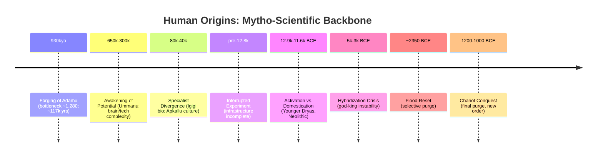

# Appendix F: Mytho-Scientific Chronology of Human Origins

This appendix integrates mythic roles (Adamu, Ummānu/Umannu, Igigi, Apkallu, Anunnaki) with scientific signals (genetics, archaeology, climate) to provide a concise backbone timeline. It complements the standard Timeline and cross-links evidence across appendices.

Note on names: Functional names in this series map to cultural echoes:

- Anunnaki ≈ The Werdh-anes (Original Architects)
- Igigi ≈ The Reges (Administrative coup generation)
- Apkallu ≈ The Gneh-tah (Scientist-teachers)
- Nephilim ≈ The Wiros (Hybrid warrior lineage)

For definitions, see the Glossary. This chronology uses normalized phase numbers for clarity.

---

## Phase 1: The Forging of Adamu (≈930,000–813,000 years ago)

- Myth Lens: Foundational stock "Adamu" forged under existential constraint; latent capacities installed for long-horizon development.
- Science Lens: A severe, long-duration population bottleneck with an effective population of just 1,280 individuals for 117,000 years. The cause was the Mid-Pleistocene Transition, which shifted Earth's climate to brutal 100,000-year ice ages. The most severe phase, Marine Isotope Stage 22, led to widespread environmental collapse and fragmentation of human populations.
- Cross-links: This is the period when humans were truly domesticated as Adamu, then mixed with another robust human species—probably Homo erectus—hiding most of the domestication traits. Mythically, this is the time when Prometheus gave humans fire. Genetic Evidence → The 930–813 kya Bottleneck, admixture signals; Glossary → Adamu, Mid-Pleistocene Transition, Marine Isotope Stage 22, Homo erectus, Prometheus.

- **The "Big Bang" Parallel:** This mythological forging coincides with a major archaeological mystery: the "Big Bang" of genus Homo. After a long period with little change, our ancestors' brains and physical forms suddenly began to evolve, with the first evidence of systematic tool use appearing alongside a new, more humanlike jawbone from this period.

## Phase 2: The Awakening of Potential (≈650,000–300,000 years ago)

- Myth lens: Rise of Ummānu/Umannu—the artisan/specialist potential emerges.
- Science lens: Emergence of Homo heidelbergensis; cranial capacity expansion; increasing technological complexity trending toward Mode 3.
- Cross-links: Archaeological Anomalies → technology transitions; Glossary → Umannu.
- The Recovery: Around 813,000 years ago, humanity began a 20-fold demographic recovery, with the population growing to approximately 30,000 individuals. This rapid expansion was fueled by climate improvement and the mastery of controlled fire, with definitive evidence around 790,000 years ago.

## Phase 3: The Specialist Divergence (≈80,000–40,000 years ago)

- Myth lens: Divergence into specialist lineages—Igigi (biological specialists, “watchers”) and Apkallu (cultural specialists, sages).
- Science lens: Major demographic expansion (80k–10k); symbolic/creative “explosion”; regional high-altitude adaptations.
- Cross-links: Mythological Cross-References → Watchers/Apkallu; Genetic Evidence → demographic expansions.

## Phase 4: The Interrupted Experiment (pre–12,800 BCE)

- Myth lens: Tensions between original architects and younger administrators; infrastructure incomplete.
- Science lens: Pre-Younger Dryas late Pleistocene signals; pre-collapse cultural trajectories.
- Cross-links: Original Titans part; Timeline → pre-impact context.

## Phase 5: The Activation (Younger Dryas onset ≈12,900–11,600 BCE)

- Myth lens: “Anunnaki activation”: agriculture/social architecture as activation key; domestication programming begins competing with original design.
- Science lens: Younger Dryas climate shock; rapid shifts; early Neolithic transitions.
- Cross-links: Timeline → Crash and Takeover; Genetic Evidence → neoteny/domestication traits.

## Phase 6: The Hybridization Crisis (≈5,000–3,000 BCE)

- Myth lens: God-king systems, hybrid vigor then instability; Nephilim/Wiros dynamics and human countermeasures.
- Science lens: Early state formation, monumental construction, elite lineages; divergent health/robustness signals.
- Cross-links: Hybrid Crisis chapter; Nephilim appendix (Genesis 6:4; Numbers 13:33).

- **The "Muddle in the Middle" Parallel:** The mythological chaos of this period is powerfully mirrored in the scientific record. This was a time when multiple human species coexisted, competed, and sometimes interbred, creating a "tangled bush" of a family tree. Genetic analysis has since confirmed the existence of "ghost lineages"—entire human populations that left genetic traces in modern humans but almost no physical fossils. The discovery of the Denisovans, known almost entirely from DNA, is a prime example of such a ghost population.

## Phase 7: The Flood Reset (≈2,350 BCE)

- Myth lens: Coordinated purge of unstable hybrids; selective preservation; memory codified in global deluge narratives.
- Science lens: 4.2k event window correlations; cultural resets; settlement discontinuities.
- Cross-links: Timeline → Great Reset; Mythological Cross-References → Flood.

## Phase 8: The Chariot Conquest (≈1,200–1,000 BCE)

- Myth lens: Coordinated elimination of Bronze Age hybrid lines; installation of new order; hero propaganda cycle.
- Science lens: Simultaneous chariot tech dispersion; Bronze Age collapse; Indo-European expansions.
- Cross-links: Chariot Conquerers part; Archaeological Anomalies → chariot package; Glossary → *koryos*, Sintashta.

---

### Mapping Key (Functional ↔ Cultural)

- Werdh-anes ↔ Anunnaki (Architects)
- Gneh-tah ↔ Apkallu (Scientist-teachers)
- Reges ↔ Igigi (Administrators)
- Wiros ↔ Nephilim (Hybrid warriors)

### Reading Tips

- Use this alongside “Timeline of Human Management” for dates, then dive into Genetic/Archaeological/Mythological appendices for evidence.
- Click glossary terms for definitions and name equivalences.

