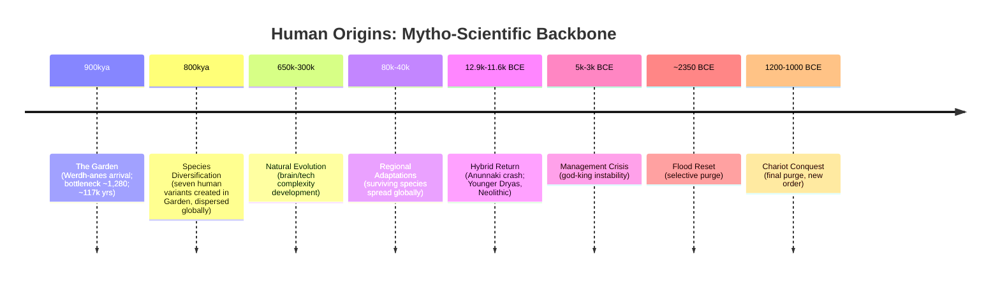

# Chapter 63: Appendix F: Mytho-Scientific Chronology of Human Origins

This appendix integrates mythic roles (Adamu, Ummānu/Umannu, Igigi, Apkallu, Anunnaki) with scientific signals (genetics, archaeology, climate) to provide a concise backbone timeline. It complements the standard Timeline and cross-links evidence across appendices.

Note on names: Functional names in this series map to cultural echoes:

- Werdh-anes ≈ Original dragon-like architects (900,000 years ago)
- Anunnaki ≈ Hybrid descendants who crash-landed (12,000 years ago)
- Igigi ≈ The Reges (Higher-level Anunnaki administrators)
- Apkallu ≈ The Gneh-tah (Lower-level Anunnaki scientists)
- Nephilim ≈ The Wiros (Hybrid warrior lineage)

For definitions, see the Glossary. This chronology uses normalized phase numbers for clarity.

---

## Phase 1: The Garden Experiment (≈900,000–783,000 years ago)

- Myth Lens: **The Werdh-anes** (dragon-like beings) create a controlled "Garden" environment for human domestication and genetic modification.
- Science Lens: A severe, long-duration population bottleneck with an effective population of just 1,280 individuals for 117,000 years. The bottleneck coincides with the Mid-Pleistocene Transition climate shift, providing natural cover for the controlled breeding program.
- Cross-links: This is the period when humans were domesticated as "Adamu" under direct **Werdh-anes** management. The genetic modifications during this period prepare the population for species diversification. Genetic Evidence → The 900–783 kya Bottleneck; Glossary → Adamu, Werdh-anes, Mid-Pleistocene Transition.

- **The "Big Bang" Parallel:** This mythological forging coincides with a major archaeological mystery: the "Big Bang" of genus Homo. After a long period with little change, our ancestors' brains and physical forms suddenly began to evolve, with the first evidence of systematic tool use appearing alongside a new, more humanlike jawbone from this period.

## Phase 2: The Species Diversification (≈800,000 years ago)

- Myth Lens: **The Werdh-anes** create seven distinct human species within the Garden and disperse them across Earth's different environments.
- Science Lens: The emergence of multiple human species (Homo heidelbergensis, early Neanderthal lineages, Denisovan ancestors) across different geographical regions, each adapted to specific environmental conditions.
- Cross-links: This explains the sudden appearance of diverse human species in the archaeological record. Archaeological Anomalies → multiple species emergence; Glossary → Homo heidelbergensis, Neanderthals, Denisovans.

## Phase 3: The Natural Evolution Period (≈650,000–300,000 years ago)

- Myth Lens: The dispersed species develop naturally according to their environmental adaptations, with dormant **Werdh-anes** programming gradually activating.
- Science Lens: Continued evolution of the dispersed human species; cranial capacity expansion; increasing technological complexity; mastery of fire and tool-making.
- Cross-links: Archaeological Anomalies → technology transitions; Glossary → Homo heidelbergensis evolution.
- The Recovery: Following dispersal, the human populations expand and adapt to their new environments, developing the characteristics we see in the archaeological record.

## Phase 4: The Regional Adaptations (≈80,000–40,000 years ago)

- Myth lens: Divergence into specialist lineages—Igigi (biological specialists, “watchers”) and Apkallu (cultural specialists, sages).
- Science lens: Major demographic expansion (80k–10k); symbolic/creative “explosion”; regional high-altitude adaptations.
- Cross-links: Mythological Cross-References → Watchers/Apkallu; Genetic Evidence → demographic expansions.

## Phase 4: The Interrupted Experiment (pre–12,800 BCE)

- Myth lens: Tensions between original architects and younger administrators; infrastructure incomplete.
- Science lens: Pre-Younger Dryas late Pleistocene signals; pre-collapse cultural trajectories.
- Cross-links: Original Titans part; Timeline → pre-impact context.

## Phase 5: The Adamu → Umannu Activation (Younger Dryas onset ≈12,900–11,600 BCE)

- Myth lens: “Anunnaki activation”: agriculture/social architecture as activation key; domestication programming begins competing with original design.
- Science lens: Younger Dryas climate shock; rapid shifts; early Neolithic transitions.
- Cross-links: Timeline → Crash and Takeover; Genetic Evidence → neoteny/domestication traits.

## Phase 6: The Hybridization Crisis (≈5,000–3,000 BCE)

- Myth lens: God-king systems, hybrid vigor then instability; Nephilim/Wiros dynamics and human countermeasures.
- Science lens: Early state formation, monumental construction, elite lineages; divergent health/robustness signals.
- Cross-links: Hybrid Crisis chapter; Nephilim appendix (Genesis 6:4; Numbers 13:33).

- **The "Muddle in the Middle" Parallel:** The mythological chaos of this period is powerfully mirrored in the scientific record. This was a time when multiple human species coexisted, competed, and sometimes interbred, creating a "tangled bush" of a family tree. Genetic analysis has since confirmed the existence of "ghost lineages"—entire human populations that left genetic traces in modern humans but almost no physical fossils. The discovery of the Denisovans, known almost entirely from DNA, is a prime example of such a ghost population.

## Phase 7: The Flood Reset (≈2,350 BCE)

- Myth lens: Coordinated purge of unstable hybrids; selective preservation; memory codified in global deluge narratives.
- Science lens: 4.2k event window correlations; cultural resets; settlement discontinuities.
- Cross-links: Timeline → Great Reset; Mythological Cross-References → Flood.

## Phase 8: The Chariot Conquest (≈1,200–1,000 BCE)

- Myth lens: Coordinated elimination of Bronze Age hybrid lines; installation of new order; hero propaganda cycle.
- Science lens: Simultaneous chariot tech dispersion; Bronze Age collapse; Indo-European expansions.
- Cross-links: Chariot Conquerers part; Archaeological Anomalies → chariot package; Glossary → *koryos*, Sintashta.

---

### Mapping Key (Functional ↔ Cultural)

- Werdh-anes ↔ Anunnaki (Architects)
- Gneh-tah ↔ Apkallu (Scientist-teachers)
- Reges ↔ Igigi (Administrators)
- Wiros ↔ Nephilim (Hybrid warriors)

### Reading Tips

- Use this alongside “Timeline of Human Management” for dates, then dive into Genetic/Archaeological/Mythological appendices for evidence.
- Click glossary terms for definitions and name equivalences.

